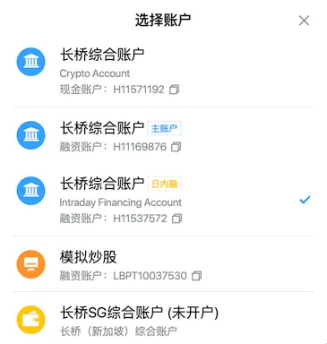
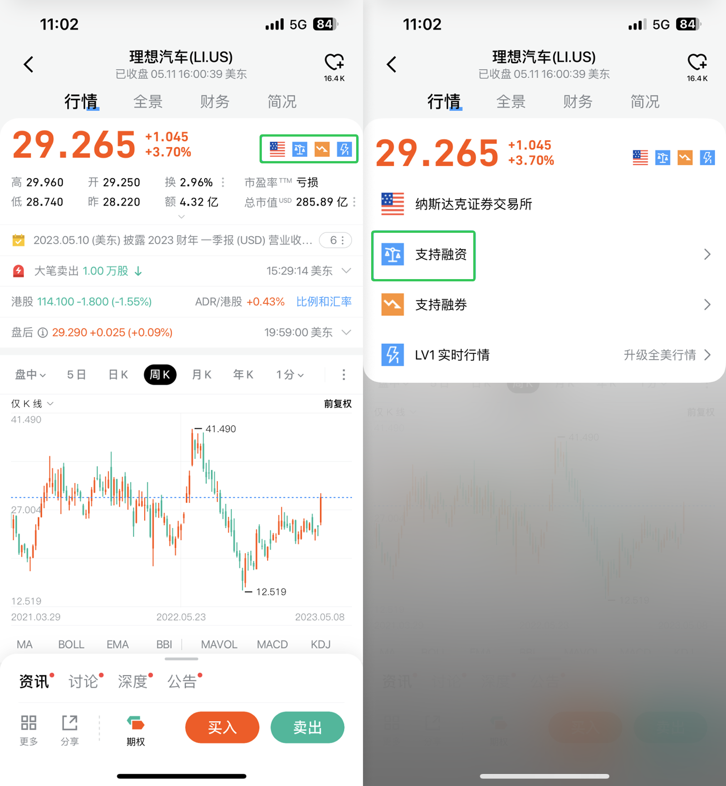
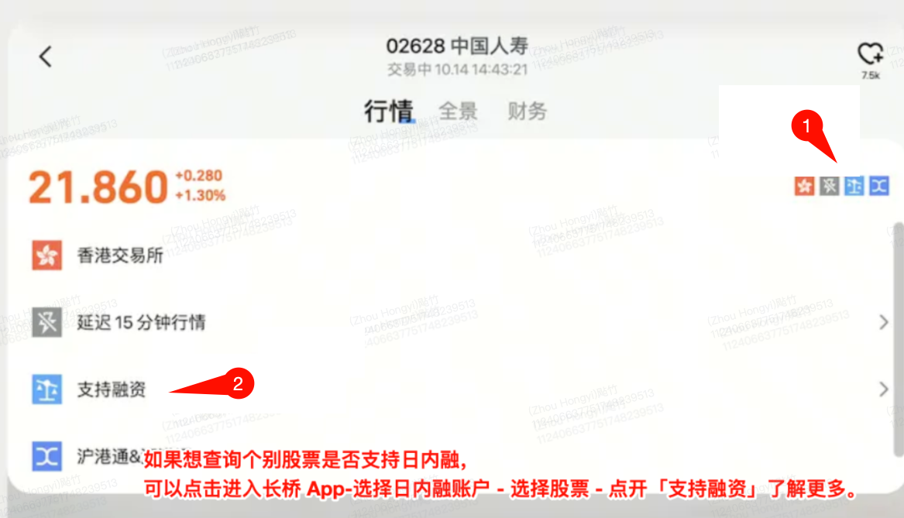

# 日内融账户

日内融资交易额度、市场和交易时间、风险控制、欠款利息及账户注销。

## 账户介绍

日内融业务是长桥香港针对成熟交易类型投资者开通的专属交易模式。投资者需在当前券商账户下开设日内融子账户，通过主子账户资金或股票划转后，实现日内融账户下的交易。

## 开通账户

[开通日内融账户链接](https://activity.longbridgehk.com/pipeline/intraday_financingtrade/index.html)

## 交易额度

日内融子账户交易股票时，需要相对更少的保证金要求。同样的账户现金金额下，相比普通证券账户，日内融子账户能够开仓更多额度的股票。

切换至日内融子账户后，可在个股详情页查看融资详情，了解针对日内融子账户的保证金要求。

## 交易时间

### 香港市场

持续交易时段：09:30 - 15:40（香港时间 GMT+8）
收盘前 20 分钟初始保证金要求调整至 100%，收盘前 15 分钟维持保证金要求调整至 100%。

### 美国市场

夏令时：16:30 - 03:40（香港时间 GMT+8）
冬令时：17:30 - 04:40（香港时间 GMT+8）
收盘前 20 分钟初始保证金要求调整至 100%，收盘前 15 分钟维持保证金要求调整至 100%。

盘后不支持日内融资交易。美股盘前时段开市 30 分钟后才接受日内融资交易账户下单。

## 可交易市场与股票

长桥证券就香港和美国股票市场的指定股票提供日内融资交易服务，不是所有股票都支持日内融资交易。

查询个别股票是否支持日内融：长桥 App - 选择日内融账户 - 选择股票 - 点开「支持融资」了解更多。

[日内融资交易合资格股票名单](https://support.longbridgehk.com/topics/2y8a2ip/8we2bz)

日内融资交易账户不支持香港市场的竞价订单。

## 风险控制

为避免股票隔夜价格波动风险，系统会在收盘前 15 分钟调整股票的维持保证金要求至 100%。若因上调保证金要求导致触发 Margin Call 或账户存在欠款，需自行平仓至账户没有欠款为止。若未及时自行平仓，将触发系统自动平仓，以确保收市时账户不存在欠款。

如在收市时仍有未成交的融资开仓订单，系统会在收盘前 15 分钟自动取消所有未成交订单。

日内融资交易借贷金额上限一般不超过 100 万港元，实际额度以客户资产组合和批核结果为准。

**借币交易**：存入港元可在日内融账户内交易美股，但即使账户整体现金充足，仍可能因借币股票亏损导致货币结欠并产生利息。可通过入金或货币兑换补足结欠。

**流通性欠佳**：若因市场情况（例如流通性不足）或任何行动导致难以或无法执行平仓，长桥证券有权在没有事先通知的情况下出售客户于长桥证券开立的任何账户内的任何证券或资产，以抵销相关仓位。

**持仓股票停牌**：盘中时段已占用的购买力维持不变，直到收盘前执行平仓流程。不能平仓部分进行结算；结算后仍有欠款时，日内信贷额度将被收回，需入金至结余恢复正值后重新申请。

**无法履行交收责任**：客户须对持仓股票履行交收责任。如因平仓或强行平仓而未能履行交收责任，须向长桥证券缴付所定之额外费用及利息，详情载于公司 App 及网站上并将不时更新。

**极端天气**：遭遇黑色暴雨警告或八号或以上台风信号等极端天气时，长桥证券可能随时关闭日内融资账户的融资额度。

**欠款利息**：日内未及时补足欠款，所欠款项产生融资利息，[利率及计算公式参考收费表](https://longbridge.hk/rate)。

## 修改资料

如需修改姓名、手机号、邮箱等个人信息，请填写信息修改申请表并发送邮件申请修改。

[信息修改申请表](https://pub.lbkrs.com/files/202602/unkgiG99RY8AmtaY/___20260206.pdf)

提交邮箱：service@longbridge.hk

账户因密码多次错误被冻结，请联系客服协助解冻。

## 注销账户

如需注销日内融资账户，请填写注销申请表并发送邮件至香港官方邮箱。

[注销申请表](https://pub.lbkrs.com/files/202602/LS5FyJKJf5ZmQAVT/___20260225.pdf)

提交邮箱：service@longbridge.hk
