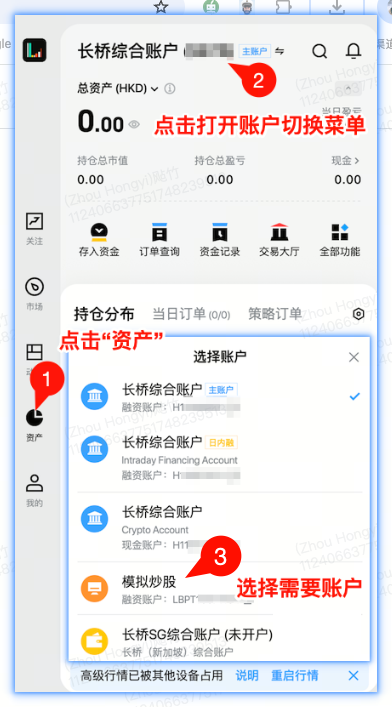
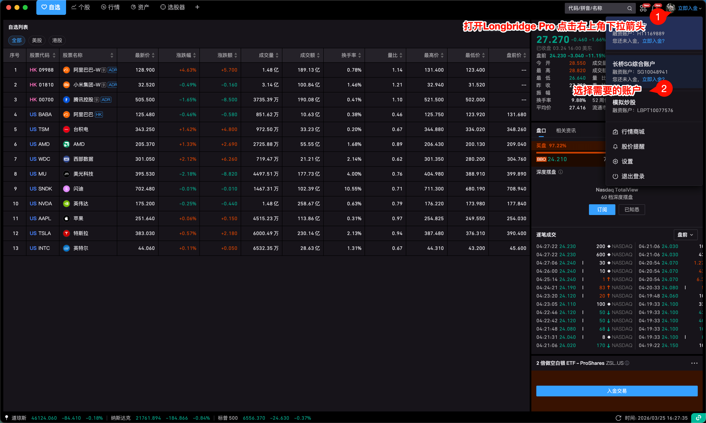
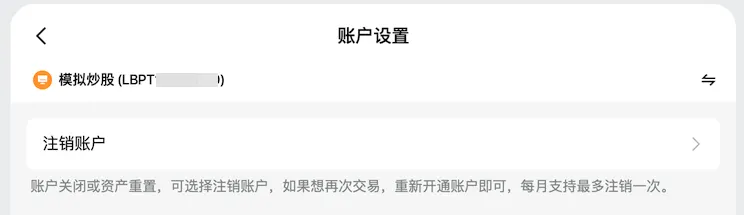

# 模拟账户

模拟账户虚拟练习资金额度、开通方式、注销与重置规则。

## 账户介绍

模拟账户是长桥提供的辅助练习工具，不涉及真实交易。账户号以 LBPT 开头。无需走具体的开户流程和开户审核。

## 开通方式

在长桥 App 资产页面左上角，切换账户，选择模拟账户进行申请，申请后大约 5 分钟内开通。桌面客户端操作方式相同。

开通自带虚拟练习资金：800,000 HKD。

## 注销与重置

注销路径：长桥 App - 我的 - 设置 - 账户设置，滑到最下面可以直接注销模拟账户。

注销后重新申请开通会重置虚拟练习资金。

可注销次数：一个月一次。
