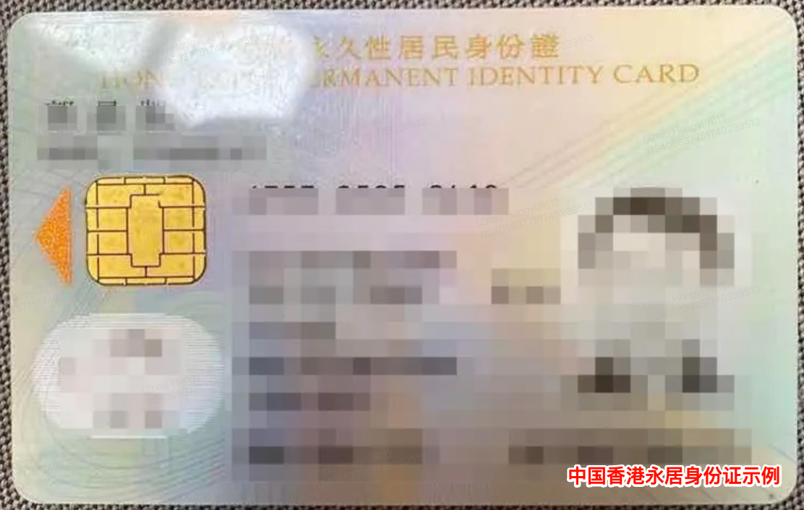
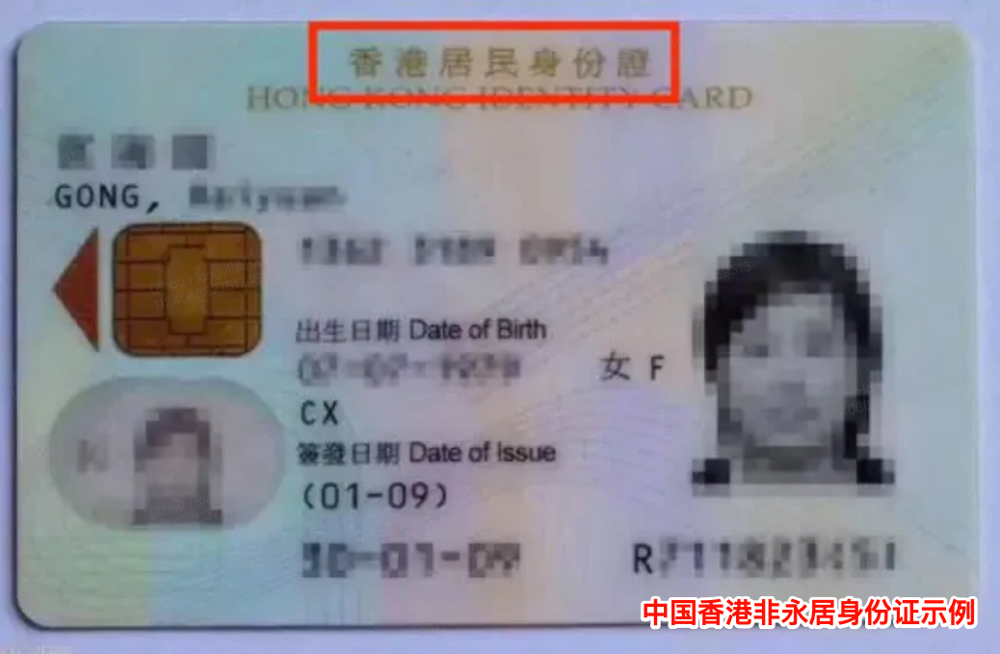
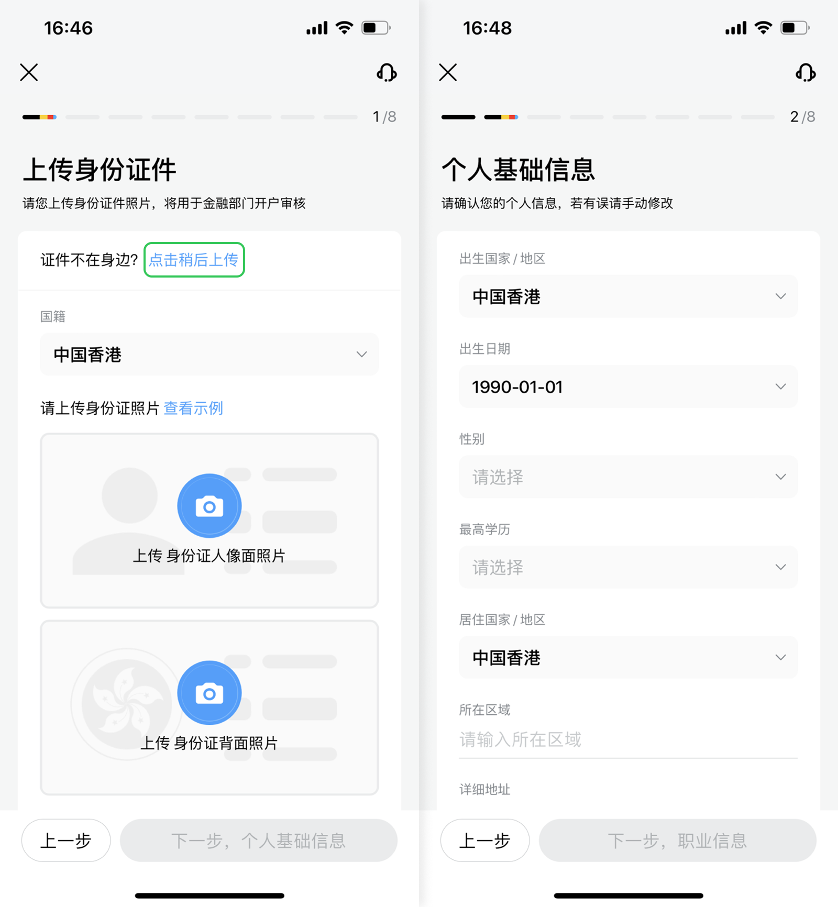
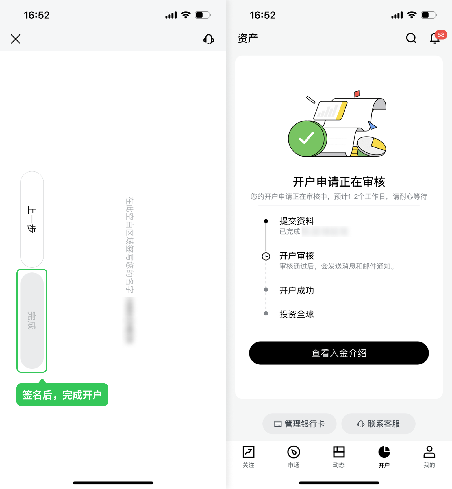
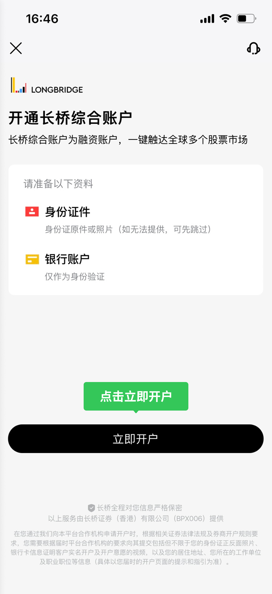
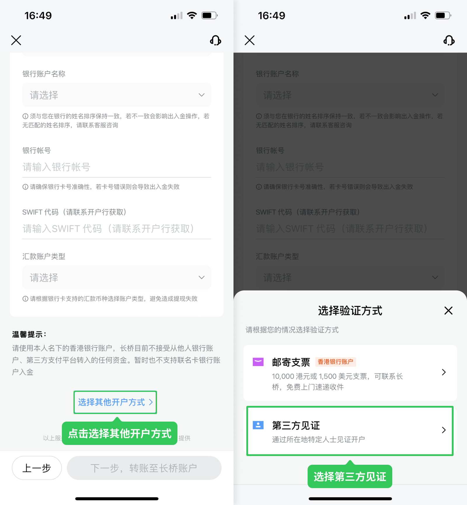
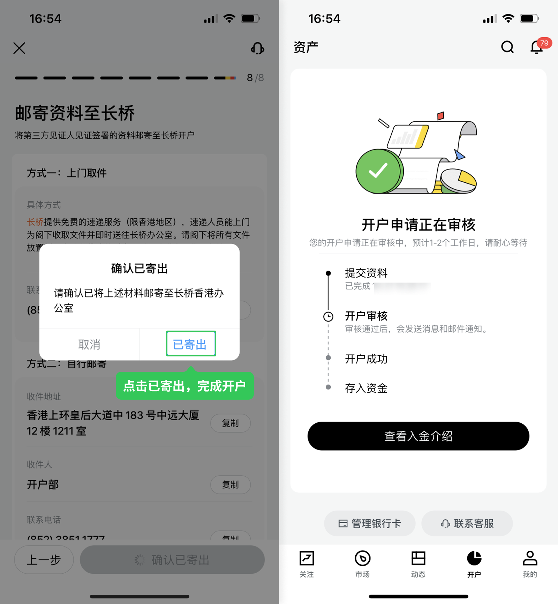
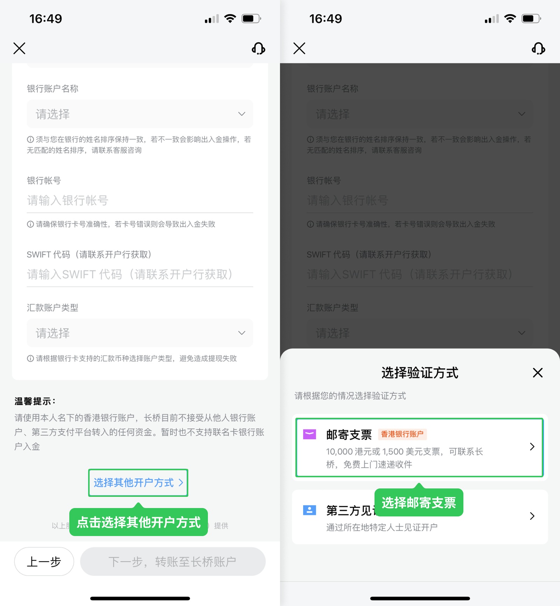

# 如何开通综合账户

长桥提供香港综合账户和新加坡综合账户两种账户，一个客户可以同时持有两个账户。

## 账户对比与选择

| 项目 | 香港综合账户 | 新加坡综合账户 |
|------|------------|--------------|
| 账户编号前缀 | H（如 H12345678） | SG（如 SG12345678） |
| 监管机构 | 香港证监会（SFC） | 新加坡金融管理局（MAS） |
| 开户时效 | 3–5 个工作日 | 2–5 个工作日 |
| 主要面向人群 | 香港居民、中国大陆居民 | 中国大陆居民、东南亚居民（含新加坡） |
| 港股交易 | ✓ | ✓ |
| 港股打新（IPO） | ✓ | — |
| 美股交易 | ✓ | ✓ |
| 新加坡股票 | — | ✓ |
| 港元账户 | ✓ | — |
| 美元账户 | ✓ | ✓ |
| 新加坡元账户 | — | ✓ |
| 融资融券 | ✓ | ✓ |
| 美股期权 | ✓ | ✓ |
| 余额通 | 香港余额通 | 新加坡余额通 |

### 入金方式

- **香港综合账户**：FPS 转数快、eDDA、网银转账、银证转账、ATM 与柜台、电汇
- **新加坡综合账户**：PayNow、DDA、网银与电汇、Wise

### 如何选择

适合开香港账户：持有香港银行卡（便捷 FPS / eDDA 入金）、主要交易港股、已在香港居住或工作。

适合开新加坡账户：在新加坡居住或工作（PayNow 即时入金）、希望交易新加坡本地股票、大陆居民持有新加坡或其他海外身份证件。

两个都开：希望交易港股、美股和新加坡股票，或希望分散账户资产至不同监管框架。

## 开通流程

<Tabs groupId="account-region">
  <TabItem value="hk" label="香港综合账户" default>

### 开户资格

| 项目 | 要求 |
|------|------|
| 年龄 | 年满 18 周岁；65 岁或以上、75 岁或以上、学历为小学程度等情形需通过电话录音（VC）额外确认，且 VC 用户没有融资额度 |
| 不支持 | 美国和加拿大证件/信息开户，及美国和加拿大居民 |
| 银行卡 | 需持有港卡；不持有港卡需走第三方见证开户 |

主要开户人群：香港（含澳门、台湾）、中国大陆；其他国家以开户页面下拉列表为准。

#### 中国内地投资者

需提供境外生活证明文件。现时只接受香港及海外地区/国家的身份证件，工作签、工作证明均不适用。境外（除香港）的驾驶证需要单独人工审核。

#### 香港居民

香港永久性居民身份证可直接申请开户。

非永久身份证需补充提供香港签证身份书或中国内地身份证其一。若提供签证书，开户身份为香港居民；若提供内地身份证，开户身份为大陆。

身份证须拍正反面，且满足 6 个月有效期。

### 认证流程

香港账户提供三种身份认证方式：

#### 中国大陆用户

通过绑定一张内地银联卡完成身份认证（填写卡号和开户预留手机号，仅用于认证，后续不能用大陆银行卡出入金），完成后通过人脸识别完成 CA 验证。

#### 香港用户 — 入金见证

需一次性入金 10,000 HKD 或 1,500 USD 或以上完成转账验证。

**开户步骤：**

**步骤 1**：打开长桥 App → 开户 → 开户申请，点击「立即开户」。

**步骤 2**：上传身份证明文件，确认无误后点击「下一步，个人基础信息」，填写个人基础信息并上传地址证明文件后，点击「下一步，职业信息」。

> 若当前未携带证件，可点击蓝色字体「点击稍后上传」，先行完成其他资料填写，在风险披露页后再补充。

**步骤 3**：填写职业信息，电子邮箱用于接收结单等重要信息，确认无误后点击「确认」。

**步骤 4**：填写资产投资信息和合规信息确认。

**步骤 5**：阅读并点选了解风险披露，下一步在「确认信息」页仔细查看各项资料无误后点选确认。

**步骤 6**：在身份认证页面，绑定本人同名香港银行账户，点击「下一步，转账至长桥账户」；转账**不少于 10,000 港币或 1,500 美元**至长桥香港收款账户，点击「已完成汇款，通知长桥」；提交汇款凭证，点击「下一步，签名」。

**步骤 7**：完成身份认证操作，在空白位置手写签名，点击「完成」提交开户申请。

**步骤 8**：提交后耐心等待审核，审核结果可通过 App → 资产页面查询，或通过 App 消息、开户时提交的邮箱接收通知。

#### 第三方见证（香港用户备选方案及其他地区用户）

适用于未持有港卡、无法使用入金见证方式的香港用户，以及其他地区用户。

**开户步骤：**

**步骤 1**：打开长桥 App → 资产 → 开户申请，点击「立即开户」。

**步骤 2**：上传身份证明文件，确认无误后点击「下一步，个人基础信息」，填写个人基础信息并上传地址证明文件后，点击「下一步，职业信息」。

> 若当前未携带证件，可点击蓝色字体「点击稍后上传」，先行完成其他资料填写，在风险披露页后再补充。

**步骤 3**：填写职业信息，电子邮箱用于接收结单等重要信息，确认无误后点击「确认」。

**步骤 4**：填写资产投资信息和合规信息确认。

**步骤 5**：阅读并点选了解风险披露，下一步在「确认信息」页仔细查看各项资料无误后点选确认。

**步骤 6**：在身份认证页面，选择下方「选择其他开户方式」，选择「第三方见证」。

**步骤 7**：在「开户资料准备」页面，打印并签署开户资料后，连同第三方见证签署的资料安排寄出。

**步骤 8**：确认已寄出，点击「已寄出」。提交后耐心等待，收到开户表格并核对无误后会尽快完成审核，审核结果可通过 App → 资产页面查询，或通过 App 消息、开户时提交的邮箱接收通知。

#### 邮寄支票（香港用户备选方案）

**开户步骤：**

**步骤 1**：打开长桥 App → 资产 → 开户申请，点击「立即开户」。

**步骤 2**：上传身份证明文件，确认无误后点击「下一步，个人基础信息」，填写个人基础信息并上传地址证明文件后，点击「下一步，职业信息」。

> 若当前未携带证件，可点击蓝色字体「点击稍后上传」，先行完成其他资料填写，在风险披露页后再补充。

**步骤 3**：填写职业信息，电子邮箱用于接收结单等重要信息，确认无误后点击「确认」。

**步骤 4**：填写资产投资信息和合规信息确认。

**步骤 5**：阅读并点选了解风险披露，下一步在「确认信息」页仔细查看各项资料无误后点选确认。

**步骤 6**：在身份认证页面，选择下方「选择其他开户方式」，选择「邮寄支票」。

**步骤 7**：可选择上门取件或自行邮寄方式将资料寄至长桥，资料寄出后点击「确认已寄出」→「已寄出」。

**步骤 8**：在空白位置手写签名，点击「完成」提交开户申请。

**步骤 9**：提交后耐心等待，收到支票后会完成开户审核，审核结果可通过 App → 资产页面查询，或通过 App 消息、开户时提交的邮箱接收通知。

### 修改资料

如需修改姓名、手机号、邮箱等，请填写信息修改申请表并发送至 service@longbridge.hk。

[信息修改申请表](https://pub.lbkrs.com/files/202602/unkgiG99RY8AmtaY/___20260206.pdf)

### 休眠账户

账户近 3 年无任何主动操作记录且资产净值低于等值 100 港元，将被界定为休眠账户，暂停交易、出金及股票转出功能。如需重新激活，请联系客服。

详细说明（活动定义、激活流程、处理时效）：[休眠账户](/account/dormant-account)

### 注销账户

已完成开户：填写注销申请表发送至 service@longbridge.hk，预计 7 个工作日内处理。

[注销申请表](https://pub.lbkrs.com/files/202602/LS5FyJKJf5ZmQAVT/___20260225.pdf)

注销前需结清所有资产、解除 eDDA/银证转账等第三方绑定。账户内现金可放弃处理，但账户内股票不可放弃，可选择以实物方式提取港股，或转出至其他证券公司。

注销分两种方式：

| 注销方式 | 同一证件重新注册 |
|---------|----------------|
| 普通注销 | 3 个月内不可使用 |
| 永久注销 | 可立即使用 |

未完成开户：请联系客服协助。

  </TabItem>
  <TabItem value="sg" label="新加坡综合账户">

### 开户资格

| 项目 | 要求 |
|------|------|
| 开户时效 | 2–5 个工作日 |
| 不支持 | 美国和加拿大证件/信息开户，及美国和加拿大居民 |

主要开户人群：中国大陆、东南亚地区（主要为新加坡）。

#### 中国大陆居民

除提交身份证/护照外，需附加新加坡或其他海外地区/国家的身份证作"海外生活证明"。接受海外国家长期居留签证签发的实体卡（工作签证、留学签证实体卡或居民身份证等）。暂不支持电子证书。

#### 新加坡本地用户

可通过 Myinfo（Singpass）渠道快捷开户。

### 修改资料

#### 证件与开户信息

长桥 App → 资产 → 全部功能 → 开户资料 → 个人信息板块提交证件更新申请。

#### 税务信息

长桥 App → 资产 → 全部功能 → 开户资料，更新后提交审核；完成后进入全部功能 → 更新文件 → W-8BEN 确认最新资料。W-8BEN 更新预计 2 周内生效。

美股股息税：长桥依据税务协定适用对应税率（中国区 10%，非中国区 30%）。

#### 其他修改

如 App 内无法提交，可发邮件至 contact@longbridge.sg。

### 注销账户

已开户用户：使用登记联系邮箱发送邮件至 contact@longbridge.sg，注明账号、注销范围（仅证券账户 或 证券账户及登录信息）及注销原因。预计 7 个工作日内处理。账户内现金可放弃处理，但账户内股票不可放弃，可选择以实物方式提取港股，或转出至其他证券公司。

未开户用户：请联系客服协助。

  </TabItem>
</Tabs>

## 同时持有两个账户

一个客户可以同时申请并使用两个账户，资金相互独立。如需在两个账户之间划转资金，可通过「资金划转与换汇」中的跨账号划转功能操作。
