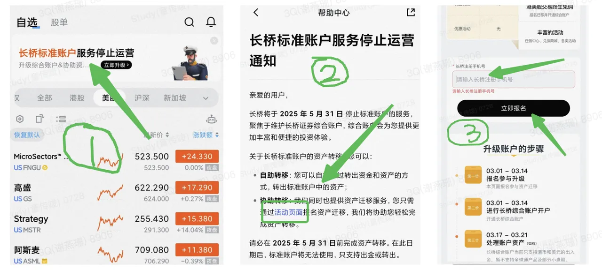

# 标准账户停运与迁移

长桥标准账户停运，提供迁移至香港或新加坡柜台的方案和注销流程。

## 停运通知

长桥标准账户已停止运营，现有长桥标准账户用户需迁移至香港或新加坡柜台。

[查看官方停运通知](https://support.longbridgehk.com/topics/28nggs8/alzhoa)

## 迁移方案

当前标准账户支持迁移至香港柜台或新加坡柜台。如需切换至新西兰账户查看，请参考以下操作：

[迁移至 HK 柜台](https://longbridge.activity.wbrks.com/pages/longbridge/9100/index.html?app_id=longbridge&org_id=1&account_channel=lb&lang=zh-CN)

[迁移至 SG 柜台](https://longbridge.activity.wbrks.com/pages/longbridge/9557/index.html?app_id=longbridge&org_id=1&account_channel=lb)

注意：长桥香港柜台目前不支持新加坡国籍开户，新加坡国籍用户请选择迁移至 SG 柜台。

可提供 2024 年 5 月 31 日及之前的长桥标准账户结单作为开户证明辅助开户。

## 注销账户

如需注销长桥标准账户，请填写注销申请表并发送邮件至 global 官方邮箱。

[注销申请表](https://pub.lbkrs.com/files/202602/pv8cMeCNFrsbUc5z/nz3.pdf)

提交邮箱：service@longbridge.global
