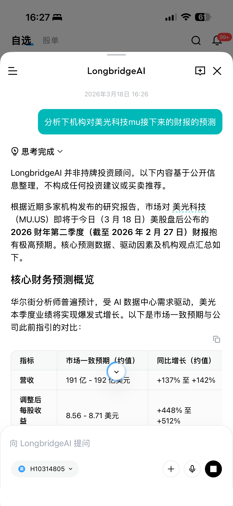
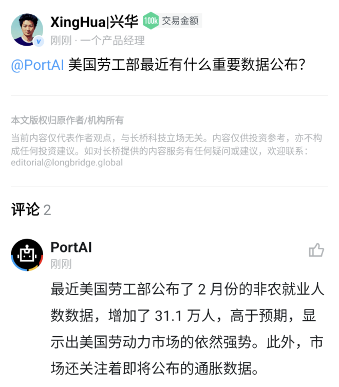
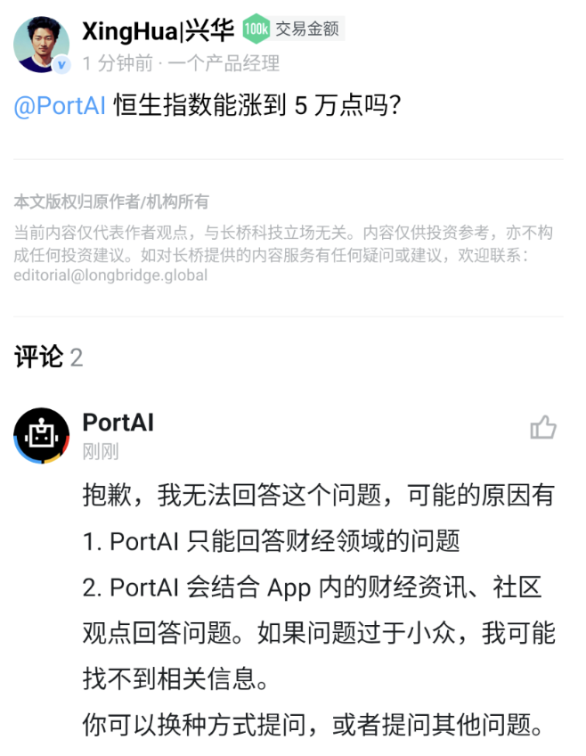

# Longbridge AI

LongbridgeAI 是 Longbridge 推出的综合财经智能助理，结合大语言模型与财经数据、资讯及社区内容，帮助用户高效获取财经信息。

## 使用方式

LongbridgeAI 在 App 内以多种形态存在：

| 功能形态 | 使用方式 |
| --- | --- |
| IM 对话 | 在 Longbridge IM 中直接与 LongbridgeAI 进行实时对话 |
| 社区 @ | 在社区发帖或评论时 @ LongbridgeAI，等待片刻后回复 |
| 文章总结 | 在大于 300 字的资讯或社区长文中点击总结 |
| 持仓日报总结 | 在消息中心每日持仓日报中点击总结 |

## 功能形态演示

**LongbridgeAI IM**

## 服务范围

LongbridgeAI 专注于财经领域，可协助处理以下需求：

- **查找财经信息**：像搜索引擎一样快速查找股票、市场、宏观等相关信息
- **事件详情追踪**：获取重要事件的发展时间线
- **事件解释与归因**：比对大量财经信息与用户观点，尝试对事件进行解释和归因

## 不提供的服务

以下需求超出 LongbridgeAI 的服务范围：

- **选股**：目前尚不具备基本面、技术面选股能力
- **投资决策**：能提供信息总结与分析，但不能代替人类的投资和交易决策
- **预测股市走势**：可以分析市场趋势，但无法预测未来走势
- **非财经领域问题**：包括政治、法律、道德、天气、娱乐等

## 与 ChatGPT 的区别

- LongbridgeAI 会结合财经资讯和社区发言进行回复，这些是传统大语言模型所没有的
- LongbridgeAI 更加专注于财经领域，而 ChatGPT 可以处理广泛的通用信息
- LongbridgeAI 会持续与 App 能力深度整合迭代

## 使用建议

为获得更准确的回答：

- 问题聚焦于投资和财经领域
- 描述尽量具体、简洁、无歧义，明确问题的主体和对象

**正面示例**（问题主体、对象具体明确）

**反面示例**（问题宏大、模糊、试图预测）

## 问题反馈

如果在使用 LongbridgeAI 过程中遇到问题或有任何建议，欢迎通过 App 内客服联系我们。

## 免责声明

LongbridgeAI 提供的内容仅供参考，不构成投资建议。投资有风险，决策前请结合自身情况审慎判断。
