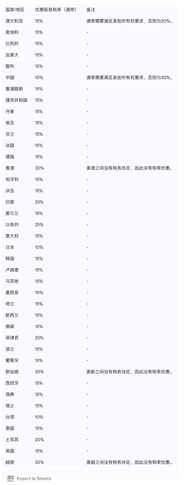

# 美股税表与股息税

美国税表类型选择、预扣股息税率及 W-8 更新流程。

## 美国税表介绍

### W-8 表格

W-8 是一个系列表格，用于证明收款人的外国人身份，告知付款方应适用的预扣税率。允许非美国居民根据与美国签订的税务协定申请降低或豁免预扣税。

- **W-8BEN**：最常见版本，由外国个人填写，用于证明非美国税务居民身份并申请税务协定优惠，减少美国投资收入（如股息）的预扣税
- **W-8BEN-E**：适用于外国实体（公司、基金等），用途与 W-8BEN 类似

### W-9 表格

全称「要求纳税人识别号码及证明」，由需要向您付款的美国个人或企业发出，用于收集纳税人识别号码（TIN），如社会安全号码（SSN）或雇主识别号码（EIN）。

W-9 适用于美国公民或税务居民。

### 1099 表格

系列表格，用于报告除常规工资薪水之外的各种非雇员收入：

- **1099-NEC**：支付给独立承包商、自由职业者的报酬
- **1099-MISC**：杂项收入，如租金或版权费
- **1099-DIV**：股息和分配收入

### 如何选择

- 美国税务居民：提交 W-9 表格，付款方发出 1099 表格报告收入
- 非美国税务居民：提交 W-8 表格，证明外国身份并申请税务协定优惠

## 预扣分红股息税

长桥依据税务协定为不同地区用户适用对应股息税率：
- 中国区用户：10%（中美税务协定优惠税率）
- 非中国区用户：30%（美国标准预扣税率）
部分特别税区可能适用不同税率，具体以实际收取为准。

如需享受优惠税率，请确保 W-8BEN 表格中的税务信息准确并及时更新。

**W-8BEN 更新入口（SG 柜台）**：长桥 App > 资产 > 全部功能 > 开户资料，提交审核后通过全部功能 > 更新文件 > W-8BEN 查看最新状态。

W8 表格更新预计 2 周内生效。过往已扣除的股息税不予返还。

## 重要提示

作为金融机构，长桥不获允许提供税务或法律意见。如对税务身份或税率有疑问，请咨询专业税务顾问。
