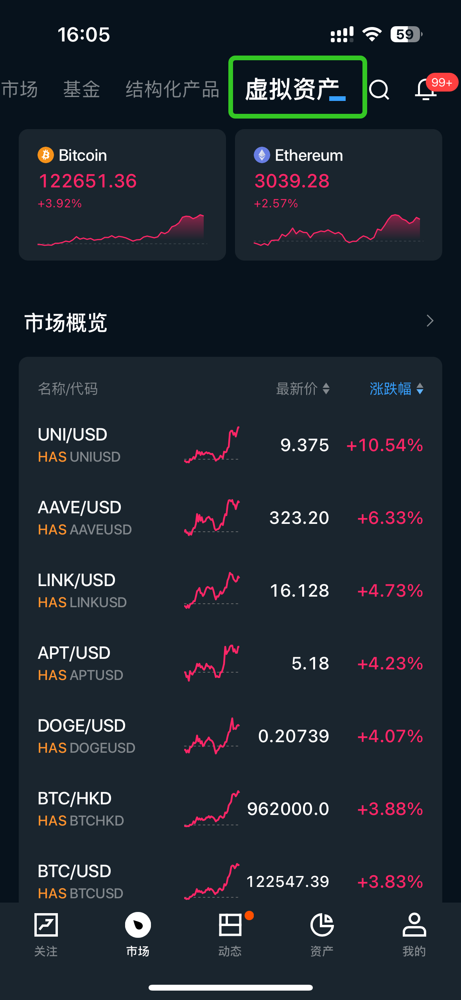
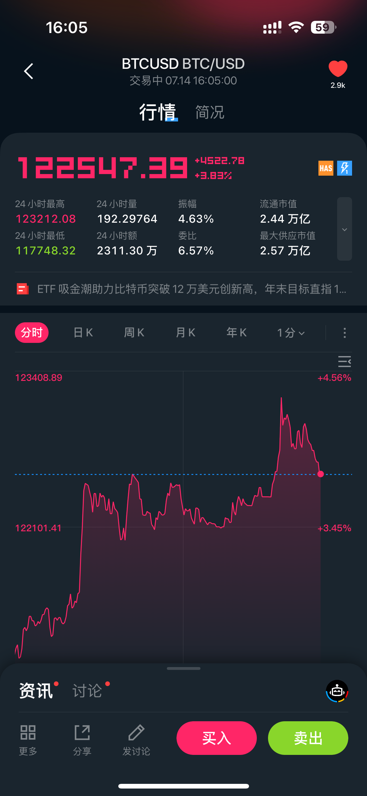
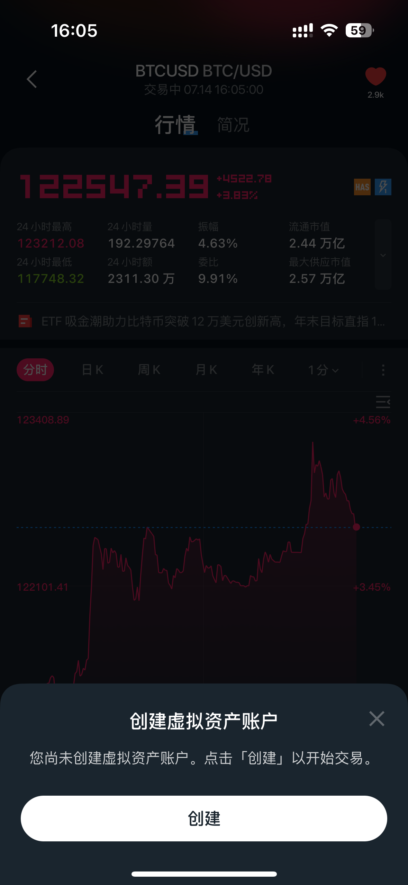
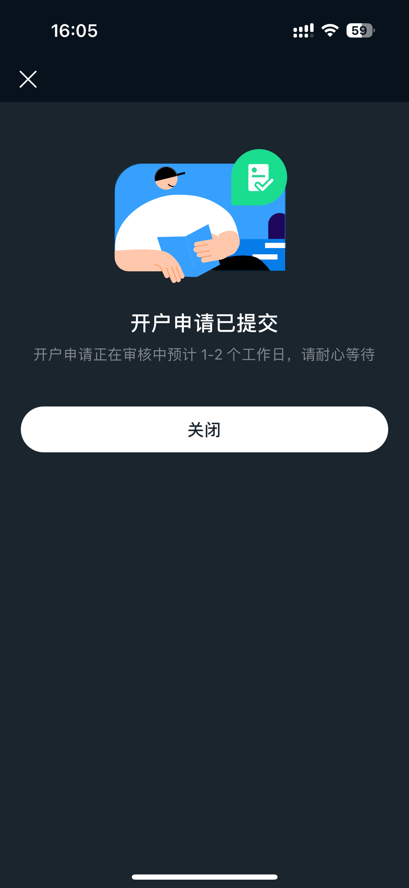
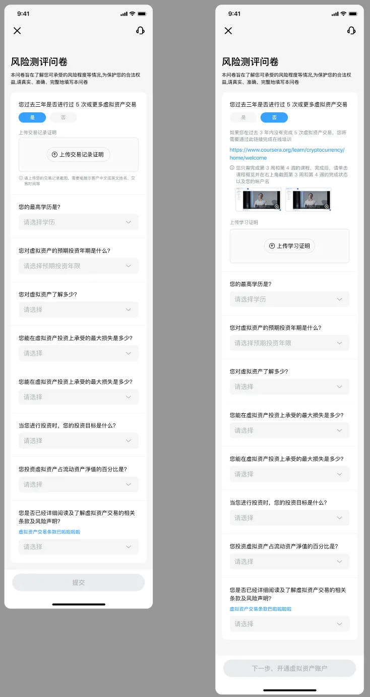
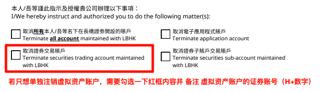

# 虚拟资产账户

虚拟资产账户的开户资格、开通步骤及注销方式。

## 账户基本信息

长桥虚拟资产账户（Crypto Account）是长桥香港提供的加密货币交易账户，账户号码以 H 开头，附带 Crypto Account 标识。

开户时效：1–2 个工作日。

## 开户资格

仅支持海外身份用户及香港永居身份用户开户。

## 开通步骤

进入长桥 App → 市场，切换顶部标签至虚拟资产频道，即可查看各类虚拟资产行情及最新资讯。

点击感兴趣的加密货币进入详情页，可查看实时行情、逐笔成交和买卖盘口等深度数据。

在标的详情页点击**买入**或**卖出**按钮进入交易页面，若尚未开通虚拟资产账户，可根据指引提交开户申请。

账户成功开通后，可通过入金或账户内划转资金的方式为虚拟资产账户存入资金。

## 风险测评

开户或交易前需完成风险测评，默认有效期 1 年。若未提交过或即将过期，App 会弹出填写界面，按照页面提示填写即可。

## 注销账户

如需注销虚拟资产账户，请填写注销申请表并发送邮件至香港官方邮箱。

[注销申请表](https://pub.lbkrs.com/files/202602/LS5FyJKJf5ZmQAVT/___20260225.pdf)

提交邮箱：service@longbridge.hk

如仅注销虚拟资产账户（保留证券账户），请在申请表中勾选「取消证券交易账户」，并备注虚拟资产账户的证券号码。

