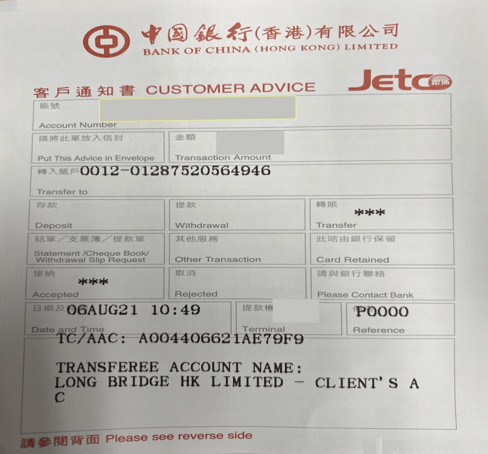
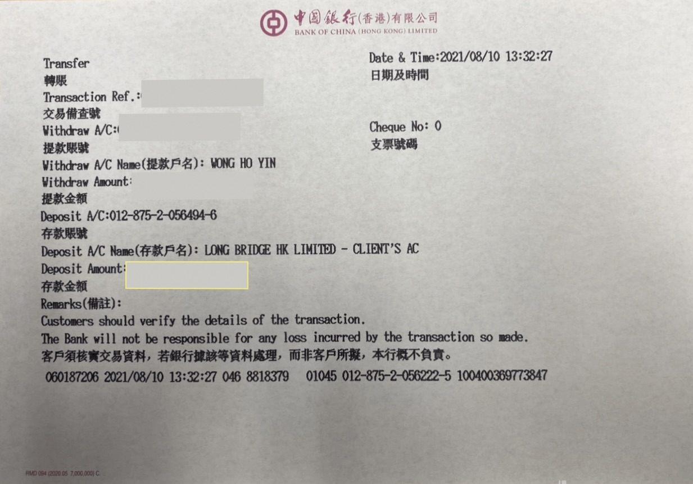

# ATM 与柜台入金

通过香港银行 ATM 或银行柜台将资金转账至长桥收款账户，转账完成后需上传汇款凭证。

| 项目     | 说明                       |
|--------|--------------------------|
| 支持币种   | 港元（HKD）、美元（USD）          |
| 预计到账时间 | 同行转账：2 小时内；跨行转账：1–3 个工作日 |
| 手续费    | 长桥免费，具体费用以银行实际收取为准       |

## 收款银行信息

- 收款人名称：Long Bridge HK Limited
- 港元收款账号：01287520564946
- 美元收款账号：01287520564962
- 收款银行（中文）：中国银行（香港）有限公司（银行编号：012）
- 收款银行（英文）：Bank of China (Hong Kong) Limited
- SWIFT 代码：BKCHHKHHXXX
- 银行地址：83 Des Voeux Road Central, Hong Kong

## 操作步骤

1. 获取长桥收款账户信息（见上方）
2. 前往香港银行 ATM 或柜台，将资金转账至长桥收款账户
3. 保留汇款凭证截图（ATM 打印凭条或柜台回执）

   ATM 转账凭证示例：
   

   柜台转账凭证示例：
   

4. 打开长桥 App，进入**资产 → 存入资金 → 选择币种 → ATM / 柜台转账**，上传汇款凭证

> 完成转账后请立即上传凭证，否则影响入金进度。

## 同名账户要求与使用限制

- 仅适用于香港银行柜台及 ATM
- 转账银行账户名必须与证券账户名同名，不可使用他人账户，否则产生的退款费用由客户承担
- 银行间后台处理汇款申请需要一定时间，银行通知「已汇出」不等于长桥证券已收到款项；资金到达长桥证券后需进行结算与审批
- 银行和长桥证券在香港公众假期均不处理汇款业务，请预留好汇款处理时间
- 不接受直接存入现金

## 出金

银行线下不支持办理出金，如需出金请使用 [FPS 转数快](/withdrawal/hk-online-banking)、[网银转账](/withdrawal/hk-online-banking)
或 [电汇](/withdrawal/wire-transfer)。
