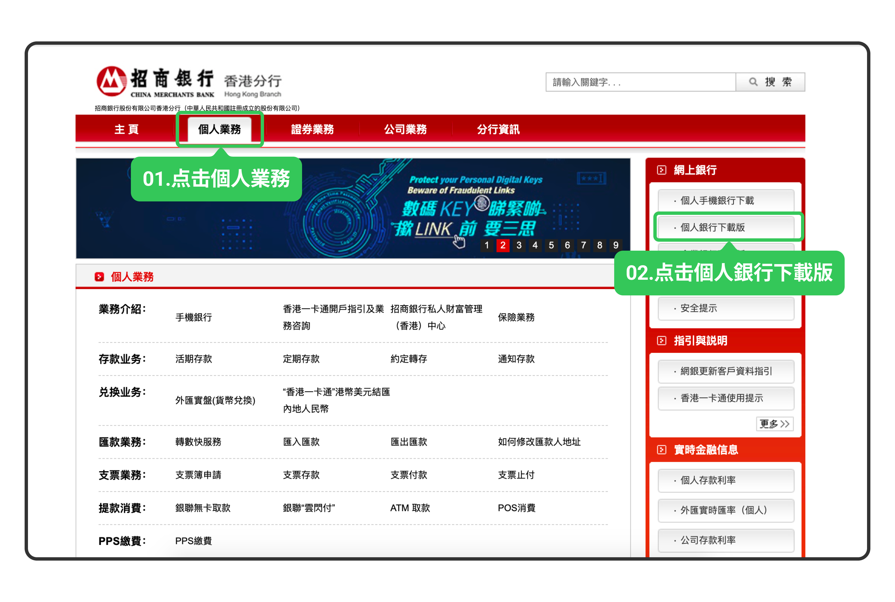

# 招行 eDDA

招商银行香港的 eDDA 授权**仅支持 PC 桌面端**，需先下载「个人银行香港专业版」应用，移动端不支持在线授权。

> eDDA 入金的到账时间、手续费及通用故障排查，见 [eDDA 入金](/deposit/hk-methods/edda)。

## 第一步：PC 桌面端授权

1. 登录**招商银行香港分行个人网上银行** → **個人業務** → **個人銀行下載版**，下载 PC 端应用，通过**个人银行香港专业版**登录

   

2. 选择**一卡通** → **转账汇款** → **电子直接付款授权**

   

3. 进入「电子直接付款授权」页面，点击右下角**新增授权**

   

4. 填写以下授权信息后点击**确认提交**：

   | 字段 | 填写内容 |
   |------|---------|
   | 付款周期 | 按需填写 |
   | 生效日期 | 按需设置 |
   | 失效日期 | 按需设置，建议不设到期日 |
   | 币种 | 港币 |
   | 限额 | 按需填写 |
   | 收方姓名 | Long Bridge HK Limited |
   | 收方开户银行 | 024 - Hang Seng Bank Ltd. |
   | 收方户口号码 | 752027854001 |
   | 付款方参考号 | 您的长桥账号（即长桥 App 授权指引页面中的「付款人编号」） |

## 第二步：长桥 App 发起入金

提交授权后，等待银行和长桥审批（预计 1–2 个银行工作日生效）。授权成功以银行端通知为准。

授权生效后：长桥 App → **资产** → **存入资金** → **存入港元**，选择招商银行卡，点击「立即入金」。
