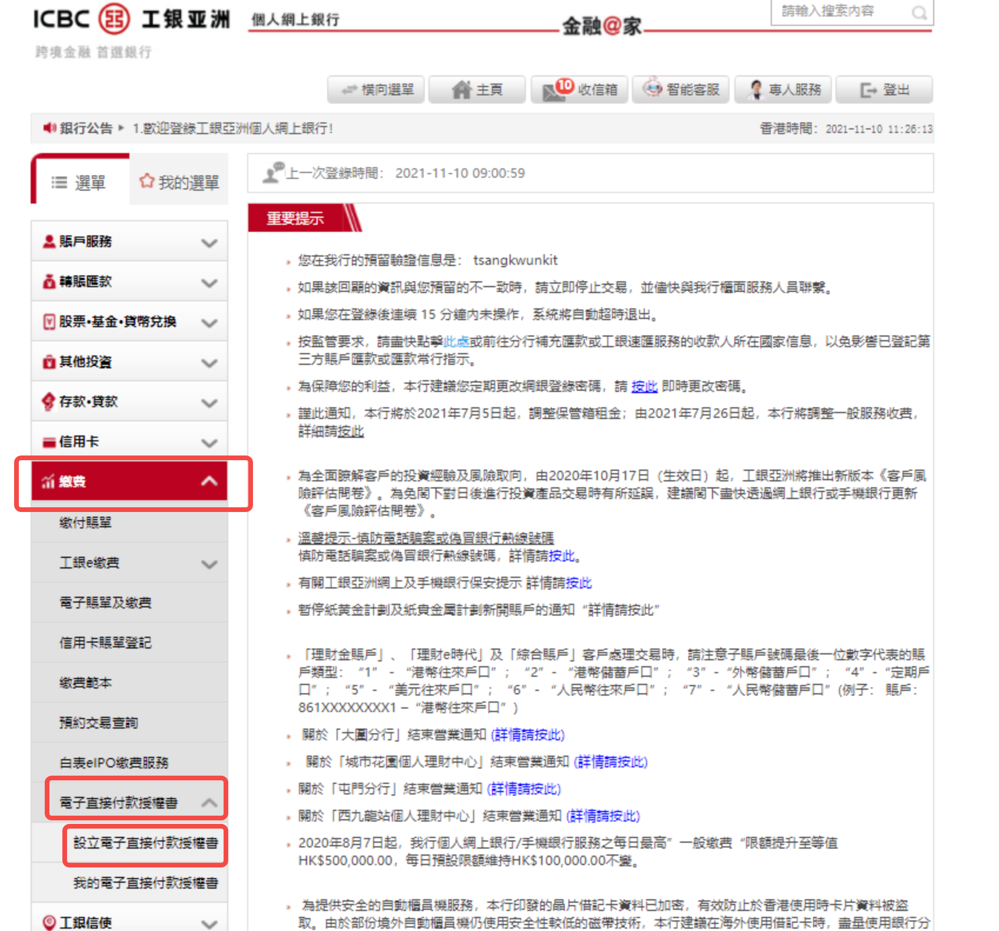
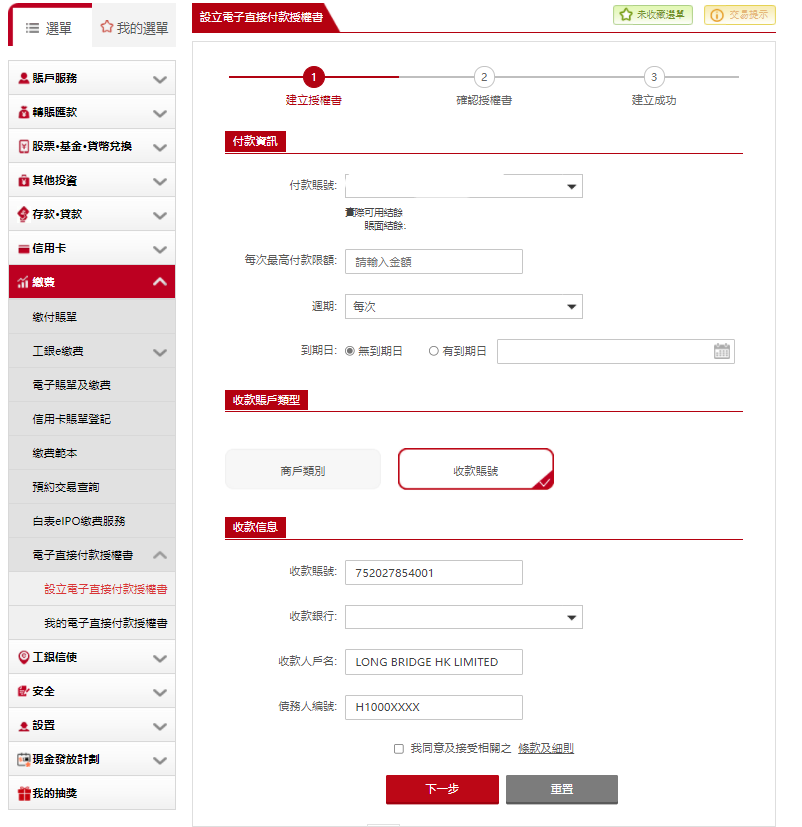
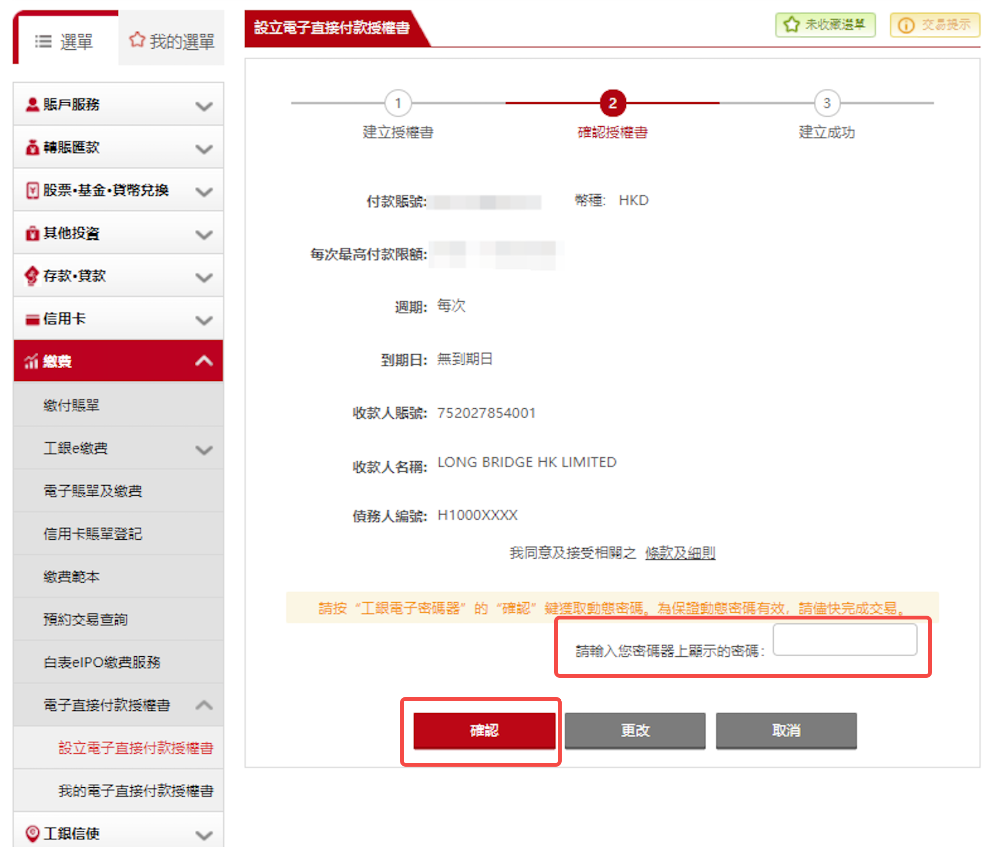

# 工银亚洲 eDDA

工银亚洲（ICBC Asia）的 eDDA 授权需通过**网上银行**操作，完成前需持有工银亚洲实体密码器。

> **前置条件**：需持有工银亚洲网上银行账户及实体密码器（用于最终确认）。
>
> eDDA 入金的到账时间、手续费及通用故障排查，见 [eDDA 入金](/deposit/hk-methods/edda)。

## 第一步：网上银行授权

1. 登入**工银亚洲网上银行** → **缴费** → **电子直接付款授权书** → **设立电子直接付款授权书**

   

2. 填写以下授权信息，同意条款后点击**下一步**：

   **付款资讯**

   | 字段 | 填写内容 |
   |------|---------|
   | 付款账号 | 选择您的付款银行账户 |
   | 每次最高付款限额 | 按需填写，建议不超过港币十万元；超过十万元需另外下载并邮寄授权书表格 |
   | 到期日 | 按需设置，建议不设到期日 |

   **收款信息**

   | 字段 | 填写内容 |
   |------|---------|
   | 收款账号 | 752027854001 |
   | 收款人户名 | Long Bridge HK Limited |
   | 债务人编号 | 您的长桥账号（即长桥 App 授权指引页面中的「付款人编号」） |
   | 收款银行 | 024 - 恒生银行有限公司 |

   

3. 核对信息无误，输入**密码器**上显示的密码，点击**确认**完成授权申请

   

## 第二步：长桥 App 发起入金

提交授权后，等待银行和长桥审批（预计 1–2 个银行工作日生效）。授权成功以银行端通知为准。

授权生效后：长桥 App → **资产** → **存入资金** → **存入港元**，选择工银亚洲银行卡，点击「立即入金」。
