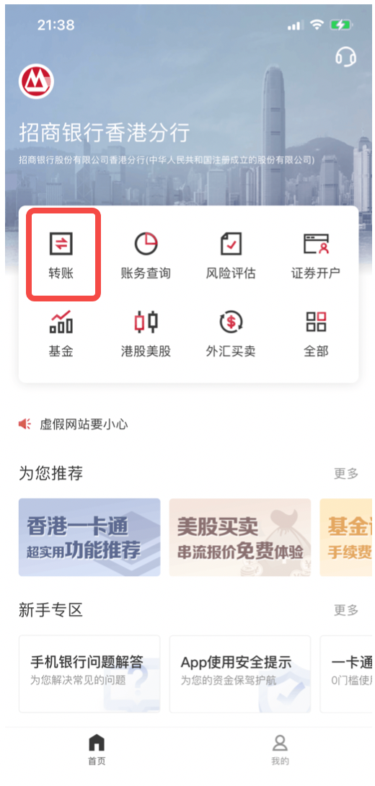
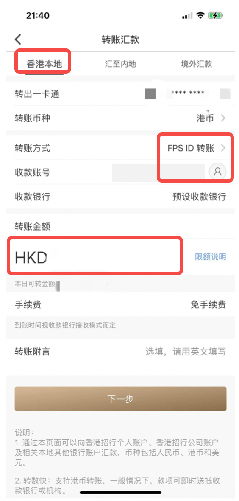
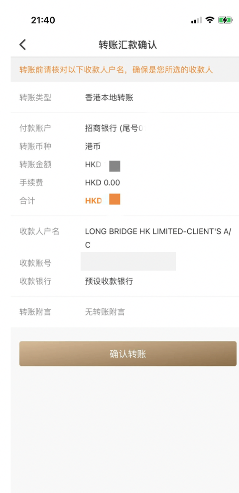

# 招行 FPS 转数快

通过招商银行香港 App 的 FPS 功能将资金转至长桥，转账完成后上传凭证即可。

> FPS 入金的到账时间、手续费及通用注意事项，见 [FPS 转数快入金](/deposit/hk-methods/fps)。

## 操作步骤

1. 打开**长桥 App** → **资产** → **存入资金** → **FPS 转数快**，复制 FPS ID

   | 长桥 FPS ID | 169152691 |
   |------------|-----------|
   | 收款银行 | 中国工商银行（亚洲） |
   | 收款人名称 | LONG BRIDGE HK LIMITED-CLIENT'S A/C |

   

2. 打开**招商银行 App** → **转账** → **香港本地** → **FPS ID 转账**，填写转账金额

   > 转账附言可填写长桥综合账户号和姓名，如：`H123456 XIAOHUA`，方便长桥识别。

   

   

3. 确认信息，点击**提交**完成转账

   

4. 转账完成后，立即返回**长桥 App** → **资产** → **存入资金** → **FPS 转数快**，上传汇款凭证

   

   > 凭证必须在转账后立即上传，否则影响入金进度。
