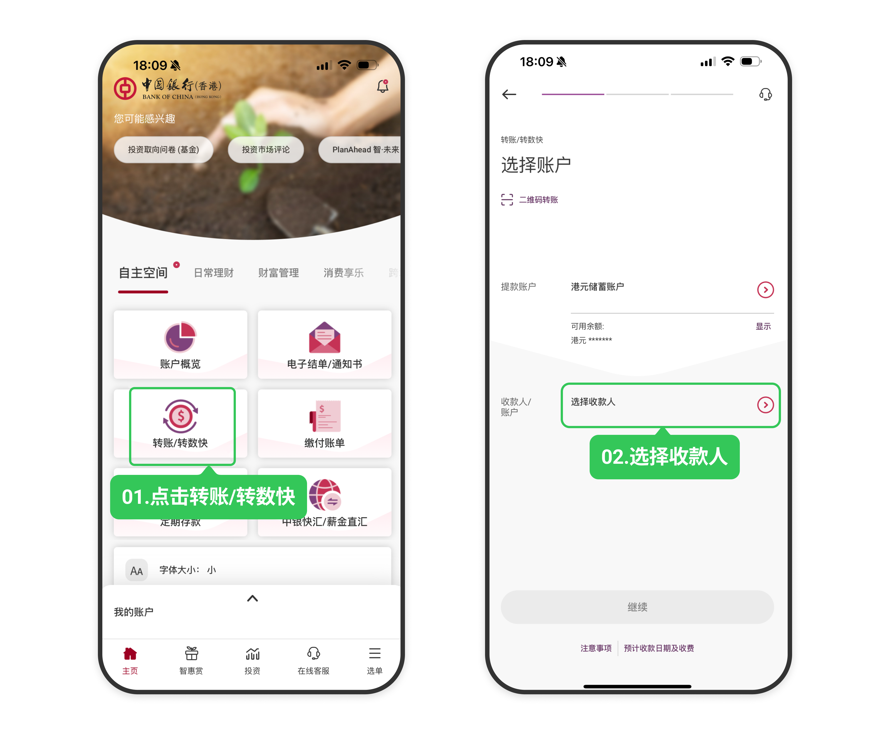
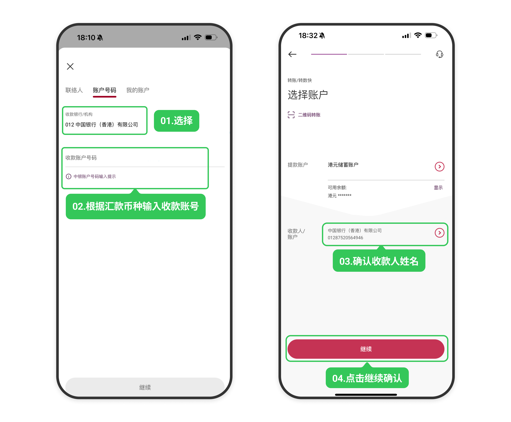
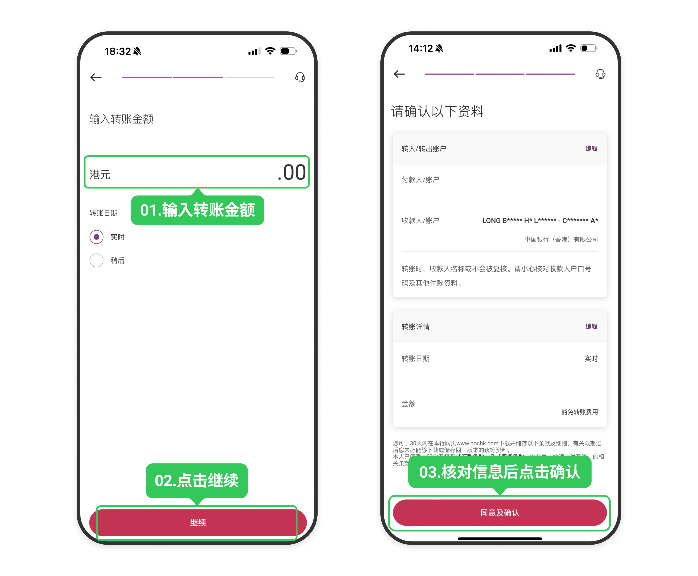
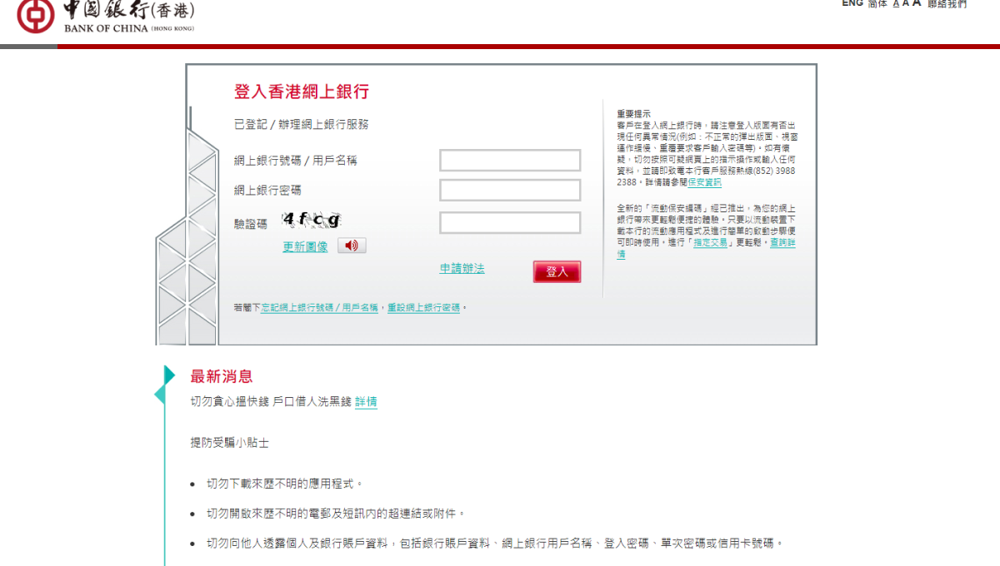
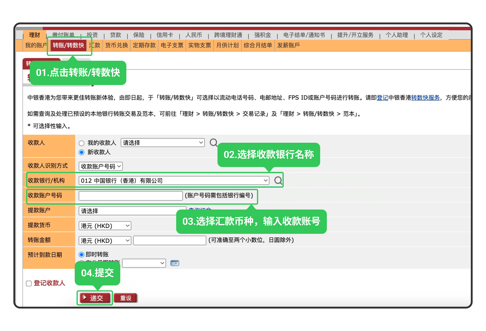
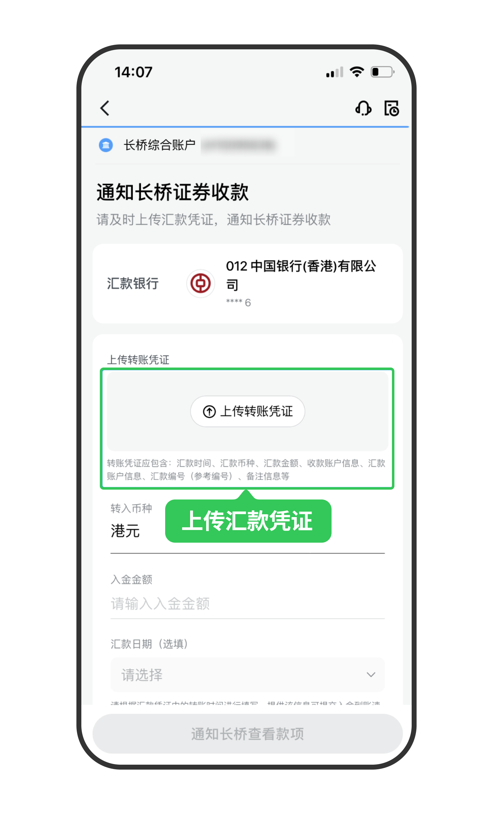

# 中银香港网银转账

通过中银香港手机银行或网上银行将资金转至长桥，转账完成后上传凭证即可。

> 网银转账的到账时间、手续费及通用注意事项，见 [网银转账入金](/deposit/hk-methods/online-banking-transfer)。

## 收款账户信息

| 字段 | 内容 |
|------|------|
| 收款人名称 | Long Bridge HK Limited |
| 港元收款账号 | 01287520564946 |
| 美元收款账号 | 01287520564962 |
| 收款银行 | 中国银行（香港）有限公司 |
| 银行编号 | 012 |
| SWIFT 代码 | BKCHHKHHXXX |
| 银行地址 | 83 Des Voeux Road Central, Hong Kong |

## 手机银行

1. 打开**中银香港 App** → **转账/转数快** → **我的账户/收款人**，选择收款人

   

2. 填写收款方信息，核对无误后点击**继续**，完成安全认证

   

3. 填写转账金额和币种，点击**继续**确认，再次核对后点击**确认**，提示成功即表示汇款完成

   

4. 立即截图保留汇款凭证，返回**长桥 App** → **资产** → **存入资金** → **网银转账**，上传凭证

   

## 网上银行

1. 登录**中银香港个人网上银行**（https://its.bochk.com）

   

2. 选择**理财** → **转账**；首次汇款选择**新收款人**，再次汇款直接选已有收款人，核对信息后点击**递交**，完成安全验证即汇款成功

   

3. 立即截图保留汇款凭证，返回**长桥 App** → **资产** → **存入资金** → **网银转账**，上传凭证

   

   > 凭证必须在汇款完成后立即上传，否则影响入金进度。
