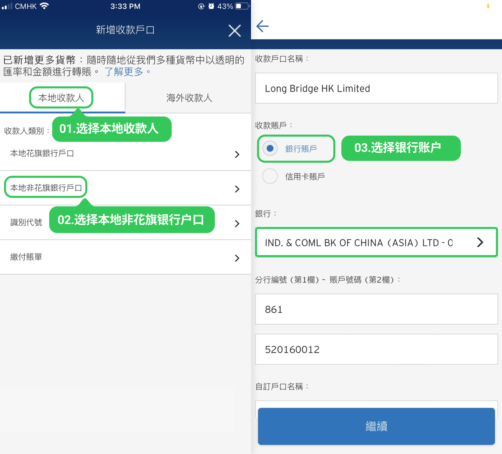
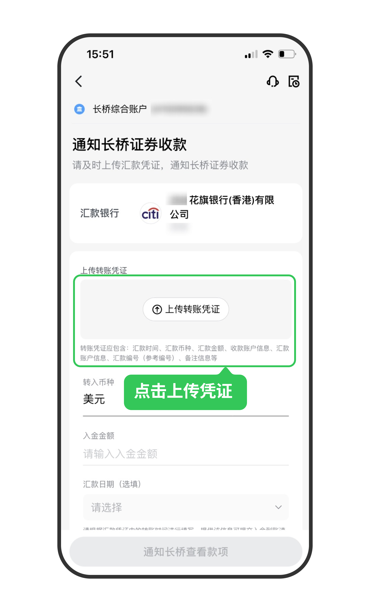

# 花旗银行网银转账

通过花旗银行 App 将资金转至长桥，转账完成后上传凭证即可。

> 网银转账的到账时间、手续费及通用注意事项，见 [网银转账入金](/deposit/hk-methods/online-banking-transfer)。

## 操作步骤

1. 打开**花旗银行 App** → **转账** → **新收款户口**

2. 选择**本地收款人**，收款人类别选择**本地非花旗银行户口**，根据入金币种填写以下信息后点击**继续**：

   **港元（收款银行：工银亚洲 072）**

   | 字段 | 填写内容 |
   |------|---------|
   | 收款户口名称 | Long Bridge HK Limited |
   | 收款账户 | 选择银行账户 |
   | 银行 | 中国工商银行（亚洲）有限公司（英文：IND.& COML BK OF CHINA(ASIA) LTD） |
   | 分行编号 | 861520160012（港元收款账号） |
   | 自定户口名称 | LONGBRIDGE（建议填写） |
   | 转账目的 | 自行选择 |
   | 货币 | HKD |

   **美元（收款银行：创兴银行 041）**

   | 字段 | 填写内容 |
   |------|---------|
   | 收款户口名称 | Long Bridge HK Limited |
   | 收款账户 | 选择银行账户 |
   | 银行 | 创兴银行有限公司（Chong Hing Bank Limited） |
   | 分行编号 | 256150608546（美元收款账号） |
   | 自定户口名称 | LONGBRIDGE（建议填写） |
   | 转账目的 | 自行选择 |
   | 货币 | USD |

   

3. 核对信息无误，点击**确认**，完成**保安编码**校验

4. 填写转账金额，点击**付款**，完成转账

5. 立即截图保留凭证，返回**长桥 App** → **资产** → **存入资金** → **网银转账**，上传凭证

   

   > 凭证必须在汇款完成后立即上传，否则影响入金进度。
