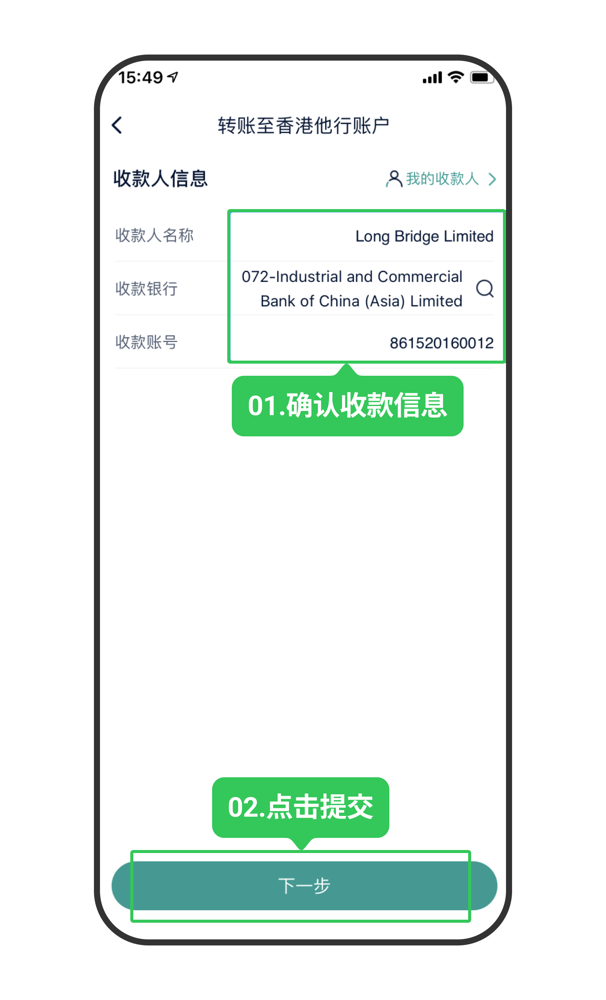
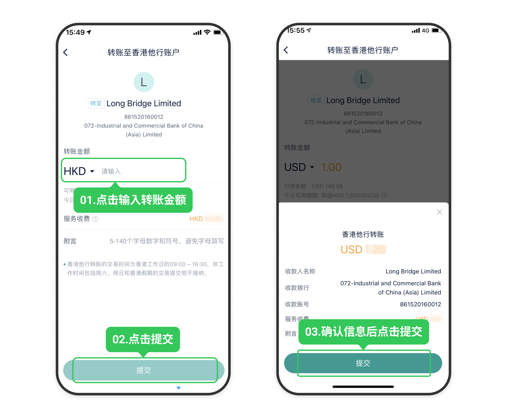
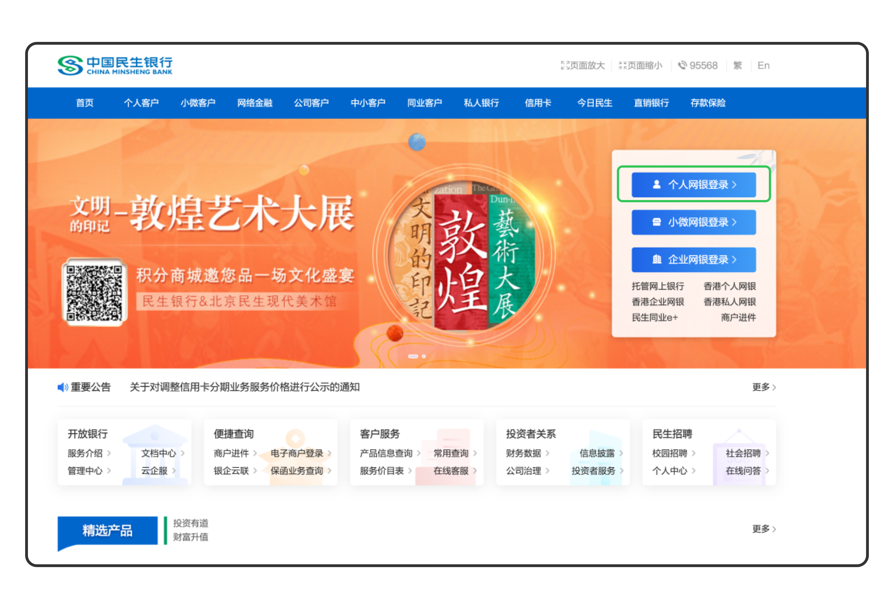
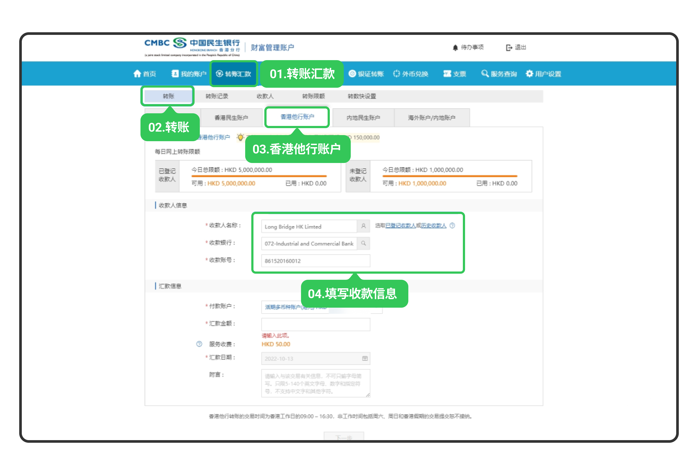

# 民生银行网银转账

通过民生香港 App 或网上银行将资金转至长桥，转账完成后上传凭证即可。

> 网银转账的到账时间、手续费及通用注意事项，见 [网银转账入金](/deposit/hk-methods/online-banking-transfer)。
>
> 如已在民生银行开通银证关联，可直接使用 [银证转账入金](/deposit/hk-methods/bank-securities-transfer)，无需上传凭证。

## 收款账户信息

**港元（工银亚洲 072）**

| 字段 | 内容 |
|------|------|
| 收款人名称 | Long Bridge HK Limited |
| 港元收款账号 | 861520160012 |
| 收款银行 | 中国工商银行（亚洲）有限公司 |
| 银行编号 | 072 |
| SWIFT 代码 | UBHKHKHHXXX |
| 银行地址 | 33/F, ICBC Tower, 3 Garden Road, Central, Hong Kong |

**美元（创兴银行 041）**

| 字段 | 内容 |
|------|------|
| 收款人名称 | Long Bridge HK Limited |
| 美元收款账号 | 256150608546 |
| 收款银行 | 创兴银行有限公司 |
| 银行编号 | 041 |
| SWIFT 代码 | LCHBHKHH |
| 银行地址 | Chong Hing Bank Centre, 24 Des Voeux Rd. Central, Hong Kong |

## 手机银行（民生香港 App）

1. 打开**民生香港 App** → **转账**

2. 选择转账方式：
   - **首次转账**：选择**香港他行转账**，手动填写收款人名称、收款银行和收款账号

     > 首次转账需手工填写全部字段，请仔细核对，不要填错。

   - **再次转账**：直接选择**最近收款人 / 已登记收款人**

   

3. 输入转账金额，点击**提交**，再次确认收款银行信息后再次点击**提交**，完成转账

   

4. 立即截图保留凭证，返回**长桥 App** → **资产** → **存入资金** → **网银转账**，上传凭证

   

## 网上银行

1. 登录**民生银行香港个人网上银行**（https://hkper.cmbc.com.cn）

   

2. 选择**转账汇款** → **转账** → **香港他行账户**，填写收款人信息和转账金额，点击**下一步**，完成安全验证，提示成功即汇款完毕

   

3. 立即截图保留凭证，返回**长桥 App** → **资产** → **存入资金** → **网银转账**，上传凭证

   

   > 凭证必须在汇款完成后立即上传，否则影响入金进度。
