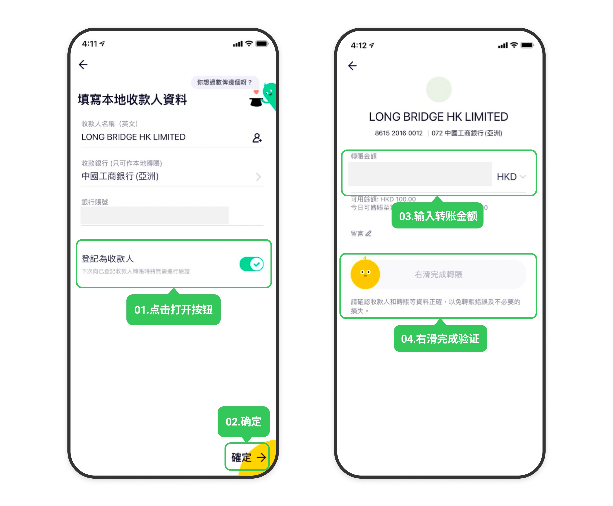

# 众安银行网银转账

通过众安银行 App 的银行账号转账功能将资金转至长桥，转账完成后上传凭证即可。

> 网银转账的到账时间、手续费及通用注意事项，见 [网银转账入金](/deposit/hk-methods/online-banking-transfer)。

## 收款账户信息

**港元（工银亚洲 072）**

| 字段 | 内容 |
|------|------|
| 收款人名称 | Long Bridge HK Limited |
| 港元收款账号 | 861520160012 |
| 收款银行 | 中国工商银行（亚洲）有限公司 |
| 银行编号 | 072 |
| SWIFT 代码 | UBHKHKHHXXX |
| 银行地址 | 33/F, ICBC Tower, 3 Garden Road, Central, Hong Kong |

**美元（创兴银行 041）**

| 字段 | 内容 |
|------|------|
| 收款人名称 | Long Bridge HK Limited |
| 美元收款账号 | 256150608546 |
| 收款银行 | 创兴银行有限公司 |
| 银行编号 | 041 |
| SWIFT 代码 | LCHBHKHH |
| 银行地址 | Chong Hing Bank Centre, 24 Des Voeux Rd. Central, Hong Kong |

## 操作步骤

1. 打开**众安银行 App** → **转账** → **银行账号转账**

2. 填写收款人资料，将「**登记为收款人**」开关打开，点击**确定**，输入转账金额，完成滑动验证后提交

   

3. 核对信息无误，确认提交，完成转账

4. 立即截图保留汇款凭证，返回**长桥 App** → **资产** → **存入资金** → **网银转账**，上传凭证

   

   > 凭证必须在汇款完成后立即上传，否则影响入金进度。
