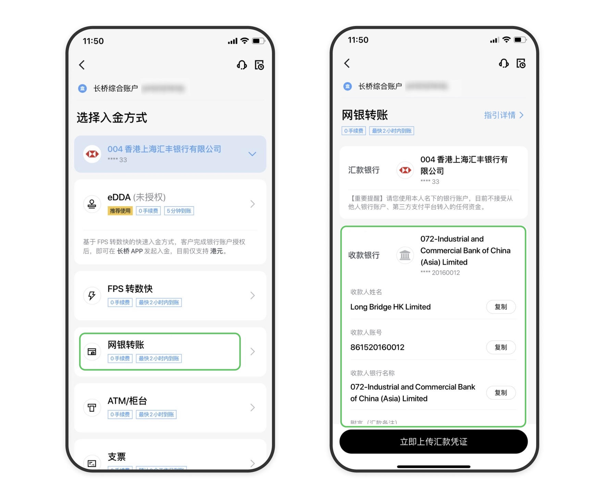

# 网银转账入金

通过手机银行或网上银行将资金转账至长桥收款银行账户，转账完成后需上传汇款凭证。

| 项目 | 说明 |
|------|------|
| 支持币种 | 港元（HKD）、美元（USD） |
| 预计到账时间 | 同行转账约 2 小时；跨行转账 1–3 个工作日 |
| 手续费 | 长桥免费；港币同行/跨行银行不收费；美元同行银行不收费；美元跨行：工银亚洲收 1.3 USD，中银香港/汇丰收 15 HKD |

## 收款银行信息

**港币收款账户（工商银行亚洲 072）**

- 收款人名称：Long Bridge HK Limited
- 港元收款账号：861520160012
- SWIFT 代码：UBHKHKHHXXX
- 汇款备注：证券账户名（账号 + 姓名），**必填**

**美元收款账户（创兴银行 041）**

- 收款人名称：Long Bridge HK Limited
- 美元收款账号：256150608546
- SWIFT 代码：LCHBHKHH
- 银行地址：Chong Hing Bank Centre, 24 Des Voeux Rd. Central, Hong Kong
- 汇款备注：证券账户名（账号 + 姓名），**必填**

针对香港地区银行持卡用户，长桥已上线 CHB 创兴银行作为跨行美元入金账户（网银转账），替代原 ICBC 工银亚洲账户（豁免每笔 USD 1.3 入金手续费）。2026 年 3 月 25 日已为无同行渠道的持卡用户全量开放上线。

**港币/美元收款账户（中银香港 012）**

- 收款人名称：Long Bridge HK Limited
- 港元收款账号：1287520564946
- 美元收款账号：1287520564962
- SWIFT 代码：BKCHHKHHXXX
- 银行地址：83 Des Voeux Road Central, Hong Kong

**港币/美元收款账户（汇丰银行 004）**

- 收款人名称：LONG BRIDGE HK LTD- CLIENT'S AC
- 港元收款账号：741733224001
- 美元收款账号：741733224201
- SWIFT 代码：HSBCHKHHHKH
- 银行地址：Level 3 & BL1, HSBC Main Building, 1 Queen's Road Central, Central, Hong Kong

费用承担方：SHA（共同）

**海外银行电汇入金（仅 USD）**

适用于美国、马来西亚、新加坡、澳大利亚等境外银行：
- 收款账号：861530198867
- 收款银行：072 中国工商银行（亚洲），SWIFT：UBHKHKHHXXX
- 预计到账时间：2–5 个交易日
- 仅支持 FATF 成员国家/地区，**不支持中国大陆内地银行卡**

## 操作步骤

1. 打开长桥 App，进入**资产 → 存入资金 → 选择入金币种 → 选择香港银行卡 → 网银转账**，查看收款银行信息

   

2. 在银行手机端或网页端完成转账，截图保留汇款凭证
3. 返回长桥 App，上传汇款凭证截图

   

> 请在汇款完成后立即上传凭证。若有多笔入账，请每笔分别上传凭证。

各银行操作指引：

- [中银香港网银转账入金](/deposit/hk-methods/ob-boc)
- [众安银行网银转账入金](/deposit/hk-methods/ob-za)
- [工银亚洲网银转账入金](/deposit/hk-methods/ob-icbc)
- [恒生银行网银转账入金](/deposit/hk-methods/ob-hase)
- [招行香港网银转账入金](/deposit/hk-methods/ob-cmb)
- [民生银行（香港）网银转账入金](/deposit/hk-methods/ob-minsheng)
- [汇丰银行网银转账入金](/deposit/hk-methods/ob-hsbc)
- [花旗银行网银转账入金](/deposit/hk-methods/ob-citi)
- [香港渣打银行网银转账入金](/deposit/hk-methods/ob-scb)

## 账户要求与工银多币种说明

- 转账银行账户名必须与证券账户名同名，不可使用他人或联名账户
- 不支持信用卡入金；若客户首次已通过信用卡汇款，需提供结单或汇款凭证对上信用卡账号及名字后方可正常加款，并提醒下次不要再使用信用卡入金；如未汇款则直接告知不支持，资金会原路退款处理
- 工银或其他银行有多币种账户时，**不接受 0 结尾的账户**
- 工银亚洲多币种账户：港币分币种账号尾号为 1 或 2，美元分币种账号尾号为 3 或 5，请汇款前确认
- 中银香港自 2025 年 11 月 1 日起，持卡客户无论是否完成见证，均支持中银同行入金
- 香港节假日不处理汇款业务，请预留时间
