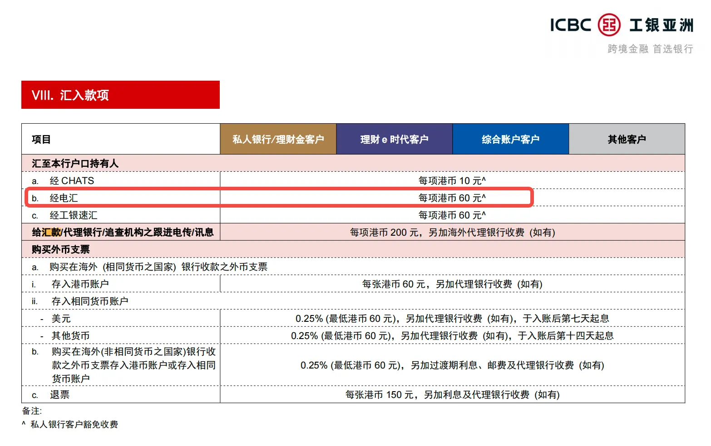

# 电汇入金

电汇仅支持**跨境银行卡**（非香港银行卡）转账入金，通过手机银行或网上银行操作。

| 项目 | 说明 |
|------|------|
| 支持币种 | 港元（HKD）、美元（USD） |
| 预计到账时间 | 预计 2–5 个交易日，取决于银行操作 |
| 手续费 | 长桥免费；国际电汇到工银亚洲收费 60 HKD（或等值外币）；中转银行可能额外收费 |

## 收款银行信息

中国工商银行（亚洲）有限公司

| 字段 | 内容 |
|------|------|
| 收款人名称 | Long Bridge HK Limited |
| 港元收款账号 | 861520160012 |
| 美元收款账号 | 861530198867 |
| 银行编号 | 072 |
| SWIFT 代码 | UBHKHKHHXXX |
| 银行地址 | 33/F, ICBC Tower, 3 Garden Road, Central, Hong Kong |

## 操作步骤

1. 在长桥 App 查看收款银行账户信息（资产 → 存入资金 → 选择币种 → 电汇）
2. 通过手机银行或网上银行，将资金从跨境银行卡转至长桥收款账户
3. 完成汇款后保留汇款凭证截图
4. 返回长桥 App，上传汇款凭证

> 完成转账后请立即上传凭证，否则影响入金进度。

## 支持的国家和地区

仅支持 FATF 成员国家/地区的跨境银行转账。请勿使用非 FATF 成员国家/地区的银行卡转账，入金会被退回且退款手续费由客户自行承担。

## 账户要求与大陆银行卡限制

- 暂不接受中国大陆银行发行的银行卡转账，款项将退回，产生的手续费不退还
- 转账银行账户名必须与证券账户名同名，不可使用他人账户转账，否则产生的退款费用由客户自身承担
- 客户需要在其所属的银行已登记有效的手机号码或者电邮地址和最新签发的证件等重要信息
- 银行间后台处理汇款申请需要一定时间，银行通知「已汇出」不等于长桥证券已收到款项；资金到达长桥证券后需进行结算与审批
- 银行和长桥证券在香港公众假期均不处理汇款业务，请预留好汇款处理时间
- 不接受直接存入现金
