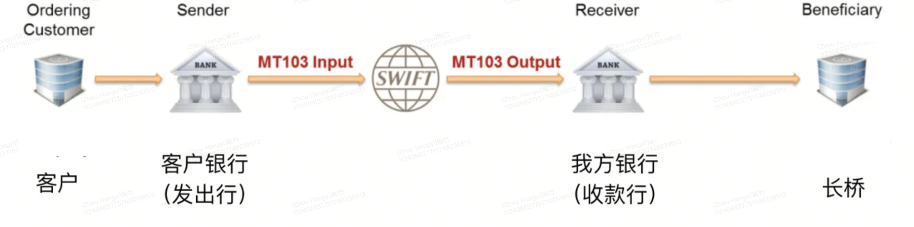
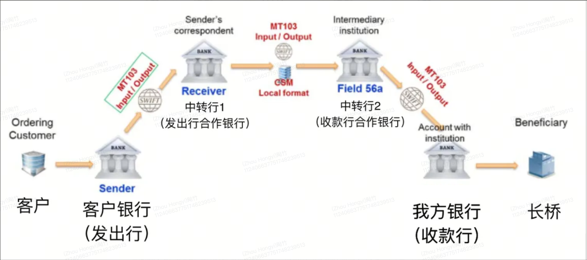

# MT103 汇款回执

MT103 国际电汇报文格式、关键字段说明及手续费承担方式，用于追踪电汇入金进度。

## 什么是 MT103

MT103 是国际银行间通用的电汇报文格式，用于记录和传递跨行转账信息。只要有电汇转账就会生成 MT103 报文，在银行系统内部流转。当电汇入金到账较慢时，可向汇款银行索取 MT103 报文，用于追踪汇款进度。

## 电汇路径

### 香港境内汇款

客户银行（发出行）发送 MT103 报文 → 长桥收款银行（收款行）收到报文并匹配信息 → 长桥分配资金到客户账户。

### 国际跨境汇款

客户银行（发出行）发送 MT103 报文 → 中转行 1（与发出行合作的国际大行）→ 中转行 2（与收款行合作）→ 长桥收款银行（收款行）匹配信息 → 长桥分配资金到客户账户。

注意：中转行不限于 1-2 家，如双方合作银行之间无法直接传送报文，可能存在更多中转行，这也是跨境电汇耗时较长的原因。

## MT103汇款回执关键字段

| 字段 | 名称 | 用途 |
|------|------|------|
| 20 | 汇款银行编号 | 用于查询实际汇款行 |
| 32A | 汇款时间和金额 | 核实发出时间、币种和金额（发出行扣除手续费后的已结算金额） |
| 50K | 汇款方信息 | 核实汇款方名称和地址 |
| 56A | 收款方银行代理行 | 查看代理行和中间行信息，包括 SWIFT/BIC 代码 |
| 57A | 收款方银行 | 核实收款方银行信息，包括 SWIFT/BIC 代码和名称 |
| 59 | 收款方信息 | 核实收款方名称和地址 |
| 70 | 汇款附言 | 汇款方填写的备注信息 |
| 71A | 手续费承担方式 | SHA = 共同承担（默认），BEN = 收款方承担，OUR = 汇款方承担 |

SWIFT 代码统一为 11 位数，位数不够时系统会用「XXX」补齐，对汇款无影响。

## 手续费承担方式说明

- **SHA**（共同承担）：一般默认选项，后程费用基本由收款方承担
- **BEN**（收款方承担）：所有手续费由收款方承担
- **OUR**（汇款方承担）：汇款方承担大部分费用

## MT202 与补足付款

在正常电汇流程中，银行使用 MT103 完成转账。但如果汇款银行检测到客户有异常操作（如突然大额转账）或需要进一步核实身份，会先正常发出 MT103 报文，同时对汇款进行审查。核实通过后，银行会补发 **MT202 报文**（补足付款报文）来完成资金实际划转。

这是电汇入金有时出现额外延迟的原因之一——资金实际到账需等待银行完成审查并发出 MT202。

## 如何使用 MT103

如电汇入金长时间未到账，可联系汇款银行索取 MT103 报文，并提供给长桥客服协助追踪资金状态。
