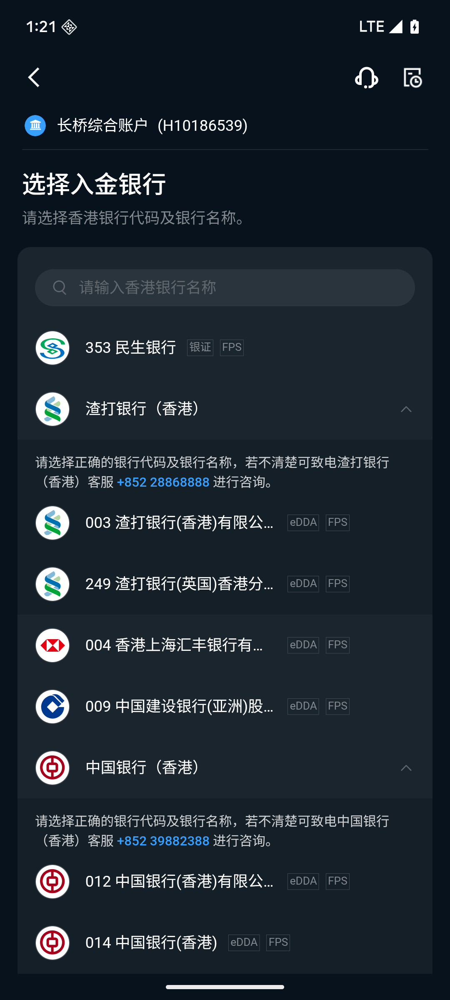
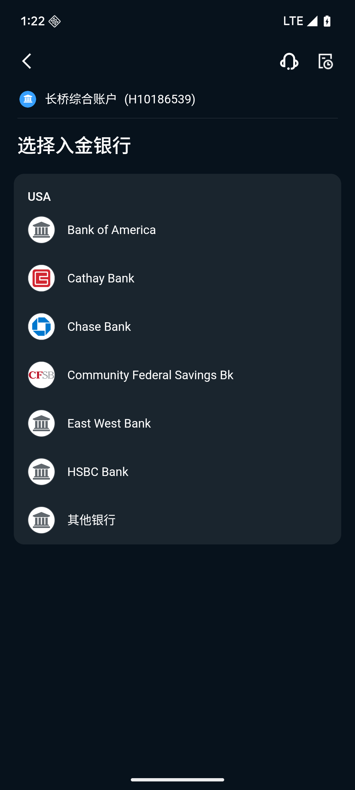
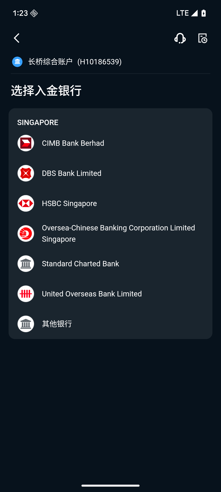
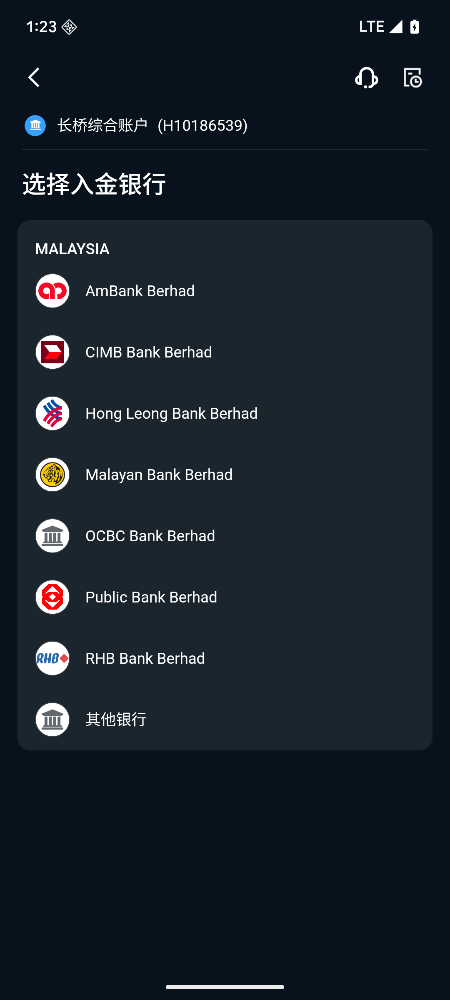
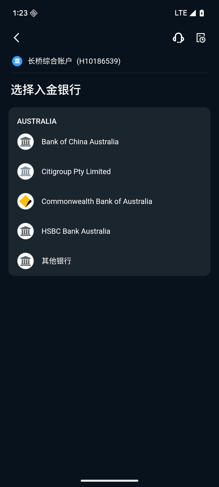

# 支持银行列表

香港账户支持绑定香港本地及海外多个地区的银行卡。香港本地银行可通过 eDDA、FPS 或银证转账入金；海外银行通过电汇入金。实际支持情况以长桥 App 入金页面为准。

---

## 香港地区银行

### 支持 eDDA + FPS 的银行

| 银行代码 | 银行名称          | SWIFT       |
|------|---------------|-------------|
| 003  | 渣打银行（香港）有限公司  | SCBLHKHHXXX |
| 249  | 渣打银行（英国）香港分行  |             |
| 004  | 香港上海汇丰银行有限公司  | HSBCHKHHHKH |
| 009  | 中国建设银行（亚洲）股份有限公司 | CCBQHKAX    |
| 012  | 中国银行（香港）有限公司  | BKCHHKHHXXX |
| 014  | 中国银行（香港）      |             |
| 019  | 中国银行（香港）      |             |
| 026  | 中国银行（香港）      |             |
| 030  | 中国银行（香港）      |             |
| 031  | 中国银行（香港）      |             |
| 033  | 中国银行（香港）      |             |
| 036  | 中国银行（香港）      |             |
| 064  | 中国银行（香港）      |             |
| 070  | 中国银行（香港）      |             |
| 338  | 中国银行（大陆）香港分行  |             |
| 015  | 东亚银行有限公司      | BEASHKHH    |
| 016  | 星展银行（香港）      | DHBKHKHH    |
| 018  | 中信银行（国际）      | KWHKHKHH    |
| 020  | 招商永隆银行        | WUBAHKHH    |
| 024  | 恒生银行          | HASEHKHH    |
| 025  | 上海商业银行        | SCBKHKHHXXX |
| 035  | 华侨永亨银行        | WIHBHKHH    |
| 039  | 集友银行          | CIYUHKHHXXX |
| 040  | 大新银行          | DSBAHKHH    |
| 041  | 创兴银行          | LCHBHKHH    |
| 043  | 南洋商业银行        | NYCBHKHH    |
| 072  | 中国工商银行（亚洲）    | UBHKHKHH    |
| 214  | 中国工商银行        |             |
| 128  | 富邦银行          | IBALHKHHXXX |
| 222  | 中国农业银行        | ABOCHKHHXXX |
| 238  | 招商银行香港分行      | CMBCHKHH    |
| 250  | 花旗银行（香港）      | CITIHKAXXXX |
| 377  | 兴业银行          | FJIBHKHH    |
| 382  | 交通银行（香港）      | COMMHKHK    |
| 385  | 平安银行          | SZDBHKHHXXX |
| 387  | 众安银行          | AABLHKHH    |
| 388  | LIVI Bank     | LIVIHKHH    |
| 389  | MOX Bank      | MOXBHKHK    |
| 390  | WeLab 汇立银行    | WEDIHKHH    |
| 393  | Ant Bank 蚂蚁银行 | ASEHHKHH    |
| 395  | Airstar 天星银行  | AIRRHKHH    |

### 支持银证转账 + FPS 的银行

| 银行代码 | 银行名称 | SWIFT       | 支持币种                |
|------|------|-------------|---------------------|
| 353  | 民生银行 | MSBCHKHHXXX | HKD（银证+FPS）、USD（银证） |

### 仅支持 FPS 的银行

| 银行代码 | 银行名称             | SWIFT       |
|------|------------------|-------------|
| 006  | 花旗银行香港分行         | CITIHKHXXXX |
| 022  | 华侨银行             | OCBCHKHHXXX |
| 027  | 交通银行香港分行         | COMMHKHH    |
| 028  | 大众银行（香港）         | CBHKHKHHXXX |
| 032  | 星展银行             | DHBKHKHHXXX |
| 038  | 大有银行             | TYBLHKKWXXX |
| 052  | 星展银行             |             |
| 055  | 美国银行             | BOFAHKHX    |
| 061  | 大生银行             | TSBLHKHHXXX |
| 071  | 大华银行有限公司         | UOVBHKHH    |
| 103  | 瑞银香港             | UBSWHKHHXXX |
| 152  | 澳新银行集团有限公司       |             |
| 185  | 星展银行香港分行         | DBSSHKHH    |
| 221  | 中国建设银行（亚洲）       |             |
| 241  | 永丰商业银行股份有限公司     | SINOHKHHXXX |
| 258  | 华美银行             | EWBKHKHHXXX |
| 272  | 新加坡银行有限公司        | INGPHKHHXXX |
| 274  | 王道商业银行股份有限公司     |             |
| 345  | 上海浦东发展银行香港分行     | SPDBHKHH    |
| 384  | 摩根士丹利银行亚洲        |             |
| 391  | 富融银行             | IFFUHKHH    |
| 392  | PAO Bank 平安壹账通银行 | PONCHKHHXXX |

未列出的香港银行可通过网银转账或电汇入金。

---

## 海外地区银行

以下为各地区常见银行，均通过电汇入金。

### 美国

| 银行名称            | SWIFT       |
|-----------------|-------------|
| Bank of America              | BOFAUS3N    |
| Cathay Bank                  | CATHUS6L    |
| Chase Bank                   | CHASUS33    |
| Community Federal Savings Bk |             |
| East West Bank               | EWBKUS66XXX |
| HSBC Bank                    | MRMDUS33    |
| 其他银行                         |             |

### 新加坡

| 银行名称                    | SWIFT    |
|-------------------------|----------|
| CIMB Bank               | CIBBSGSG |
| DBS Bank                | DBSSSGSG |
| HSBC Singapore          | HSBCSGS2 |
| OCBC Bank               | OCBCSGSG |
| Standard Chartered Bank | SCBLSG22 |
| UOB Bank                | UOVBSGSG |
| 其他银行                    |          |

### 马来西亚

| 银行名称                   | SWIFT    |
|------------------------|----------|
| AmBank Berhad          | ARBKMYKL |
| CIMB Bank Berhad       | CIBBMYKL |
| Hong Leong Bank Berhad | HLBBMYKL |
| Malayan Bank (Maybank) | MBBEMYKL |
| OCBC Bank Berhad       | OCBCMYKL |
| Public Bank Berhad     | PBBEMYKL |
| RHB Bank Berhad        | RHBBMYKL |
| 其他银行                   |          |

### 澳大利亚

| 银行名称                           | SWIFT       |
|--------------------------------|-------------|
| Bank of China Australia        | BKCHAU2AXXX |
| Citigroup Pty Limited          |             |
| Commonwealth Bank of Australia | CTBAAU2S    |
| HSBC Bank Australia            | HKBAAU2S    |
| 其他银行                           |             |

未列出的银行也支持电汇入金，以长桥 App 入金页面为准。

---

## 入金方式说明

| 入金方式    | 适用范围        | 特点                   |
|---------|-------------|----------------------|
| eDDA    | 香港本地银行（部分）  | 快捷扣款，免费，预计 5 分钟到账    |
| FPS 转数快 | 香港本地银行（大部分） | 即时转账，免费，预计 2 小时到账    |
| 银证转账    | 仅民生银行       | 免费，预计 5 分钟到账，支持港元和美元 |
| 网银转账    | 所有香港银行      | 同行约 2 小时，跨行 1-3 个工作日 |
| 电汇      | 海外银行        | 2-5 个工作日，可能产生中转行费用   |

各入金方式的操作流程见对应文档。

## 香港银行代码查询

香港银行代码为三位数字，用于本地银行间结算。部分银行（如中国银行香港）下设多个分行，各有独立代码，入金时需确认所属分行代码。

- [银行代码总览（PDF）](https://www.wfsfaa.gov.hk/sfo/pdf/common/Form/tsfs/bank_code.pdf)
- [银行代码在线查询](https://bank-codes-hk.com/hong-kong-bank-code-search/)
