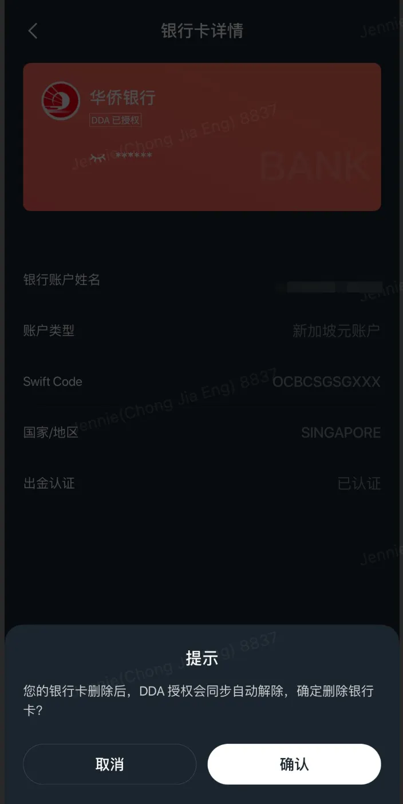
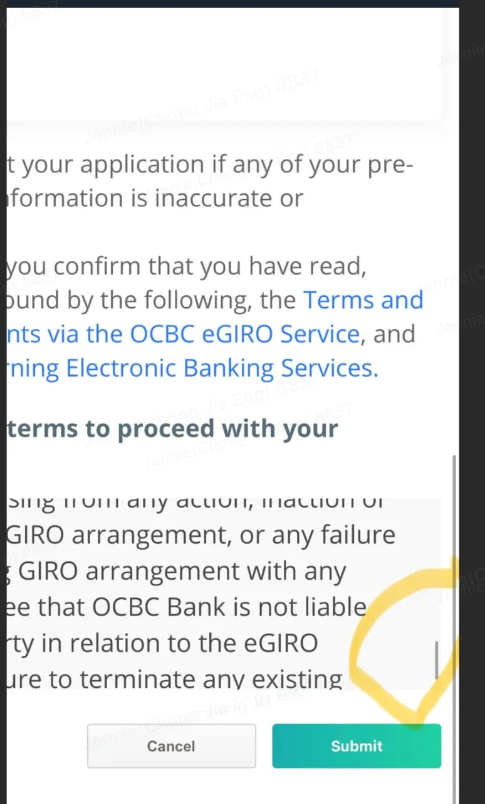

# DDA 入金

DDA（Direct Debit Authorisation）是新加坡银行与长桥证券合作的授权转账服务。将银行账户与长桥账户绑定后，可直接从长桥 App 发起新元入金，无需上传入金凭证。

注意：DDA 是新加坡账户服务，与香港账户的 eDDA（基于 FPS 转数快系统）是不同的服务。

| 项目 | 说明 |
|------|------|
| 支持币种 | 新加坡元（SGD） |
| 预计到账时间 | 实时到账 |
| 手续费 | 免费 |

## 第一步：完成 DDA 授权

1. 打开长桥 App，进入**资产 → 全部功能 → 存入资金 → SGD → DDA**，按页面指引发起授权
2. 确认银行端的证件信息与长桥端一致（不一致可在 App 的 DDA 授权页面更新证件）
3. 授权时需**完整阅读条款并划到底端**，才能点击「Submit」提交（中途取消会导致授权失败）
4. 等待授权结果通知

## 第二步：发起入金

授权成功后，在长桥 App 的 DDA 入金页面输入入金金额，点击提交即可。无需上传入金凭证。

## 解除 DDA 授权

解除授权需在长桥 App 和银行端**双向操作**：

1. 在长桥 App 入金页面删除该银行账户
2. 在银行端操作解除 DDA 绑定

> 仅操作一端不会彻底解除：仅在 App 删除不会解除银行端授权；仅在银行端解除，App 不会自动更新，继续入金会显示失败。

## 常见授权失败原因

| 错误码 | 含义 |
|--------|------|
| 1209（Refer to your payer/payee） | 银行账户余额或额度不足 |
| 1100（Other reason） | 曾在银行端删除 DDA 绑定，需联系客服关闭旧记录后重新授权 |
| ID number verification failed | 长桥注册的身份证号与银行端不一致 |
| BA3002（Consent not given） | 授权页面条款未完整阅读即取消，需重新操作并完整阅读后提交 |

## 出金限制与账户信息一致性

- DDA 不支持出金
- 银行端证件信息需与长桥开户信息一致
