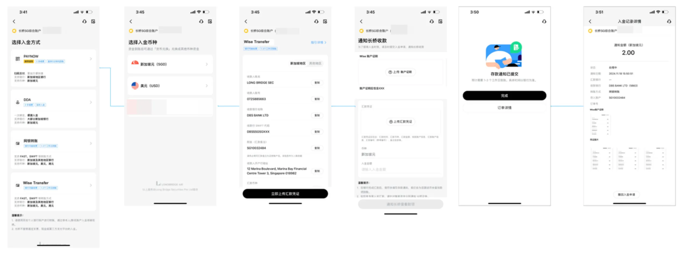

# Wise 入金与出金

Wise（原名 TransferWise）是国际汇款和货币转换服务平台，可以较低费用完成国际转账，将资金转入或转出长桥新加坡账户。

## 入金

| 项目 | 说明 |
|------|------|
| 支持币种 | 美元（USD）、新加坡元（SGD） |
| 预计到账时间 | 约 5 分钟至 3 个工作日，取决于入金币种 |
| 手续费 | 长桥免费；Wise 平台可能收取汇款手续费，以 Wise 实际收取为准 |

## 收款账户信息

| 字段 | 内容 |
|------|------|
| 账户持有人 | LONG BRIDGE SEC |
| 银行账号 | 0725885663 |
| 银行名称 | DBS BANK LTD |
| SWIFT/BIC | DBSSSGSGXXX |
| 汇款备注 | 填写证券账户号（如 SG10039100），**必填** |

## 操作步骤

1. 打开长桥 App，进入**资产 → 全部功能 → 存入资金 → 选择币种（USD 或 SGD）→ Wise**，查看并复制收款账户信息

   
2. 在 Wise App 或网页端填入收款账户信息，汇款备注填写你的证券账户号（必填）
3. 完成汇款后，在 Wise App 截图（需包含 Wise 账号及汇款至 Long Bridge 的交易记录页面）
4. 返回长桥 App，上传汇款凭证截图

## 单向限制与同名账户要求

- 首次通过 Wise 入金后，可以入金但不能通过 Wise 出金
- 不接受第三方汇款（非本人账户），退回资金产生的手续费由客户自行承担
- 转账账户名必须与长桥证券账户名同名

## 出金

| 项目 | 说明 |
|------|------|
| 支持币种 | 美元（USD）、新加坡元（SGD）、港元（HKD） |
| 预计到账时间 | 审核约 1 个工作日，出金 1–3 个工作日 |
| 手续费 | 长桥不收费；银行可能收费，具体以实际到账为准 |

### 出金操作步骤

打开长桥 App，进入**资产 → 全部功能 → 提取资金**，选择币种（新币、港币或美元），填写收款信息后提交。
