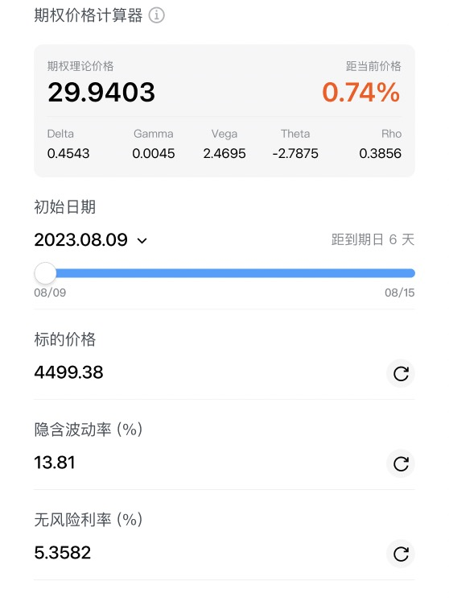
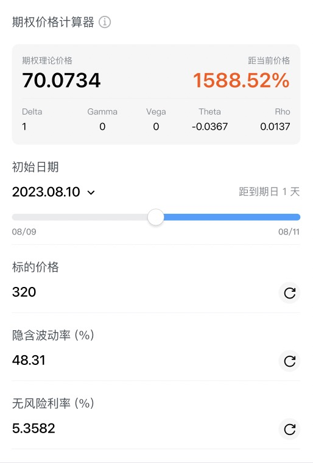
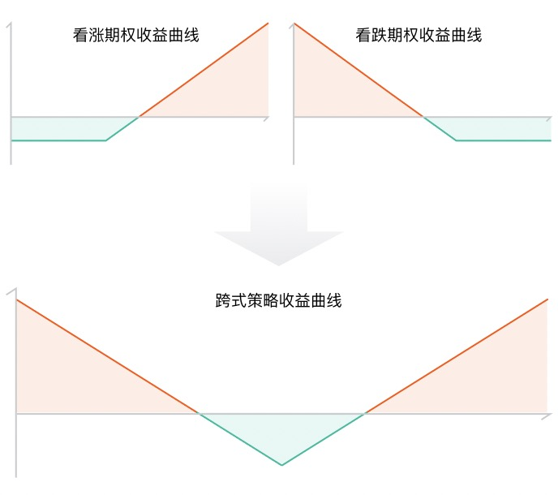
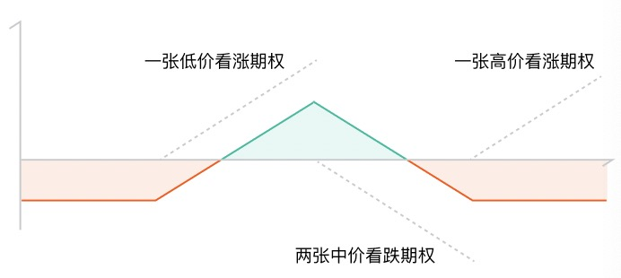

# 期权计算器

期权计算器基于 Black-Scholes 模型，通过调整关键参数，模拟期权的理论价格和希腊字母，帮助用户评估不同市场情景下的期权价值。

## 入口

个股详情页 > 期权链 > 点击合约 > 期权详情页 > 期权计算器

## 输入参数

| 参数 | 说明 |
|------|------|
| 标的价格 | 正股当前价格，默认取实时市价，可手动修改 |
| 隐含波动率 (%) | 市场对未来波动的预期，默认取当前合约的隐含波动率，可手动修改 |
| 无风险利率 (%) | 无风险收益率，默认取当前利率（如美国国债利率），可手动修改 |
| 初始日期 | 计算起始日期，默认为今日，可通过滑动条调整至到期日之前的任意日期 |

> 初始日期下方展示从起始日到到期日的剩余天数（如"距到期日 260 天"），方便直观感受时间价值的衰减。

## 输出结果

### 期权理论价格

根据上述参数，由 Black-Scholes 公式计算出的期权理论价值，同时展示与当前市场价格的偏差百分比（如 `-14.75%` 表示理论价格低于市价）。

### 希腊字母

| 字母 | 含义 |
|------|------|
| Delta | 标的价格变动 1 元时，期权价格的预期变动量；Call 的 Delta 为正，Put 为负 |
| Gamma | Delta 本身的变化速度，即标的价格变动 1 元时 Delta 的变化量 |
| Vega | 隐含波动率每变动 1% 时，期权价格的预期变动量 |
| Theta | 每过一天，期权价格因时间流逝而减少的金额（时间价值衰减），通常为负值 |
| Rho | 无风险利率每变动 1% 时，期权价格的预期变动量 |

## 使用场景

**情景模拟**：在买入前，调整标的价格，预测正股涨跌对期权价值的影响。

**波动率分析**：修改隐含波动率，评估 IV 压缩或扩张时期权价格的变化（常用于财报前后的判断）。

**时间价值评估**：拖动初始日期滑条，观察随着临近到期日，Theta 如何加速侵蚀期权价值。

**利率敏感度**：对于长期期权（LEAPS），无风险利率的变化影响更显著，可通过 Rho 评估利率风险。

## 典型应用案例

### 场景一：单边买入策略 — 判断当前价格是否合理

期权的理论价格通过定价模型计算得出，实际价格受市场供需、大盘走势等多方面因素影响，从而与理论价格产生一定差距。如果想避免买入被明显高估的期权、尽量买入低估的期权，可运用期权计算器进行判断：

### 场景二：单边买入策略 — 预判盈利空间

得知某公司上季度销量暴增，想买入相关期权获利时，可结合预期股价，通过期权计算器预判届时关注的期权将上涨到什么价格：

### 场景三：跨式价差策略 — 判断盈亏边界

当方向不明但预期标的将大幅波动时（如重大经济数据发布前），可采取跨式期权策略（同时买入相同行权价的 Call 和 Put）。跨式策略的收益曲线呈 V 型，其盈亏平衡点可通过期权计算器精确确定：

### 场景四：蝶式套利策略 — 判断盈亏边界

如果预估标的将在小幅范围内波动，可买入一张低价位看涨期权和一张高价位看涨期权，同时卖出两张中价位看涨期权，形成蝶式套利。可运用与场景三类似的方法，通过期权计算器确定盈亏边界，得出大概在什么波动区间内会盈利：

## 模型限制与免责说明

- 计算结果基于 Black-Scholes 模型，仅供参考，不代表实际成交价格。
- 实际市场价格受供需、流动性等因素影响，可能与理论价格存在差异。
- 点击「查看免责声明」了解更多说明。
