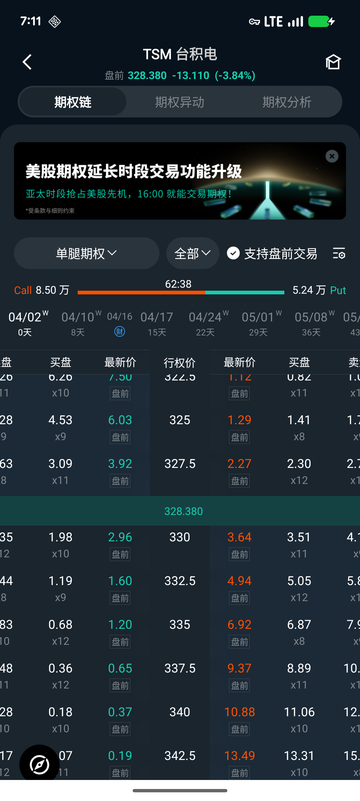

# 期权链

期权链页面集中展示某支股票所有可交易期权合约，方便快速筛选到期日、行权价，以及对比 Call 和 Put 的行情数据。

## 进入期权链

在股票详情页顶部 Tab 栏切换至「期权链」，即可查看该标的的所有期权合约。

页面顶部显示标的股票名称、当前价格及涨跌幅（含交易时段标识）。

## 页面布局

期权链页面分为三个层次：

1. **筛选栏**：策略类型 + Call/Put 方向选择
2. **Call:Put 成交量统计**：展示多空情绪比例
3. **到期日横向滚动列表**：快速切换不同到期日
4. **合约列表**：以行权价为中轴，左侧为 Call、右侧为 Put，当前股价所在行以蓝色高亮（价内期权也以蓝色标注）

## 策略类型

点击筛选栏左侧的策略选择器可切换策略类型：

- **单腿期权**：单个 Call 或 Put 合约

组合策略（如价差、跨式等）在相应选项下展示。

## Call / Put 方向筛选

点击方向选择器可在以下选项间切换：

| 选项   | 说明                 |
|------|--------------------|
| 全部   | 同时显示 Call 和 Put 两列 |
| Call | 仅显示看涨期权            |
| Put  | 仅显示看跌期权            |

选择「全部」时，行权价居中显示，Call 在左、Put 在右；选择单一方向时，数据列更宽，便于查看更多字段。

## Call:Put 成交量比

筛选栏中间显示当日 Call 和 Put 的成交量及比例，例如「62:38」表示当日 Call 成交量占 62%、Put 占 38%，可快速感知市场多空倾向。

## 到期日选择

横向滑动到期日列表选择目标到期日，每个到期日标签显示：

- 日期（如 04/17）
- 距今天数（如 15 天）
- 角标「W」表示周期权（Weekly），无角标为月期权

当前选中的到期日会高亮显示。

## 合约列表数据列

合约列表左右两侧各展示若干行情字段，可通过右上角**布局设置**按钮自定义。常见字段包括：

| 字段        | 说明                   |
|-----------|----------------------|
| 最新价       | 期权合约当前成交价            |
| 涨跌幅       | 相较昨收的涨跌百分比           |
| 成交量       | 当日成交合约张数             |
| 未平仓数      | 当前持仓合约总数             |
| 隐含波动率（IV） | 由期权价格反推的市场预期波动率      |
| Delta     | 标的价格变动 1 单位时期权价格的变化量 |

价内（ITM）合约行以蓝色背景标识；当前标的价格所在行以分隔线标注，便于区分实值与虚值期权。

## 盘前交易

勾选「支持盘前交易」复选框后，列表将包含可在盘前时段交易的期权合约。

## 布局设置

点击右上角设置图标，可调整合约列表显示的数据列：选择要展示的字段并拖动排序，设置实时生效。

## 进入合约详情

点击任意期权合约行，进入该期权的详情页，可查看完整行情数据（Delta、Gamma、Theta、Vega、Rho、隐含波动率、历史波动率等）、K
线图表、期权计算器，以及发起买入/卖出下单。
