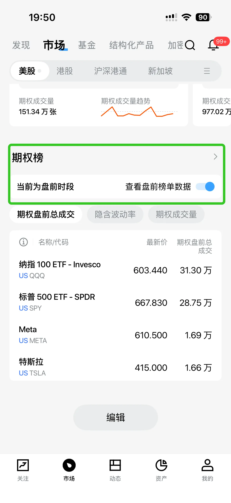
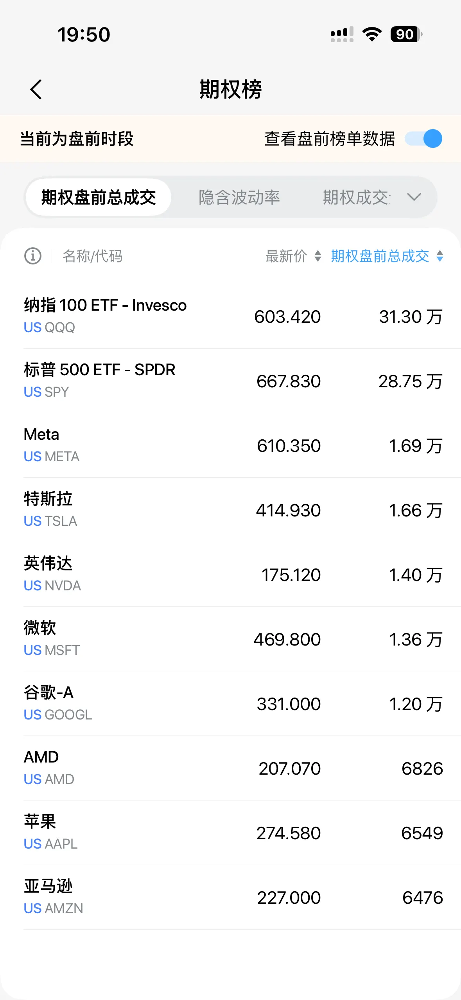
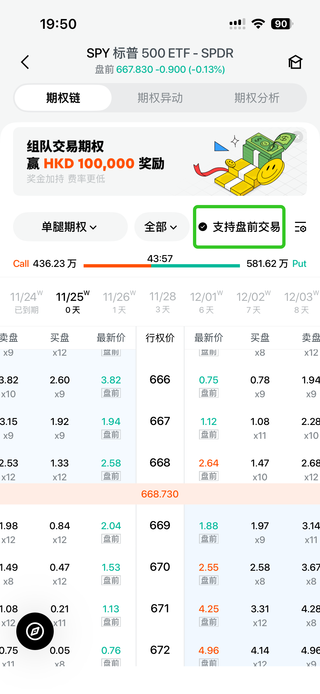
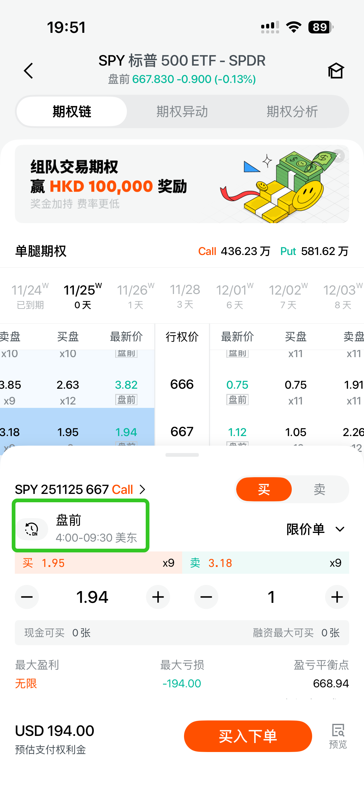
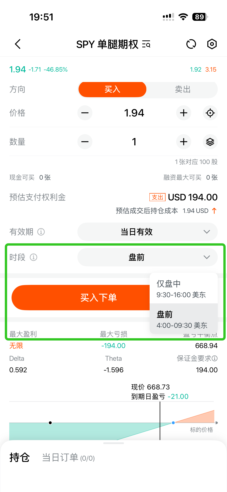
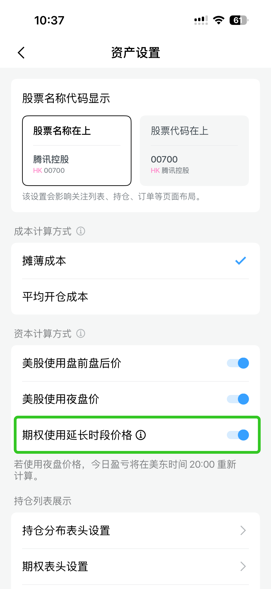

# 期权延伸时段

期权盘前交易是长桥与特定做市商合作的延长时段报价撮合，非交易所正式盘。在盘前时段可委托期权订单，做市商会尝试成交撮合，帮助投资者更早响应市场变化。

## 交易时间

期权盘前交易时段：美东时间周一至周五 04:00 - 09:30（与股票盘前时段一致）

## 支持标的

当前开放部分热门股票和 ETF 期权的近期合约支持盘前交易。

目前支持的正股包括：QQQ、SPY、AAPL、AMD、AMZN、GOOGL、META、MSFT、NVDA、TSLA
做市商将持续评估并更新支持的标的名单，更多标的扩展中。

查看方式：
- 长桥 App **期权盘前交易榜单**，实时查看支持的正股列表

- 期权链页面：勾选「支持盘前交易」筛选，带「盘前」标签的价格为盘前最新报价

## 如何交易

在盘前时段（美东 04:00 - 09:30），进入支持期权盘前交易的期权链页面，点击期权合约，在底部交易抽屉中选择「盘前交易 4:00 - 9:30」类型即可委托。

首次交易时 App 会引导签署相关风险声明，完成后即可继续交易。

### 订单规则

- 仅支持限价单
- 订单仅当日有效，不支持提前预埋
- 正式开盘前未成交的盘前订单会被系统自动撤销
- 盘前时段暂不支持卖空。已持有的期权如支持盘前交易，可在该时段卖出平仓

盘前交易为做市商非公开撮合模式，委托不会进入公开的 BBO（最佳买卖盘），因此在订单簿中不可见；报价匹配时即可成交。

盘前时段期权参与计算账户整体风控指标，如触发 Margin Call，实际平仓操作会在开盘后执行。

极端情况下，盘前成交的订单可能因开盘后正股异常状态（如停牌）而被取消；取消后金额和持仓恢复至盘前交易前状态，不产生损失。

### 收费

期权盘前交易与常规时段计费规则相同，无特殊收费。暂不支持使用期权现金卡和免佣卡。

推广期间，所有客户的盘前期权订单佣金及平台费全免（先收后返），直至另行通知。

## 盈亏与资产设置

App 支持自定义是否使用盘前价格计算期权持仓市值和盈亏。设置路径：我的 - 设置 - 资产设置 - 开启或关闭「期权使用延长时段价格」。

