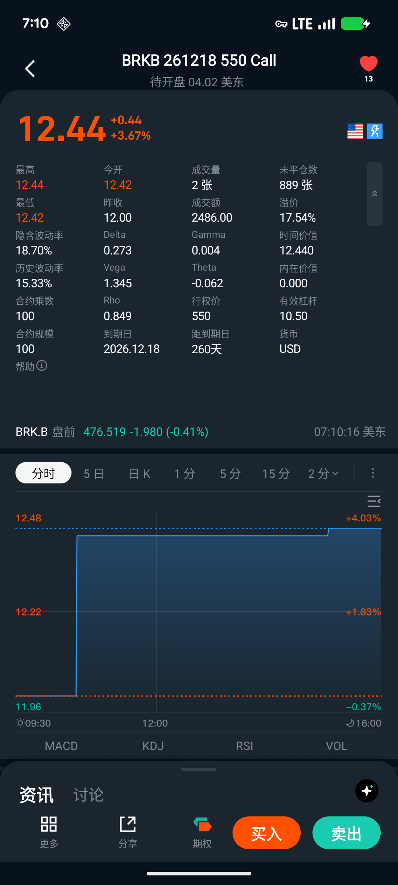

# 期权交易入门

在本教程结束时，你将完成第一笔看涨期权的买入，并通过卖出平仓，走完一个完整的期权交易周期。

完成这个教程大约需要 **15 分钟**，需要在美股交易时间内操作（美东时间周一至周五 09:30–16:00）。

## 开始前的准备

确认以下两项：

- 账户已开通**一级期权权限**（可交易 Long Call 和 Long Put）
- 账户中有足够美元余额（至少 200–500 USD，用于支付权利金）

如果尚未开通期权权限，请先完成[开通期权交易](/derivatives/options/enable-options)。

> 本教程只涉及**买入看涨期权（Long Call）**。最大亏损限于支付的权利金，无其他额外风险。

## 第一步：找到目标股票

点击 App 搜索图标，输入 **AAPL**（苹果公司）。

进入 AAPL 股票详情页，查看顶部显示的**当前股价**。记下这个价格，接下来选择行权价时会用到。

> 本教程用 AAPL 举例——它是流动性最好的美股期权标的之一，买卖价差较小，适合入门。你也可以换成任何你熟悉的美股。

## 第二步：进入期权链

在 AAPL 详情页顶部 Tab 栏中，点击**「期权链」**。

你会进入期权链页面，顶部横向排列着不同的到期日。

## 第三步：选择到期日

在到期日列表中，选择一个**距今 2–4 周**的到期日。

你会看到有些标记了「W」，代表周期权；没有标记的是月期权。选一个**月期权**（无「W」标记）——它的流动性更好，买卖价差更小。

选好到期日后，合约列表会更新。

## 第四步：选择行权价

确认筛选栏方向为**「Call」**（看涨）。

合约列表以当前股价为中轴排列，**蓝色背景的行**是价内期权（行权价低于当前股价），**白色背景的行**是价外期权。

找到**刚好高于当前股价的第一或第二行**（轻度价外 Call），点击进入合约详情页。

> 第一次操作选轻度价外即可。行权价与权利金的取舍关系，见[期权买方](/derivatives/options/options-buyer)。

## 第五步：买入 1 张看涨期权

在合约详情页：

1. 查看右下角**「买入」**按钮旁显示的**买价（Ask）**——这是你需要支付的权利金单价
2. 记住：1 张合约 = 100 股，**总权利金 = 权利金单价 × 100**
3. 点击**「买入」**

在下单面板中：
1. 确认方向：**买入（Buy to Open）**
2. 数量：填 **1**（张）
3. 委托类型：选**限价**，价格填当前 Ask 价（或略高 1–2 分以确保成交）
4. 确认预估总金额（即你需要支付的权利金）
5. 点击提交，再点确认

你会看到提示「订单已提交」。

## 第六步：确认持仓

进入**资产 → 持仓**，切换到**「期权」**标签。

你会看到刚才买入的期权合约，显示：
- 持仓数量：1 张（正数 = 多头 = 买方权利）
- 权利金成本：你支付的总金额
- 当前市值：随标的股价实时变化

**恭喜！你已完成第一笔期权买入。**

## 第七步：卖出平仓（关闭仓位）

持有期权时，有三种结果：

**主动平仓（推荐）**：在到期前任何时间，在持仓页面点击该期权合约，选**「卖出」**，即可按当前市价卖出平仓，获得当前市值的权利金收入，结束这笔交易。

**到期价内自动行权**：若到期时股价高于行权价，期权自动行权，你将以行权价买入 100 股 AAPL 正股（需账户有足够美元余额）。

**到期价外自动作废**：若到期时股价低于行权价，期权自动作废，损失全部权利金——这也是你的最大亏损上限。

---

走完这个流程，你已经体验了期权的完整周期：选标的 → 读期权链 → 买入 → 持仓 → 平仓。

- 深入理解盈亏结构：[期权买方](/derivatives/options/options-buyer)
- 看期权链数据字段含义：[期权链](/derivatives/options/options-chain)
- 使用计算器估算到期盈亏：[期权计算器](/derivatives/options/options-calculator)
