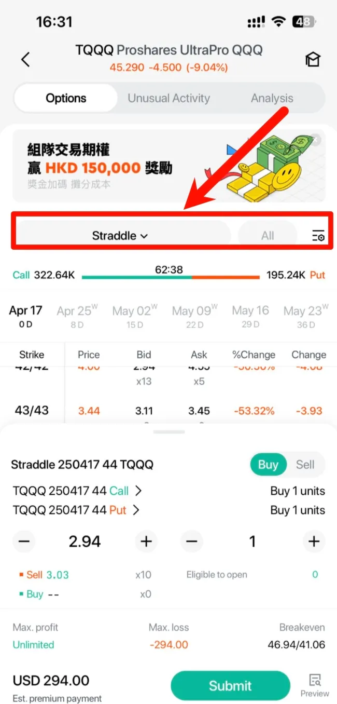
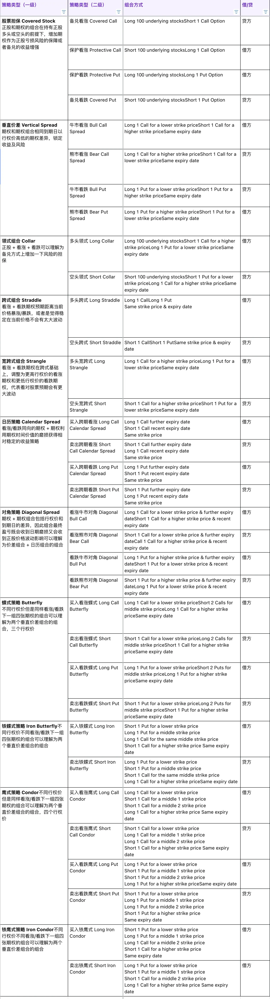

# 期权策略

单腿与多腿期权区别、组合保证金机制、常见期权策略和对比。

## 单腿期权与多腿期权

**单腿期权**：仅涉及单一合约的买入或卖出（如单独买入看涨或看跌期权），不涉及任何组合。

**多腿期权（期权策略）**：利用不同行权价、到期日、看涨/看跌的期权盈亏特征，以多腿订单方式委托期权 + 期权或期权 + 股票的组合，通过盈亏对冲获得相对稳定的盈利。

## 组合保证金

组合保证金综合考虑整个投资组合的风险来计算保证金要求。若期权开仓能与已有持仓形成风险对冲，所需保证金会相应减少或抵消，提高资金使用效率。

目前长桥支持的组合保证金场景：
- **Covered Call**：持有正股多仓 + 卖出看涨期权（Short Call）
- **Covered Put**：持有正股空仓 + 卖出看跌期权（Short Put）

可形成组合的期权张数 = 取整（正股持仓可用数量 ÷ 单张期权对应正股数量）

### 组合保证金示例

以 Covered Call 为例，正股 XYZ.US 期权 1 张对应 100 股正股，委托价格 5.00：

| 正股可用数量 | 卖出 Call 张数 | 组合保证金 | 传统保证金 |
|------------|--------------|----------|----------|
| 350 | 1 | 0.00 | 500.00 |
| 350 | 2 | 0.00 | 1,000.00 |
| 350 | 3 | 0.00 | 1,500.00 |
| 350 | 4 | 500.00 | 2,000.00 |
| 350 | 5 | 1,000.00 | 2,500.00 |

持有 350 股可组合 3 张期权（取整 350÷100=3），前 3 张无需保证金，超出部分按正常要求收取。

### 组合保证金常见问题

**加仓或减仓对组合的影响？**
加仓正股不影响已形成的组合，还可能提升可卖出期权数量。减仓正股可能导致组合正股不足，产生裸卖空期权，此时会重新计算保证金。

**末日期权组合会加收保证金吗？**
不会。已形成 Covered Call/Put 的期权在到期日会冻结对应正股持仓准备行权，不额外提高保证金。

**公司行动是否影响组合保证金？**
正股拆合股时期权也会相应调整，不影响组合。例如 500 股正股 + 5 张 Short Call，正股 5 合 1 变为 100 股后，期权合约规模从 100 变为 20（1 张对应 20 股），仍满足 5 张的 Covered Call。

**多张期权但正股不足时如何组合？**
系统会动态选取保证金要求较高的期权进行组合，使账户占用购买力最小。

示例：持有 100 股正股，卖出一张价外 Short Call（期权 A，保证金需 500 USD），期权 A 被组合后账户期权保证金为 0。后续再卖出一张价内 Short Call（期权 B，保证金需 600 USD），期权 B 成交后，系统动态将保证金更高的期权 B 纳入组合，期权 A 变为裸卖空，账户实际保证金只收 500 USD（A 的保证金，B 被组合减免）。

**Margin Call 对组合保证金有影响吗？**
无论是组合保证金模式还是传统保证金模式，Margin Call 均按统一公式在账户级别计算，衡量账户整体保证金是否足够维持要求，与使用哪种模式无关。

**平仓组合期权时为什么出现较大损失？**
组合期权在流动性不足时买卖盘价差可能明显放大，无法以理想价格成交，这属于期权交易的流动性风险。

---

## 期权策略下单界面

## 常见期权策略

### Covered Call（备兑看涨）

- 构成：持有标的股票 + 卖出看涨期权
- 适用场景：预期标的价格波动较小，通过卖出看涨期权获取额外权利金收入
- 最大盈利：行权价差 + 权利金收入
- 最大亏损：股票全部亏损 - 权利金收入
- 特点：牺牲上涨潜力换取权利金保护

详细说明（含 Covered Put / Protective Call / Protective Put 策略与案例）：[Covered Stock 股票担保策略详解](/derivatives/options/covered-stock-strategies)

### Vertical Spread（垂直策略）

- 构成：同时买入和卖出相同标的、相同到期日但不同行权价的期权
- 四种变体：
  - Bull Call Spread（牛市看涨）：买低价 Call + 卖高价 Call
  - Bull Put Spread（牛市看跌）：卖高价 Put + 买低价 Put
  - Bear Call Spread（熊市看涨）：卖低价 Call + 买高价 Call
  - Bear Put Spread（熊市看跌）：买高价 Put + 卖低价 Put
- 适用场景：预期股价涨幅或跌幅有限，控制成本和风险
- 最大盈利：行权价差 - 净权利金成本
- 最大亏损：净权利金成本
- 特点：通过卖出期权对冲买入成本，盈亏均有上限

详细说明（含四种变体的特点图、构成图与案例）：[Vertical Spread 垂直策略详解](/derivatives/options/vertical-spread-strategy)

### Collar（领式策略）

- 构成：持有标的股票 + 买入看跌期权 + 卖出看涨期权
- 适用场景：持有优质股票但担忧短期下跌，寻求风险保护同时限制上涨收益
- 最大盈利：卖出 Call 行权价处封顶
- 最大亏损：买入 Put 行权价处托底
- 特点：用卖 Call 收入部分抵消买 Put 成本，平衡保护成本

详细说明（含 Long Collar / Short Collar 区别与案例）：[Collar 领式策略详解](/derivatives/options/collar-strategy)

### Straddle（跨式策略）

- 构成：买入相同标的、相同到期日、相同行权价的看涨期权和看跌期权
- 适用场景：预期标的价格大幅波动但方向不确定（如财报发布、重大事件）
- 最大盈利：无上限
- 最大亏损：两张期权权利金总和
- 特点：捕捉任何方向的大幅波动，成本较高

详细说明（含 Long Straddle / Short Straddle 区别与案例）：[Straddle 跨式策略详解](/derivatives/options/straddle-strategy)

### Strangle（宽跨式策略）

- 构成：买入相同标的、相同到期日但不同行权价的虚值看涨期权和虚值看跌期权
- 适用场景：预期标的价格大幅波动但方向不确定，希望降低成本
- 最大盈利：无上限
- 最大亏损：两张期权权利金总和
- 特点：选择虚值期权降低成本，但需要更大幅度波动才能盈利

详细说明（含 Long Strangle / Short Strangle 区别与案例）：[Strangle 宽跨式策略详解](/derivatives/options/strangle-strategy)

---

## 策略对比

| 策略 | 类型 | 方向判断 | 最大盈利 | 最大亏损 |
|------|------|---------|---------|---------|
| Covered Call | 保守策略 | 中性偏多 | 有限 | 较大 |
| Vertical Spread | 方向策略 | 看涨或看跌 | 有限 | 有限 |
| Collar | 保护策略 | 中性 | 有限 | 有限 |
| Straddle | 波动策略 | 无方向 | 无限 | 有限 |
| Strangle | 波动策略 | 无方向 | 无限 | 有限 |

## 借方与贷方

- 借方策略：作为权利方，需付出权利金（如牛市看涨、熊市看跌）
- 贷方策略：作为义务方，可收取权利金（如牛市看跌、熊市看涨）

