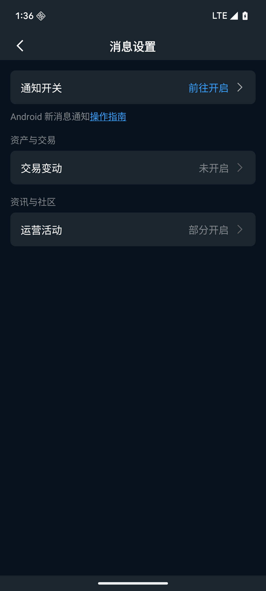

# 设置股价提醒

在本教程结束时，你将为一只股票设置好价格提醒，当它触达目标价时，你的手机会收到推送通知。

这个教程只需要 **3 分钟**，不需要在交易时间内操作。

## 开始前的准备

确认手机已开启长桥 App 的通知权限：

- **iPhone**：设置 → 长桥 App → 通知 → 允许通知
- **Android**：设置 → 应用管理 → 长桥 → 通知 → 开启

没有开启通知权限，提醒触发后你不会收到推送。

也可以在长桥 App 内，通过【我的】→【设置】→【消息设置】管理通知偏好。

## 第一步：进入股票详情页

点击 App 任意页面右上角的**搜索图标（🔍）**。

在搜索框中输入一只你想关注的股票，例如**腾讯控股**或 **00700**，点击搜索结果进入详情页。

你会看到股票当前价格、今日涨跌幅和 K 线图。

## 第二步：找到价格提醒入口

在股票详情页，注意页面右上角有一个**铃铛图标（🔔）**。

点击它。

你会看到「添加提醒」面板从下方弹出，显示该股票的当前价格。

## 第三步：设置提醒条件

面板中有两个主要设置：

**提醒方向**：
- **价格高于**：当股价涨到某个价格时提醒你（例如想在股价突破高位时知道）
- **价格低于**：当股价跌到某个价格时提醒你（例如想在股价回调到心理价位时买入）

选择你需要的方向。我们以**「价格低于」**为例，模拟设置一个买入观察点。

**目标价格**：

在价格输入栏填入你的目标价。例如，如果当前股价是 380，你想在跌到 360 时收到通知，就输入 **360**。

注意：价格栏已预填了当前市价，直接修改成你的目标价即可。

## 第四步：确认提交

检查一遍：
- 股票名称正确
- 提醒方向正确（高于 / 低于）
- 目标价格正确

点击**「确认」**或**「添加提醒」**按钮。

你会看到页面提示「提醒设置成功」，铃铛图标变为实心，表示该股票已有活跃提醒。

## 第五步：查看已设置的提醒

你可以随时查看和管理所有提醒：

点击 App 右上角的**通知图标**，选择**「我的提醒」**（或在股票详情页再次点击铃铛图标）。

你会看到刚才设置的提醒出现在列表中，显示股票名称、条件和目标价。

## 当提醒触发时

当该股票价格达到你设置的目标价时，你的手机会收到一条推送通知，通知内容会显示「腾讯控股已跌破 360 港元」（或类似文字）。

点击通知会直接跳转到该股票详情页，你可以在那里决定是否采取行动。

提醒触发一次后会自动失效，如果你还想继续追踪，可以重新设置。

## 确认完成

**恭喜！你已经学会了三项基本操作：**

1. ✅ 完成首次入金 — 账户有了港元资金
2. ✅ 买入第一只港股 — 完成了第一笔交易
3. ✅ 设置股价提醒 — 市场波动时能第一时间知道

---

接下来，你可以进一步了解：

- [港股交易规则与结算](/交易市场与规则/港股交易规则与结算) — 交易时间、T+2 交收等规则说明
- [订单类型说明](/订单类型/限价单与市价单) — 限价单、市价单等更多下单方式
- [资产设置](/portfolio-and-statements/资产设置) — 自定义持仓页面的显示偏好
