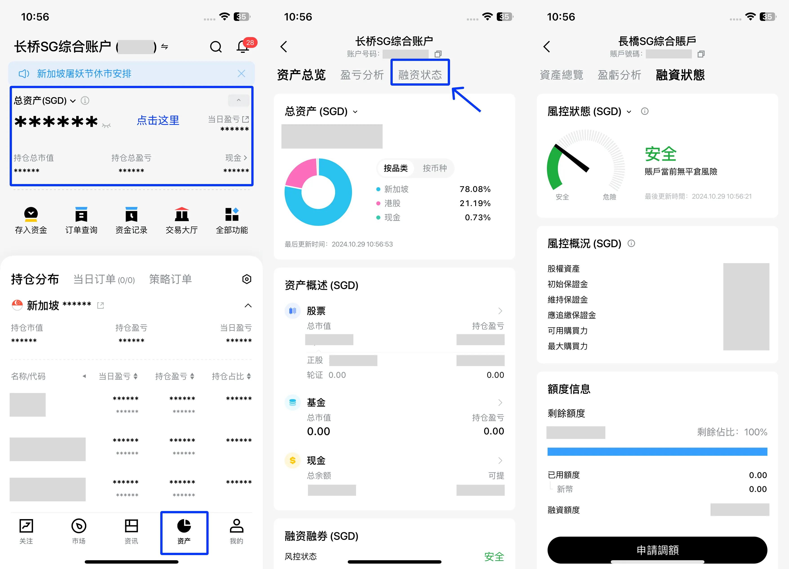
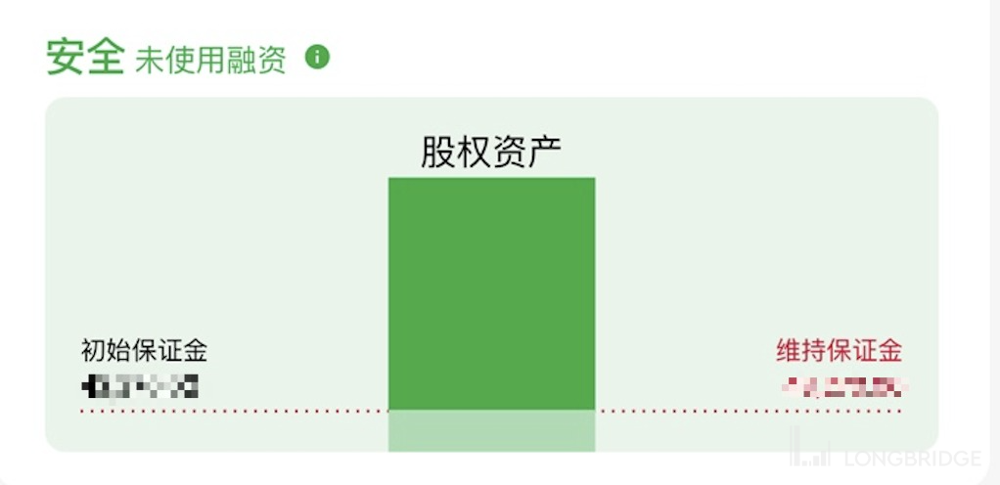
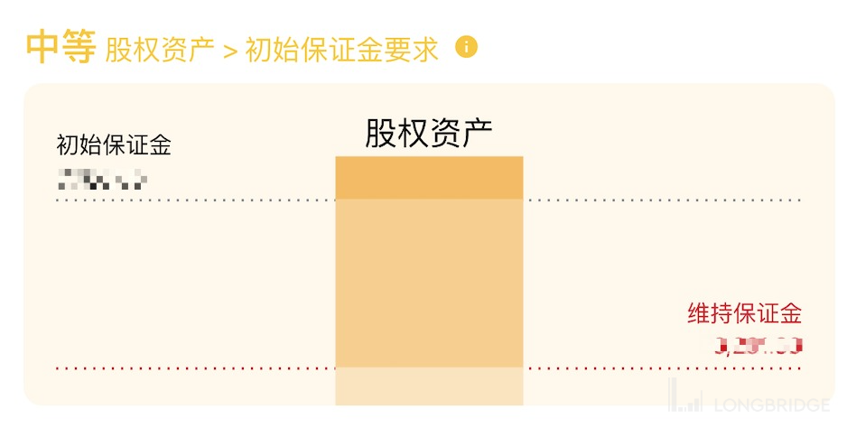
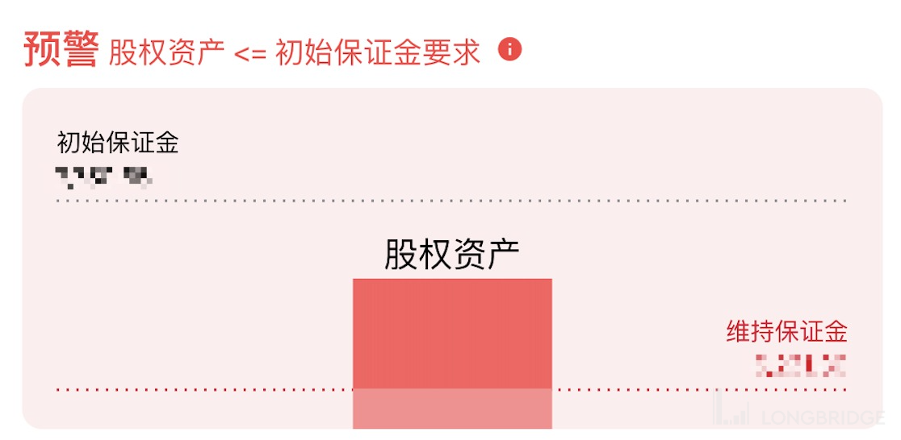
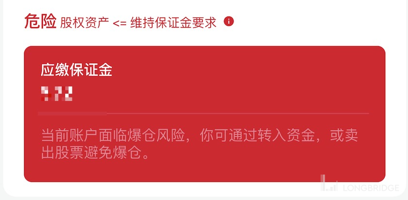

# 账户风控

融资交易会影响账户风险等级。用户可在 App 资产页的融资状态入口查看当前风控状态及购买力影响。

注：适用版本为 4.0.1 及以上。

## 风控状态等级

风控状态分为 4 个等级：安全、中等、预警、危险。

### 安全

未使用融资。

### 中等

已使用融资，股权资产大于初始保证金要求。依照账户当前杠杆倍数判断，当前使用杠杆倍数越高，则风险越高。

### 预警

股权资产小于等于初始保证金要求，且股权资产大于维持保证金要求。

此时购买力已用尽，不可新增开仓。请关注持仓风险，如账户出现「应追缴保证金」金额，请及时补充资金或卖出股票补足欠款。

### 危险

股权资产小于等于维持保证金要求。

在此状态下，您的账户必须根据「应追缴保证金」的数值，在截止日 15:00 前存入足够的保证金或主动平仓部分头寸，否则账户会被强制平仓。券商有权自行决定平仓的股票、价格、数量和时间。具体操作步骤见[如何应对追加保证金通知](/margin/how-to-respond-to-margin-call)。

## 字段解释

- 初始保证金要求：融资交易时要求的保证金，按照持仓股票市值的初始保证金率计算。当股权资产小于初始保证金要求时，购买力用尽，不可新开仓
- 维持保证金要求：维持保证金要求 = 账户持仓市值 × 账户持仓资产维持保证金率。当股权资产小于维持保证金要求时，将触发账户「危险」状态，需要平仓部分股票或者入金
- 股权资产 = 证券总价值 + 现金总价值 + 余额通总价值

## 应对措施

| 风控状态 | 限制 | 应对措施 |
|---------|------|---------|
| 安全 | 无限制 | 无需操作 |
| 中等 | 无限制 | 关注杠杆倍数，控制风险 |
| 预警 | 不可新增开仓 | 补充资金或减仓，补足应追缴保证金 |
| 危险 | 不可新增开仓 | 在 15:00 前补足保证金或主动减仓，否则强制平仓 |
