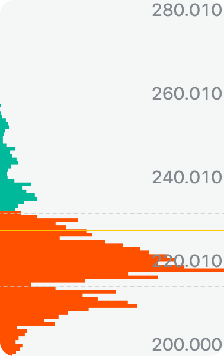
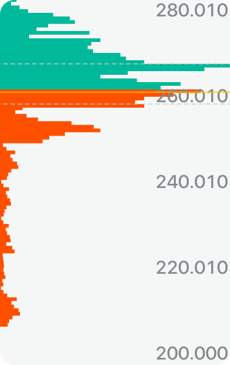
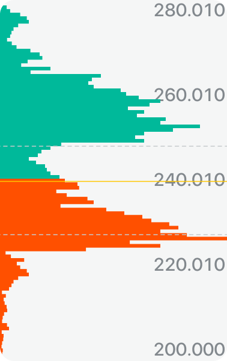
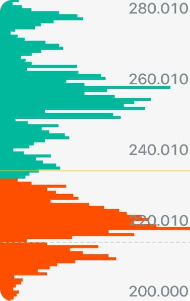

# 筹码分布

筹码分布反映流通股在不同价格区间上的持仓成本分布情况，通过观察筹码集中程度和位置，可辅助判断股价趋势、支撑/压力区域以及未来的上涨或下跌态势。

## 概念

筹码分布指的是流通股的持仓成本分布，反映了不同价位上投资者的持股数量。观察各个交易日的筹码分布状况，可以完整看出流通股的交易状况，从而进一步研判股价趋势。

- **趋势判断**：在上升趋势中，如果筹码跟随价格升高而上移，股价与平均成本持平或略高，说明看多情绪蔓延，上升趋势有望延续；下降趋势同理。
- **压力与支撑**：若当前股价上方有大量筹码密集，则股价上涨过程中很可能遇到套牢盘抛售，突破需要较大成交量配合；若大量筹码集中于股价下方，则拉升阻力相对较小。

## 如何查看筹码分布

在个股详情页点击右上方**筹码分布**入口，默认展示最后一个交易日的筹码分布，移动 K 线可查看不同交易日的筹码分布情况。

## 指标说明（以红涨绿跌为例）

| 指标 | 含义 |
|------|------|
| 红色筹码区 | 获利筹码，持仓成本低于当前价 |
| 绿色筹码区 | 亏损筹码，持仓成本高于当前价 |
| 黄色线 | 所有筹码的平均成本 |
| 压力位 | 股价上涨过程中容易遭受阻力的位置 |
| 支撑位 | 股价下跌过程中容易得到支撑的位置 |

## 常见形态与应用

### 低位密集

该形态发生于股价连续下跌或低位横盘之后，高位筹码转移到低位并集中于较小价格区间，且获利筹码比例较大。此时股价上涨阻力减小，很可能出现底部，有机会出现一波上涨。

### 高位密集

该形态发生于股价连续上涨或高位横盘之后，低位筹码转移到高位并集中于较小价格区间，且获利筹码比例较小。此时股价上涨阻力较大，继续上涨会遇到套牢盘解套抛售，操作上应以规避为主。

### 双峰形态

筹码分布图中形成两个密集峰，股价被夹在两个密集区域中间。股价下行遇到下方密集区支撑，上行遇到上方密集区抛售阻力，此时股价多以震荡为主。

### 筹码发散

筹码对应的价位极为分散，说明筹码没有被掌握在有操纵力的人手中，没有形成市场合力，股价难以出现爆发性上涨。该形态常见于大盘股。

---

*以上均为一般性规律分析，不代表市场运行必然结果，不构成任何投资建议。*
