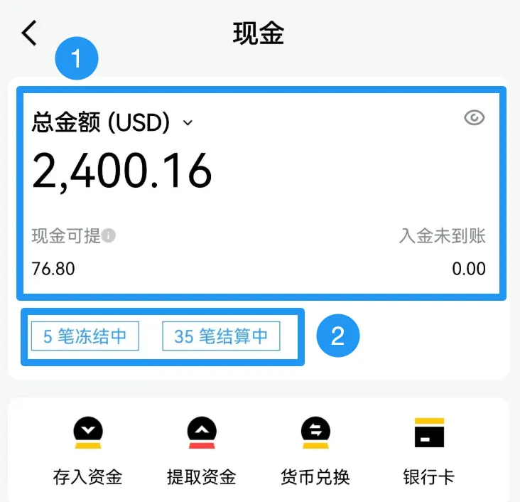
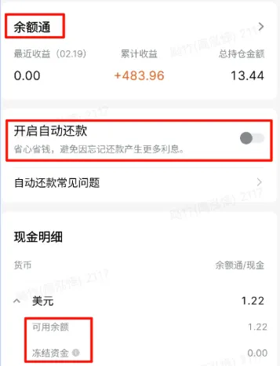

# 现金

现金页展示账户的现金资产明细，包含各币种余额、资金操作入口和还款设置。

## 页面入口

底部导航「资产」→ 顶部切换「现金」标签。

## 总金额卡片

| 字段    | 说明                     |
|-------|------------------------|
| 总金额   | 所有币种现金折算后的总价值          |
| 各币种余额 | 分别列出 HKD、USD 等各币种的实际余额 |
| 折算汇率  | 用于计算总金额的参考汇率           |

总金额按实时汇率展示，为参考值，不代表真实兑换，可能因汇率差略有偏差。

## 操作按钮

| 按钮 | 功能            |
|----|---------------|
| 转入 | 从外部银行账户入金     |
| 转出 | 提取资金到绑定银行账户   |
| 换汇 | 在不同币种之间进行兑换   |
| 存入 | 将现金存入余额通等理财产品 |

## 余额通入口

现金页提供余额通的快速入口，可一键跳转查看余额通持有情况或追加申购。详见[香港余额通](/funds-and-wealth/余额通/香港余额通)。

## 自动还款

开启自动还款后，账户产生融资欠款或使用融资时，会自动从余额通赎回或使用其他可用货币的资金（跨币种自动货币兑换）以补齐欠款 / 还清融资，避免额外利息产生。

**特殊情况**：香港公共假期而美股正常开市时，余额通资金不会自动赎回。如当期交易美股产生欠款，会计息至假期结束后自动补平，期间 App 内不显示欠款，可查看结单。

## 字段详细说明

### 现金可提（最大可提）

账户内现金及余额通按实时汇率折算后可用于交易或出金的资金。开启余额通后，该字段标注为「最大可提」。

### 可用余额

可用于交易的现金及余额通资金。

### 入金未到账

入金操作后在途、尚未到达长桥账户的资金金额。

### 结算中 / 待结算资金

买卖股票已成交但未完成交收的金额：
- 港股：T+2 交收
- 美股：T+1 交收

待结算资金可用于同市场交易，但无法出金或货币兑换。

### 冻结中 / 冻结资金

因挂单、手续费、空头持仓担保金等原因被冻结的资金，包含静态冻结（交易费用、待扣利息等）和动态冻结（随空头持仓市值变动的平仓担保金）。

一笔订单多次成交可能出现多次冻结，但最终只按实际一笔订单扣费。佣金会按标准费率先冻结，活动减免后实际扣费更少。
