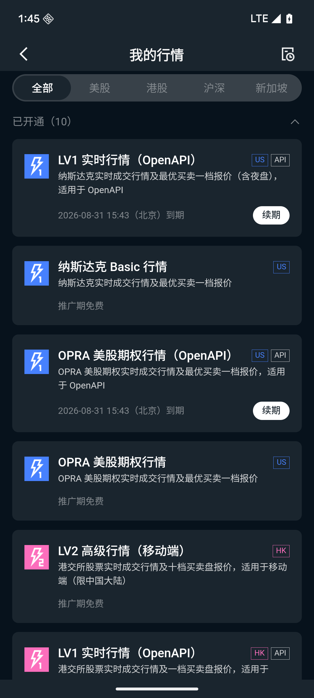
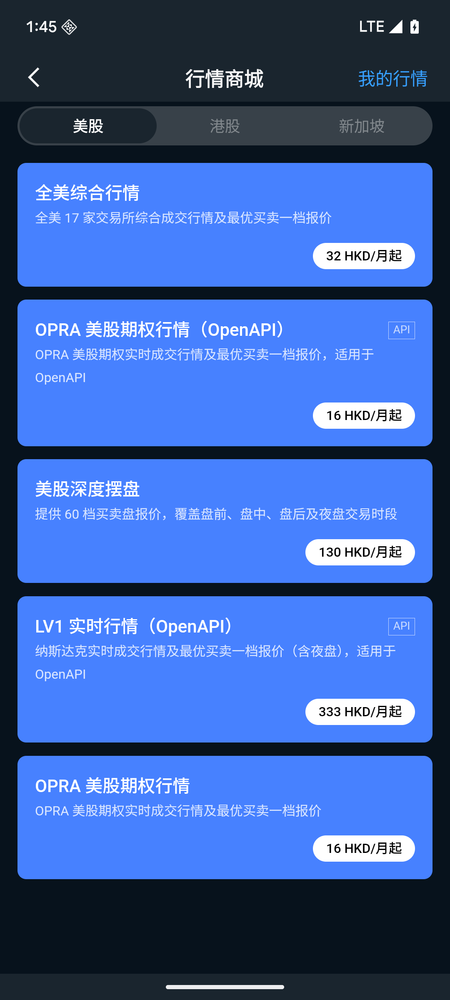

# 权益与产品

行情权益、基本面权益获取方式、有效期说明、购买流程及返佣机制。

## 权益类型

### 行情权益

行情权益让您免费或优先查看股市实时行情数据，涵盖港股、美股等多个市场。

| 权益内容   | 说明                |
|--------|-------------------|
| 港股实时行情 | 实时查看港股股价、买卖盘等信息   |
| 美股实时行情 | 实时查看美股股价和盘口数据     |
| 其他市场行情 | 根据账户等级开放不同市场的实时数据 |

未持有行情权益时，您看到的行情数据可能存在延迟（通常为 15 分钟延迟）。

### 基本面权益

基本面权益让您访问更深度的公司研究内容，辅助投资决策。

| 权益内容 | 说明               |
|------|------------------|
| 财务报告 | 查看上市公司历史和最新财务报告  |
| 公司分析 | 深度行业分析和公司基本面研究报告 |
| 估值数据 | 市盈率、市净率等核心估值指标   |

## 如何获取权益

### 活动赠送

Longbridge 会通过各类活动向用户赠送权益，例如：

- 注册赠送：完成账户注册即可获得基础权益
- 开户赠送：完成 KYC 实名认证后解锁更多权益
- 入金赠送：首次入金或达到入金门槛后获得权益奖励
- 交易奖励：完成指定交易量或交易次数后获得权益奖励
- 限时活动：节假日或专项活动期间的限时权益赠送

赠送的权益将自动发放至账户，可在 APP「我的权益」页面查看。

### 购买权益

您可以在 APP 内的「权益商城」直接购买所需行情或基本面权益产品，购买后立即生效。

## 我的行情权益

## 权益有效期说明

| 类型     | 说明             | 到期提醒                     |
|--------|----------------|--------------------------|
| 永久权益   | 无过期时间，长期有效     | 无需关注                     |
| 限时权益   | 有固定到期日，到期后自动失效 | APP 会在到期前发送提醒通知          |
| 每日刷新权益 | 每天定时重置，次日生效    | 留意权益详情中的每日刷新时间（香港时间 HKT） |

所有权益的到期时间均以香港时间（HKT，UTC+8）为准。

**权益每日刷新机制**：部分权益（如行情权益）会在每天特定时间失效并重置刷新。若您在某个时间点发现权益短暂消失，这不是系统故障，而是正常的权限管理机制。权益将在刷新后自动恢复，无需联系客服。

## 购买权益流程

1. 打开 APP，进入「权益商城」（通常在「行情」或「我的」页面入口）
2. 浏览可购买的权益产品，查看权益内容、有效期和价格
3. 选择需要的权益产品，点击「立即购买」
4. 确认订单信息（产品名称、价格、有效期）
5. 选择支付方式：港元、美元等账户余额，或 Apple Pay（仅 iOS 设备支持）
6. 完成支付，权益通常立即生效
7. 在「我的权益」页面刷新，确认权益已到账

## Apple Pay 特别说明

通过 Apple Pay 购买的权益订阅，取消续订必须在 iOS 系统设置中操作（路径：iPhone「设置」→「Apple ID」→「订阅」），不能在 Longbridge
APP 内取消。退款申请同样需要通过 Apple，而非联系平台客服。

Apple Pay 订阅管理步骤：

1. 打开 iPhone「设置」
2. 点击顶部您的 Apple ID 名称
3. 选择「订阅」
4. 找到对应的 Longbridge 订阅项目
5. 点击「取消订阅」完成操作

## 订单状态说明

| 状态   | 含义            | 需要做什么                          |
|------|---------------|--------------------------------|
| 待支付  | 订单已创建，等待您完成付款 | 尽快完成支付，订单通常有支付时限               |
| 发放中  | 支付成功，系统正在发放权益 | 等待，通常几秒内完成，无需操作                |
| 购买成功 | 权益已发放，可以正常使用  | 刷新「我的权益」页面查看生效情况               |
| 支付失败 | 支付未成功，权益未发放   | 重新发起支付，或检查支付账户余额后再试；如多次失败请联系客服 |
| 已退款  | 退款申请已处理       | 等待退款到账，一般需 3-7 个工作日            |

查看订单：APP「权益商城」→「我的订单」，可查看所有历史订单和当前状态。

## 返佣说明

### 什么是返佣

返佣是平台为高活跃度用户提供的交易手续费返还福利，部分符合条件的用户可享受按月返还一定比例手续费的权益。

### 结算规则

- 结算周期：按月结算，每月结算上月产生的返佣金额
- 结算时间：通常在次月初完成结算（具体以系统通知为准，时间为香港时间 HKT）
- 待结算：当月交易产生的返佣，尚未到账，月末后进入结算流程
- 已结算：已正式到账的返佣金额，可在账户中查看

APP 中显示的实时返佣金额为预估值，实际到账以月末结算为准。

### 如何查看返佣

在 APP「我的」→「返佣记录」或权益详情页中查看待结算和已结算的返佣明细。

## 权益激活与使用答疑

**Q：我完成了开户（KYC），为什么还没收到权益？**

A：权益发放通常在 KYC 审核通过后自动处理，可能需要最多 1 个工作日。请在 APP「我的权益」页面下拉刷新。若超过 1
个工作日仍未到账，请联系客服并提供开户完成的截图。

---

**Q：购买的行情权益什么时候生效？**

A：支付成功后权益通常立即生效。若订单状态已显示「购买成功」但行情仍显示延迟数据，请尝试退出 APP 并重新登录，或在「我的权益」页面手动刷新。

---

**Q：我的限时权益快到期了，怎么续期？**

A：您可以在权益到期前前往「权益商城」重新购买同类权益产品。部分权益支持在到期前续购，购买后有效期将自动顺延（以商品说明为准）。

---

**Q：权益到期时间是哪个时区？**

A：所有权益的到期时间均以香港时间（HKT，UTC+8）为准。例如显示「2026-04-30 23:59」，即为香港时间 4 月 30 日深夜到期。

---

**Q：支付失败了，钱会被扣吗？**

A：支付失败时不会扣款。如您使用银行卡或第三方支付，可能会有短暂的预授权冻结，通常 1-3 个工作日内自动释放。如超时未释放，请联系发卡银行。

---

**Q：我想退款，已购买的权益可以退吗？**

A：已生效使用的权益通常不支持退款。若权益因系统问题未正常生效，请联系客服说明情况，我们将核实后按实际情况处理退款申请。

---

**Q：Apple Pay 支付失败怎么办？**

A：请检查：Apple Pay 是否已正确设置并绑定有效银行卡；银行卡余额是否充足且未被银行限制网络支付。也可尝试切换其他支付方式（如账户余额）。如问题持续，请联系客服。

---

**Q：我的行情权益为什么每天某个时间会短暂消失？**

A：这是正常的权益每日刷新机制，不是系统故障。部分行情权益会在每天特定时间（香港时间
HKT）失效并重置，刷新后权益自动恢复。无需任何操作，也无需联系客服。具体刷新时间点请查看对应权益的详情页说明。

---

**Q：用 Apple Pay 购买的订阅如何取消？**

A：通过 Apple Pay 购买的订阅必须在 iOS 系统设置中取消，无法在 APP 内操作。步骤：iPhone「设置」→ 点击顶部 Apple ID → 「订阅」→
找到对应订阅 → 「取消订阅」。退款申请也需通过 Apple 处理，请联系 Apple 客服。

---

**Q：返佣什么时候到账？**

A：返佣按月结算，通常在次月初发放上月的返佣金额（以香港时间为准）。在结算完成前，返佣显示为「待结算」状态。具体到账时间以系统通知为准，请关注
APP 通知。

---

**Q：APP 显示的返佣金额和最终到账金额不一样，正常吗？**

A：正常。APP 中实时显示的返佣金额为预估值，基于当月已产生的交易计算，可能随交易变化而调整。最终到账金额以月末结算为准。

---

**Q：我符合返佣条件吗？如何知道自己的返佣比例？**

A：返佣资格通常与账户交易活跃度、账户等级等因素有关。您可以在 APP「返佣记录」页面查看当前返佣比例和资格说明。如无相关入口，说明您目前暂不符合返佣条件。如有疑问，请联系客服。

## 权益使用限制与账户要求

- 同类权益（如同市场的行情权益）通常不叠加，以最高等级权益为准；不同类型权益可同时生效
- 行情权益可通过账户等级自动获得、直接购买或激活「行情卡」获得。通过行情卡获得的权益支持叠加延长（多张同类行情卡有效期累加）；直接购买或账户等级获得的同类行情权益不叠加，取最高等级
- 购买权益时支持多种币种，汇率以支付时实时汇率为准
- 「待支付」订单有时间限制，超时后订单自动取消，需重新下单
- 退款处理后，实际到账时间为 3-7 个工作日
- 所有时间（权益到期、返佣结算、订单时限等）均为香港时间（HKT，UTC+8）
