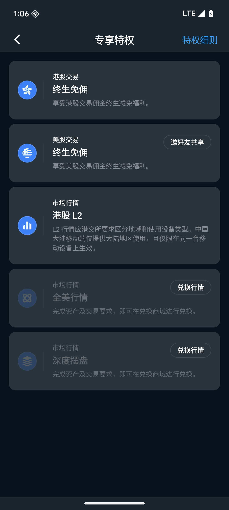
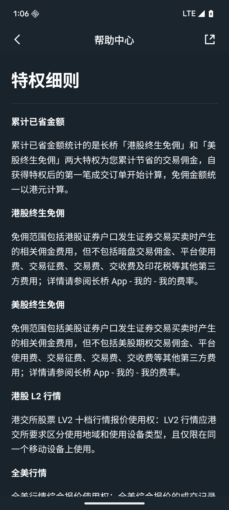

# 专享特权

「专享特权」展示账户当前已解锁的专属权益，以及可通过达成条件解锁的额外权益。入口在「我的」→ 蓝色专享特权卡片，或「我的」→「专享特权」。

## 交易权益

### 终生免佣

- **港股终生免佣**：港股股票、ETF 等交易佣金永久减免为 0
- **美股终生免佣**：美股股票、ETF 等交易佣金永久减免为 0

「终生」指在长桥平台有效运营期间持续有效，不设到期时间；若平台规则有重大调整，会提前通知。所有权益绑定账户本人，不支持转让、赠送或出售。

**港股终生免佣范围**

- 包含：港股证券户口发生证券交易买卖时产生的相关佣金费用
- 不包含：暗盘交易佣金、平台使用费、交易征费、交易费、交收费及印花税等第三方费用

**美股终生免佣范围**

- 包含：美股证券户口发生证券交易买卖时产生的相关佣金费用
- 不包含：美股期权交易佣金、平台使用费、交易征费、交易费、交收费等第三方费用

**长桥新加坡终生免佣（开户奖励）**

- 适用对象：之前从未开通长桥 SG 综合账户的新加坡居民（公民、永久居民、有效工作证持有者或有效新加坡居住地址用户），以及从未在长桥任何账户进行资产操作的非新加坡用户在长桥新加坡账户完成首次净入资后
- 适用市场：美股、港股、新加坡股的股票及 ETF
- 发放与生效：达标后 1 个工作日内发放至「我的卡券」，新加坡用户达标即时生效，非新加坡用户达标后次日生效
- 不含：期权及暗盘交易（仅新加坡用户可获得新股免佣）

详情请参阅长桥 App「我的」→「我的费率」。

## 行情权益

| 权益    | 说明                            |
|-------|-------------------------------|
| 港股 L2    | 港交所 LV2 实时十档买卖盘深度行情                                                       |
| 全美行情   | 全美综合报价，覆盖 NASDAQ、NYSE、CBOE 在内 16 家全美主流交易所和 FINRA TRF 场外数据（最新价、逐笔成交、成交量） |
| 美股深度摆盘 | 60 档位买卖盘报价，覆盖盘前、盘中、盘后、夜盘全交易时段                                          |

**港股 L2 地域限制**：应港交所要求，L2 行情区分地域和设备类型。中国大陆移动端授权仅绑定单一设备，不可在多台设备同时使用；香港及其他地区无此限制。换手机后需重新激活绑定，进入「专享特权」或「行情权限」页面按提示操作，或联系客服协助。

## 解锁方式

部分权益需完成资产或交易要求后，在「兑换商城」兑换激活：

1. 在「专享特权」页面查看待解锁权益的具体条件
2. 完成对应条件（如达到指定交易量或持仓金额）
3. 前往「我的」→「兑换商城」完成兑换

## 累计已省

「我的」主页专享特权卡片上显示**累计已省金额**，统计港股终生免佣和美股终生免佣两大特权累计节省的交易佣金，自获得特权后的第一笔成交订单开始计算，免佣金额统一以港元计算。

## 邀好友共享

点击专享特权页面内的「邀好友共享」，生成专属邀请链接。好友通过链接注册并满足条件后，双方可同时获得额外权益奖励。

## 特权细则

点击「专享特权」页面右上角的**「特权细则」**，可查看各项权益的详细说明，包括免佣范围、行情授权说明等最新规则。建议在兑换或使用权益前先阅读相关细则。
