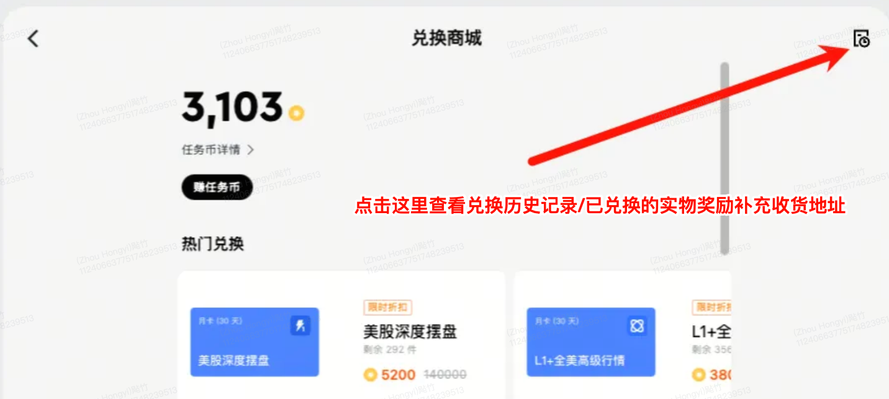

# 实物奖品

实物商品、电子券、My Link 积分和卡密的领取、激活及使用规则。

## 奖品类型

| 奖品类型       | 说明                 | 领取方式            |
|------------|--------------------|-----------------|
| 实物商品       | 有形货物，需通过快递送达       | 填写收货地址，等待快递     |
| 电子券        | 数字凭证，在指定商户消费时出示    | APP 内激活后使用      |
| My Link 积分 | 可在 My Link 平台使用的积分 | 锁仓期结束后自动到账      |
| 卡密         | 可在第三方平台兑换的密钥       | APP 内点击「领取」获取密钥 |

## 如何领取实物奖品

1. 活动结束后，在 APP「奖励中心」或活动页面查看获奖信息
2. 点击对应奖品，进入奖品详情页
3. 根据奖品类型，按提示完成相应操作（填写地址 / 激活 / 领取卡密等）
4. 在奖品详情页随时查看当前状态

## 奖品状态说明

| 状态     | 您看到的信息            | 需要做什么                |
|--------|-------------------|----------------------|
| 待填写地址  | 请填写收货地址           | 立即填写收货地址，否则无法发货      |
| 地址已填写  | 地址已提交，等待仓库处理      | 无需操作，等待仓库安排发货        |
| 发货中    | 已发货，物流单号：XXXX     | 使用物流单号在对应快递官网追踪包裹    |
| 已收货    | 奖品已送达             | 确认收货，如有问题请联系客服       |
| 电子券激活中 | 正在激活电子券           | 等待，通常 1-2 分钟内完成，无需操作 |
| 电子券已激活 | 电子券可使用            | 在指定商户消费时出示电子券        |
| 电子券已消费 | 电子券已在商户核销使用       | 无需操作，消费完成            |
| 电子券已过期 | 电子券已失效            | 联系客服说明情况             |
| 已退回    | 奖品因地址问题退回         | 联系客服，重新提供正确地址        |
| 拒绝发货   | 仓库拒绝发货（地址异常或库存问题） | 联系客服说明情况，附上奖品截图      |

## 各类奖品操作指南

### 实物商品（邮寄）

领取步骤：

1. 收到中奖通知后，进入奖品详情页
2. 点击「填写收货地址」，填写收件人姓名、手机号码、详细地址、邮政编码
3. 确认提交后，状态变为「地址已填写」
4. 仓库处理后开始发货，您将收到物流单号

注意事项：

- 兑换商城实物礼品：兑换后请在 **7 天内**填写完整收件地址，逾期未填写视为放弃领取，实物礼品将在 **30 天内**统一发货

  

- 活动奖励实物：请在 60 个自然日内主动领取，领取后 15 个自然日内填写收货信息，填写完成后 30 个工作日内安排发货（邮寄仅限香港地址）

- 实物商品设有领取截止时间，超过截止时间未填写地址，奖品将自动失效且无法补救
- 地址填写后通常无法修改，请仔细核对后再提交
- 如需修改地址，请在发货前尽快联系客服
- 国际快递时效一般为 7-15 个工作日，国内快递一般为 3-7 个工作日

### 电子券

电子券不会自动激活，需要用户在 APP 内主动点击「激活」按钮后才能使用。电子券具有两层时效：

1. 激活截止时间：必须在此时间前完成激活，超时后电子券作废
2. 激活后有效期：激活成功后另计有效期，从激活成功的那一刻开始计算

使用步骤：

1. 进入奖品详情页，点击「激活」按钮主动激活电子券
2. 激活通常在 1 分钟内完成，状态变为「已激活」
3. 激活成功后，在 APP 内查看电子券二维码或码号
4. 前往指定商户消费时，向店员出示电子券或输入码号

注意事项：

- 激活前请确认当前时间在激活截止时间之内，否则无法激活
- 激活后有效期从激活时刻开始计算，与获得时间无关
- 电子券一旦激活，不支持退回或转让

### My Link 积分

My Link 积分是在 My Link 平台使用的专属积分，奖品发放后会有一段锁仓期（例如 30 天），锁仓期结束后积分才正式到账并可使用。

查看步骤：

1. 在奖品详情页查看积分数量和预计到账时间（香港时间 HKT）
2. 锁仓期内，积分显示为「锁定中」
3. 到账后，登录 My Link 平台查看和使用积分

注意事项：

- 锁仓期间账户资产若不达标，平台有权取消该笔积分发放
- 请保持账户资产符合要求，确保积分顺利到账
- 具体锁仓期天数以奖品详情页说明为准
- 如积分到期仍未到账，请联系客服并提供奖品记录截图

### 卡密

领取步骤：

1. 进入奖品详情页，点击「领取卡密」按钮
2. 系统展示密钥（包含兑换码和可能的验证码）
3. 请立即截图或记录密钥，密钥只能查看一次
4. 前往对应第三方平台，在兑换页面输入密钥完成兑换

注意事项：

- 卡密只能领取一次，领取后无法重新查看，请务必保存好
- 请勿将卡密截图分享给他人，避免被他人使用
- 卡密兑换规则以第三方平台为准
- 如卡密无法使用，请先联系第三方平台客服；确认密钥本身有误再联系客服

## 兑换、配送与取消答疑

**Q：我获得了实物奖品，但找不到填写地址的入口怎么办？**

A：请在 APP「奖励中心」或活动详情页找到对应奖品，点击进入详情页即可看到「填写收货地址」按钮。如仍无法找到，请联系客服并提供活动名称和账户信息。

---

**Q：填写地址后可以修改吗？**

A：地址提交后原则上无法自行修改。如确需更改，请在奖品状态变为「发货中」之前尽快联系客服。一旦进入发货流程，将无法更改地址。

---

**Q：电子券显示「激活中」已经超过 10 分钟，还没激活成功怎么办？**

A：正常激活在 1 分钟内完成。若超过 10 分钟仍显示「激活中」，请尝试退出并重新进入奖品详情页刷新状态。若仍未激活，请联系客服并提供奖品截图。

---

**Q：电子券已过期但我还没用，可以补发吗？**

A：电子券过期后一般无法补发。如过期原因是系统问题或激活失败，请联系客服说明情况，我们将核实后按实际情况处理。

---

**Q：My Link 积分什么时候到账？**

A：积分到账时间 = 奖品发放日 + 锁仓天数，具体预计到账时间（香港时间）在奖品详情页中有显示。请以详情页展示的时间为准。

---

**Q：My Link 积分锁仓期内账户资产不达标会怎样？**

A：若在锁仓期内账户资产持续低于要求标准，平台有权取消该笔积分的发放。建议保持账户资产在要求水平以上。

---

**Q：我的卡密领取后发现已被使用或无效，怎么办？**

A：请先前往第三方平台客服确认密钥状态。若确认密钥在您领取时已失效或被他人使用，请联系客服，并提供领取记录截图。

---

**Q：奖品显示「已退回」，我能重新收到吗？**

A：奖品退回通常是因为地址有误或无法送达。请联系客服说明情况，提供正确的收货地址，客服核实后会安排重新发货（以实际库存和活动规则为准）。

---

**Q：我的奖品物流信息很久没更新，是不是丢件了？**

A：物流信息有时会有延迟。建议用物流单号在快递官网或 APP 查询最新状态。若 3 个工作日内物流无任何更新，请联系客服，提供物流单号，客服将协助联系快递公司核查。

---

**Q：电子券的有效期是从什么时候开始算？**

A：电子券的有效期从激活成功的那一刻开始计算，而不是从获得电子券的时间开始。例如，激活后 30 天有效，则有效期截止时间 =
激活成功的时间 + 30 天。请注意：激活前还有「激活截止时间」，必须在该时间前完成激活，否则电子券将作废。

---

**Q：我错过填写地址的截止时间了怎么办？**

A：实物商品的领取截止时间一旦过期，奖品将自动失效且无法系统恢复。如有特殊原因（如系统故障、通知未收到等），请立即联系客服说明情况，但无法保证一定可以补救。建议收到奖品后尽快完成地址填写。

---

**Q：My Link 积分的锁仓期是什么意思？**

A：锁仓期是指积分发放后暂时冻结、不可使用的一段时间。在锁仓期内，积分显示为「锁定中」，无法在 My Link
平台使用。锁仓期结束后积分才正式到账并可自由使用。若在锁仓期内账户资产低于要求标准，平台有权取消该笔积分的发放。

---

**Q：IPO 打新活动的卡券怎么使用？需要手动操作吗？**

A：不需要手动操作。系统会在您参与 IPO 申购时自动识别并使用对应卡券。请注意区分通用卡（适用所有 IPO）和指定股票卡（仅适用特定
IPO），在卡券详情中可以确认适用范围。

---

**Q：IPO 延期了，我的打新卡有效期会怎样？**

A：若 IPO 延期，对应卡券的有效期也会随之延长，与 IPO 新的结束时间保持一致。

## 配送限制与退换规则

- 地址填写时限：实物商品设有领取截止时间，超过截止时间未填写地址，奖品将自动失效且无法补救
- 电子券双层时效：电子券有「激活截止时间」和「激活后有效期」两层限制，激活后有效期从激活成功时刻开始计算
- 卡密只能领取一次，电子券通常不支持退换，请在操作前确认
- 所有时间（到账时间、过期时间等）均为香港时间（HKT，UTC+8）
- 遇到任何问题，请通过 APP 内「联系客服」功能提交，附上奖品截图可加快处理速度
