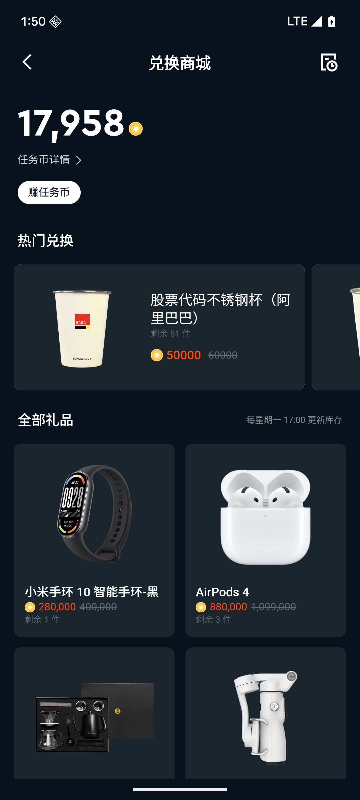

# 兑换商城

兑换商城是 App 内的积分消费平台，用户可以使用完成任务获得的任务币兑换各类商品，包括卡券、实物周边、在线课程、现金、股票份额及 App 内道具。商城商品每周刷新，部分商品提供限时折扣。

## 如何使用

参与兑换商城需已登录 App 账户，且账户内有足够的任务币余额，部分商品需满足特定账户条件。

操作步骤：

1. 进入兑换商城页面（可从任务中心入口跳转，或通过 App 导航访问）
2. 浏览商品列表，查看商品名称、所需任务币数量、库存状态
3. 选择想要兑换的商品，查看商品详情（包括使用说明、有效期、兑换限制等）
4. 确认任务币余额充足后，点击兑换按钮
5. 确认兑换信息（商品名称、扣除任务币数量），提交兑换
6. 兑换成功后，任务币自动扣除，商品发放至对应账户或入口

## 商品状态说明

| 状态名称 | 含义 | 用户应该做什么 |
|--------|------|-------------|
| 可兑换 | 商品当前有库存，可以正常兑换 | 确认任务币充足后直接兑换 |
| 库存已满/补货中 | 当前库存已用完，暂时无法兑换 | 等待补货，可定期回来查看；商城每周刷新后通常会补充库存 |
| 已下架 | 商品已不再提供 | 该商品无法兑换，可关注其他商品 |

## 积分消耗与到期规则答疑

**兑换商城的货币是什么？**

兑换商城使用"任务币"作为兑换货币。任务币通过完成任务中心的各类任务获得，也可通过参与活动、猜涨跌游戏等方式赚取。任务币不可充值购买，只能通过上述方式获得。

**商城商品多久更新一次？**

商城商品每周刷新一次（通常为每周一下午，具体时间以实际为准）。每次刷新后会更新商品库存，部分商品可能更换或下架，新商品也可能上架。建议定期查看商城。

**兑换了商品后多久能到账？**

不同商品类型到账时间不同：
- 卡券：通常较快到账，可在卡包中查看
- 现金/股票：到账时间视具体商品说明而定
- 实物商品：需要配送时间，以物流通知为准
- 课程：通常较快开通

如超出预期时间仍未收到，请联系客服并提供兑换记录截图。

**商品显示"补货中"是什么意思？能兑换吗？**

"补货中"表示该商品当前库存已用完，暂时无法兑换。等待商城刷新（每周一下午）或运营补货后恢复。处于"补货中"状态的商品无法完成兑换操作。

**我的任务币什么时候过期？**

任务币有有效期，不同来源的任务币到期时间可能不同。可在任务币流水明细或账户页面查看各笔任务币的到期时间。建议定期关注余额和到期情况，及时使用。

**任务币过期了还能用吗？**

过期的任务币会自动失效，无法继续使用，也不能申请找回或延期。建议在任务币到期前及时在兑换商城使用。

**为什么有些商品我看不到？**

部分商品设有用户群体限制，并非对所有用户开放。可能的原因包括：商品仅对特定地区或账户类型的用户展示、账户尚未满足该商品的兑换条件、商品已下架或尚未上架。

**同一件商品可以兑换多次吗？**

部分商品设有每周兑换次数限制，达到上限后本周无法继续兑换，等下周刷新后恢复。具体次数限制以商品详情页说明为准。没有次数限制的商品在库存充足时可多次兑换。

**兑换后能退款吗？**

兑换完成后通常不支持退款或退还任务币，请在兑换前仔细确认商品信息。若因系统异常导致任务币扣除但商品未到账，请及时联系客服处理。

**任务币余额在哪里查看？**

任务币余额可在以下位置查看：任务中心页面（通常显示当前余额）、兑换商城页面顶部、个人账户/资产页面的积分/任务币入口。

**任务币的来源有哪些？**

任务币主要通过以下方式获得：完成任务中心的各类任务（每日、每周、每月、新手、成长、限时任务）、完成任务包阶梯奖励、每日签到、参与猜涨跌游戏（预测正确可获得奖励）、参与 App 内特定活动、系统补发（因异常情况由运营补偿）。

**兑换失败是什么原因？**

常见原因包括：任务币余额不足、商品库存已用完（变为"补货中"状态）、账户不满足该商品的兑换条件、已达到该商品的每周兑换次数上限、网络异常导致请求失败。根据失败提示确认原因，如多次失败或提示不明确，请联系客服。

**兑换记录在哪里查看？**

可在兑换商城的"兑换历史"或"我的订单"入口查看历史兑换记录，记录包含商品名称、消耗的任务币数量和兑换时间。

**限时折扣是什么？怎么使用？**

商城部分商品会在特定时间段内提供折扣价，折扣期内所需任务币数量减少。折扣有截止时间，过期后恢复原价。折扣期间正常按流程兑换即可，系统会自动按折扣价扣除任务币。

## 实物礼品兑换流程

兑换实物礼品后，请在 **7 天内**进入「已兑换商品」填写完整收件地址及联系方式，**逾期未填写视为放弃领取**。

实物礼品将在 **30 天内**统一发货，可能因疫情、缺货、物流等原因延迟。如遇礼品缺货或因疫情、物流等原因无法发货，平台有权以同等价值礼品替换。

## 兑换限制与配送说明

- 兑换行为一旦产生不可取消，礼品不退不换，花费的任务币无法退还
- 所有商品仅限在 App 内兑换
- 部分商品设有每周兑换次数上限，具体以商品详情页为准，次数在每周一随商城刷新重置（注意：商城刷新时间为每周一下午，与任务中心每周任务重置时间 0 点不同）
- 商品库存有限，先到先得；商城每周刷新时补充库存（通常为每周一下午，具体时间以实际为准）
- 限时折扣在活动截止后自动恢复原价，折扣期间兑换的商品不受影响
- 任务币有到期时间，过期后自动失效不可找回，建议优先使用临近到期的任务币
- 部分商品需要账户满足特定条件（如已开户、已完成认证等）才能兑换
- 兑换实物商品时请特别注意可发货的地区限制
