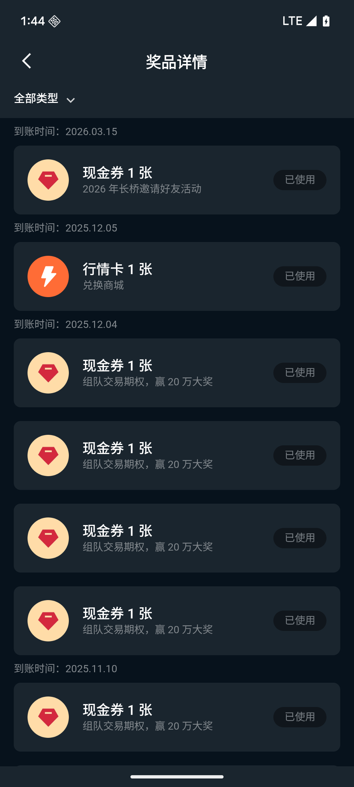

# 奖励记录

奖励记录页用于查看通过参与活动或兑换商城所获得的所有奖励凭证。

## 页面入口

「我的」→「奖励记录」

## 筛选功能

页面顶部提供「全部类型」下拉菜单，可按奖励类型筛选，快速定位特定类别的奖励。

## 记录字段

记录按到账时间分组展示，每条记录包含：

| 字段   | 说明                |
|------|-------------------|
| 奖励名称 | 奖励的具体名称，如现金券、行情卡等 |
| 来源   | 奖励来源，如活动名称或「兑换商城」 |
| 操作按钮 | 根据奖励状态显示不同操作      |

## 奖励状态

| 状态  | 说明                    |
|-----|-----------------------|
| 可使用 | 奖励尚未使用，点击「去查看」跳转至使用页面 |
| 已使用 | 奖励已核销，按钮置灰不可操作        |

## 兑换记录

在任务中心「兑换记录」页可查看任务币兑换历史，包含兑换时间、兑换商品名称及消耗的任务币数量。
