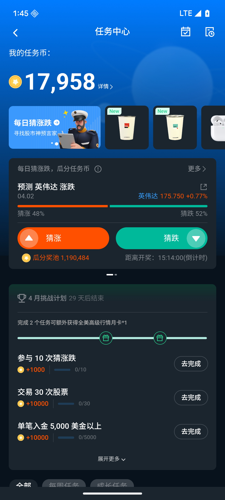
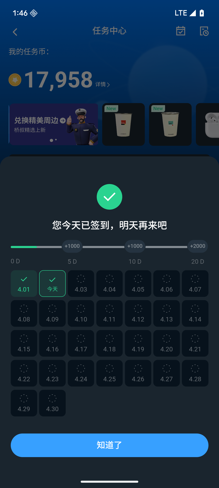

# 任务中心

任务中心是 App 内的激励系统，用户通过完成指定操作（如交易、开户、邀请好友等）来赚取奖励。奖励形式包括任务币、卡券、实物商品和现金。

任务中心提供 6 种任务类型：每日任务（每天重置）、每周任务（每周一重置）、每月任务（每月重置）、新手任务（新用户专属，一次性）、成长任务（长期任务）、限时任务（特定时间段内有效）。任务中心会根据用户身份和当前时间自动展示适合该用户的任务列表。

## 如何使用

参与任务中心需已登录 App 账户，部分任务需满足特定账户条件（如已完成开户、已完成身份认证等）。

操作步骤：

1. 打开 App，进入任务中心页面
2. 浏览当前可参与的任务列表，每条任务显示任务名称、奖励内容和当前进度
3. 按照任务要求完成对应操作（如买卖股票、完成开户、邀请好友等）
4. 系统自动检测行为并更新任务进度，无需手动提交
5. 条件达成后，系统自动发放奖励，App 内会弹出完成提示

## 任务状态说明

| 状态名称 | 含义 | 用户应该做什么 |
|--------|------|-------------|
| 进行中 | 任务已开始，完成条件尚未达成 | 按任务要求继续完成对应操作，系统会自动更新进度 |
| 已发放 | 完成条件已达成，奖励已发放至账户 | 前往对应账户或入口查看奖励 |
| 已完成 | 任务全部流程已结束 | 无需操作，可在历史记录中查看 |
| 已过期 | 任务截止日期已过且未完成 | 该任务无法继续参与，关注下一期任务 |

## 任务状态与常见问题

**任务怎么完成？是自动的还是需要手动操作？**

任务完成是自动检测的。用户按照任务要求在 App 内完成对应操作（如完成一笔交易、成功邀请一位好友等），系统会自动识别并更新进度，无需手动提交或申请。完成后 App 内会弹出提示，奖励也会自动发放。

**任务币是什么？怎么用？**

任务币是完成任务获得的虚拟积分，可在兑换商城内兑换商品，包括卡券、实物、课程、现金、股票及 App 道具等。任务币不可充值购买，也无法提现，仅可在平台内使用。任务币有有效期，过期后自动失效，请在到期前使用。任务币余额可在任务中心或个人账户页面查看。

**完成任务后多久能收到奖励？**

条件达成后系统会自动处理奖励，通常较快到账。若完成后较长时间（如超过 24 小时）仍未收到，请联系客服并提供账号信息及任务名称。

**新手任务和每日任务有什么区别？**

新手任务是新用户专属的一次性任务，完成后不会重置，主要帮助新用户了解 App 核心功能；每日任务每天重置（次日 0 点），只要满足条件每天都可以完成并获得奖励。

**任务过期了怎么办？**

已过期的任务无法继续参与，也不能补领奖励。每日任务、每周任务、每月任务会在下一个周期重置后重新出现；限时任务到期后不会重置。建议关注任务截止时间，及时完成。

**为什么我完成了条件但任务还是"进行中"？**

可能原因包括：
- 系统数据同步存在短暂延迟，稍等几分钟后刷新页面
- 操作时间与任务统计时间存在时差（如跨零点操作，建议在截止时间前至少 30 分钟完成操作）
- 本次操作不符合任务的具体要求（如金额、次数、品种等限制）

如刷新后仍未更新，请联系客服并说明账号和具体操作情况。

**每周任务什么时候重置？**

每周任务在每周一 0 点重置，上一周未完成的进度不会保留。

**任务显示"已完成"但我没有收到奖励怎么办？**

任务显示"已发放"表示奖励已发出，请检查对应账户或入口。如显示"已完成"说明全流程已结束。若确认状态已更新但奖励未到账，请联系客服，并告知账号、任务名称及完成时间。

**成长任务没有截止日期吗？**

成长任务属于长期任务，不会按周期重置。用户可以在任务开放期间内随时完成，但仍有截止日期，请在任务详情页查看具体到期时间，过期后将无法完成。

**同一个操作能同时完成多个任务吗？**

可以。例如完成一笔股票交易，可能同时满足每日任务、每周任务和成长任务的条件，系统会分别自动更新各任务进度。

**任务中心小红点是什么意思？**

小红点表示当前有可参与的未完成任务。点击进入任务中心可查看具体任务内容，完成后小红点会消失。

**为什么我看不到某些任务？**

部分任务有特定的用户群体限制，不是所有用户都能看到。常见原因包括：
- 任务仅对特定地区或账户类型的用户开放
- 新手任务仅对新用户显示
- 任务已过期或尚未开始
- 账户尚未满足任务的前置条件（如需先完成开户）

**限时任务的有效期是多久？**

限时任务的有效期各不相同，请以任务详情页显示的截止时间为准。超过截止时间后任务状态变为"已过期"，无法继续参与。

## 每日签到

## 任务周期与奖励发放规则

- 每日任务在当天 24 点前必须完成；每周任务须在本周日结束前完成；每月任务须在当月最后一天结束前完成；限时任务以详情页截止时间为准
- 奖励通常在条件达成后自动发放，若超过 24 小时仍未到账，建议联系客服
- 每日/每周/每月任务在重置后进度清零，上一周期未完成的进度不结转
- 部分任务对交易品种、金额、次数等有具体要求，请仔细阅读任务详情
- 不同类型奖励的到账方式不同，任务币直接进入账户余额，卡券和实物请在对应入口查收
- 部分任务在活动期间内每用户只能完成一次（如新手任务）
- 部分任务包需先手动点击"领取"按钮后才开始记录进度
