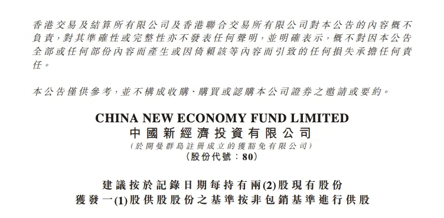
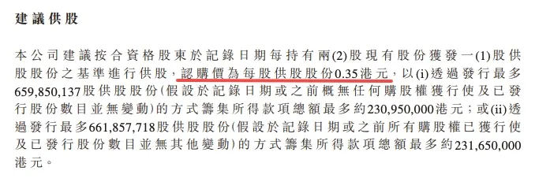
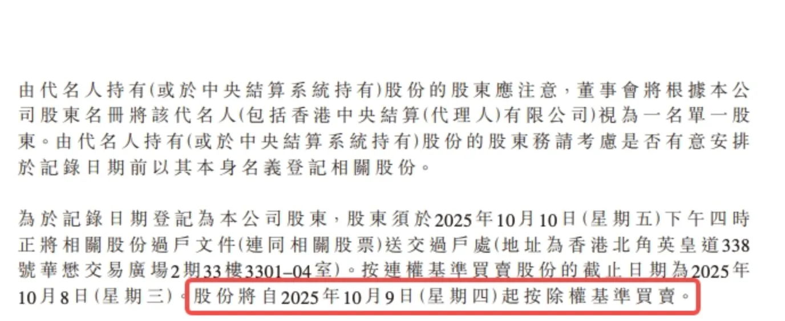
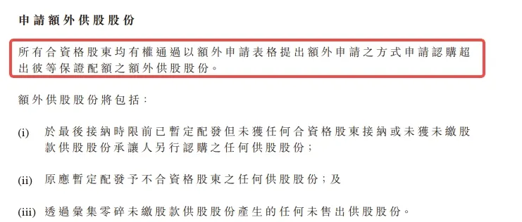
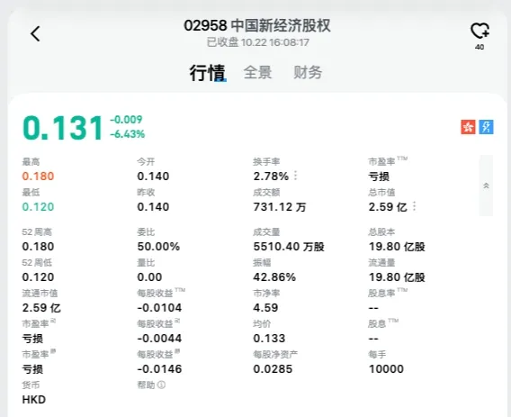
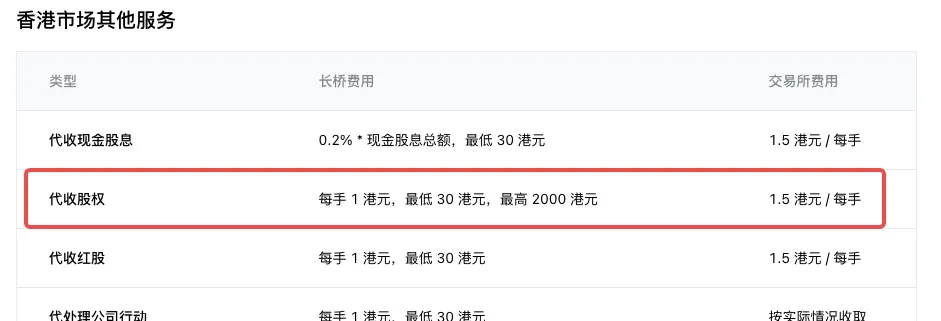

# 供股要约

供股定义、股权来源、可交易与不可交易股权区别、行使方式及收费。

## 什么是供股

供股是指上市公司发行新增股票让现有股东申购，股东可按其持股比例申购新股。如股东不参与供股，其权益将遭到稀释。

## 什么是股权

股权是一种购买正股的权利，与正股对应。

股权的表现形态与普通股票一样，具有代码和名称及价格。股权的命名规则一般是：正股名称 +「股权」。

供股是根据股权持仓数量按照供股价购买对应数量的正股。会在供股权派发的 2-3 天内，在长桥 App 显示供股资料进行提交供股，App 操作仅支持提交一笔供股，在截止供股前可自行撤销重新提交。

例如：持有阿里港股股权 5,000 股，供股价是 100.00 港元，那么就可以申请以 500,000.00 港元的价格购买 5,000 股阿里港股。

## 股权的来源

股票公司向所有持仓的股东派发股权，由交易所直接发放到股东账户（实物股票的需要到过户处办理手续才可以获得股权）。

此时正股的价格会下跌，下跌的价值刚好等于派发的股权价值。

合资格股东的判定：在除权日前一个交易日收盘后仍持有发生供股行动的股票，则会获得公司派发的股权。若客户并非合资格股东，不会收到额定分配的股权，亦不会产生代收费；此类客户若想参与供股，需先从市场上买入可交易股权（按正常交易费用收取）。

## 股权可交易与不可交易

股权分为可交易和不可交易两种类型，由派发公司决定。

可交易的股权：与普通股票一样可以买卖，有价格波动。买入股权的客户可以申请供股。可交易供股权的代码规则为 029XX。

不可交易股权：客户只能选择是否供股，如果不供股，股权会清零。不可交易的代码规则为 44XXX。

## 股权的生命周期

股权的生命节点包括：上市日、最后交易日、供股截止日、正股派送日。

可交易的股权一般只有 5-7 个交易日左右，上市日至最后交易日之间可以交易（长桥一般会在最后交易日前 2 天提前结束交易）。

上市日至供股截止日之间可以申请供股。供股时购买的正股在正股派送日进入持仓。

## 股权的属性

| 属性 | 说明 |
|------|------|
| 股权名称 | 正股名称 +「股权」 |
| 股权代码 | 一般为 29XX（可交易）或 44XXX（不可交易） |
| 正股名称 | 对应的正股名称 |
| 正股代码 | 对应的正股代码 |
| 每手股数 | 交易的每手股数 |
| 供股价 | 供股时购买正股的价格 |
| 是否可交易 | 是／否，由派发公司决定 |

## 股权的处理方式

可交易的股权：可选择卖出、供股、放任清零。

不可交易的股权：可选择供股、放任清零。

放任不管的结果是股权自动清零，客户会损失股权这部分资产。

## 如何行使供股权

在行使供股权之前，长桥会通过系统消息、邮件方式通知所有股权持仓客户。

申请供股：长桥 APP - 资产 - 全部功能 - 供股要约 - 选需要供股标的提交申请供股。

并非所有供股行动都会触发邮件通知（部分客户的股权是从市场买入的），请主动留意「供股要约」页面是否有可用入口及对应截止日。长桥的供股截止日通常会比公告截止日提前 2 个工作日（用于将供股结果汇总提交至交易所），请以长桥 App 内显示的截止日为准。

## 超额认购

一般的供股行动允许客户认购超过其股权数量的股数。超额认购越多，需支付的资金越多。但超额认购并不代表客户一定可以获得其认购的股数，具体股数受上市公司决定。

例如客户原本持有 1,000 股股权，申请超额认购 10,000 股，最终结果可能为：仅拿到 1,000 股；或拿到 1,000 + 部分超额；或拿到 1,000 + 10,000 股。

## 供股公告查询工具

- 港股公司行动：[香港交易所披露易](https://www.hkexnews.hk/index_c.htm)
- 美股公司行动：[SEC EDGAR](https://www.sec.gov/edgar/search/)

## 供股公告解读示例

以港股 00080 供股公告为例，了解如何从公告中获取关键信息：

**供股比例**（每持有 2 股可获得 1 股股权）：

**认购价**（0.35 港币 / 股）：

**除权日**（2025 年 10 月 9 日）：

**超额认购条款**：

**股权代码及价格**：

## 供股收费

合资格股东收到派发股权时会产生代收费用，由长桥代交易所收取。

- 长桥代收费：30 港币 / 只股票
- 交易所代收费：1.5 港币 / 手

例如港股 00080 一手 10000 股，客户持有一手并获派股权，会产生 30 港币（长桥）+ 1.5 港币（交易所）的代收费。

若客户并非合资格股东，未收到额定分配的股权，不会产生代收费。此类客户若想参与供股，需先从市场上买入可交易股权（按正常交易费用收取）。
