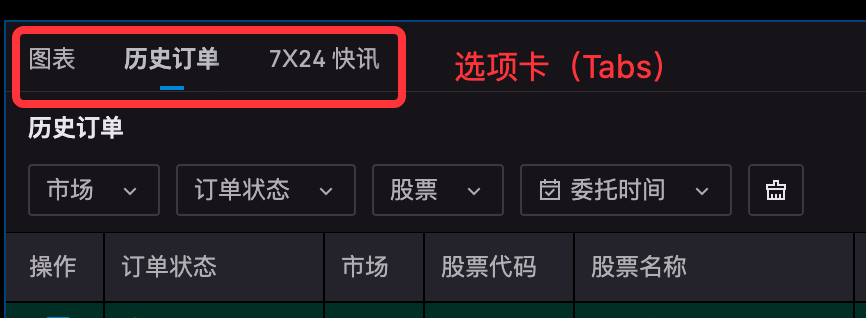
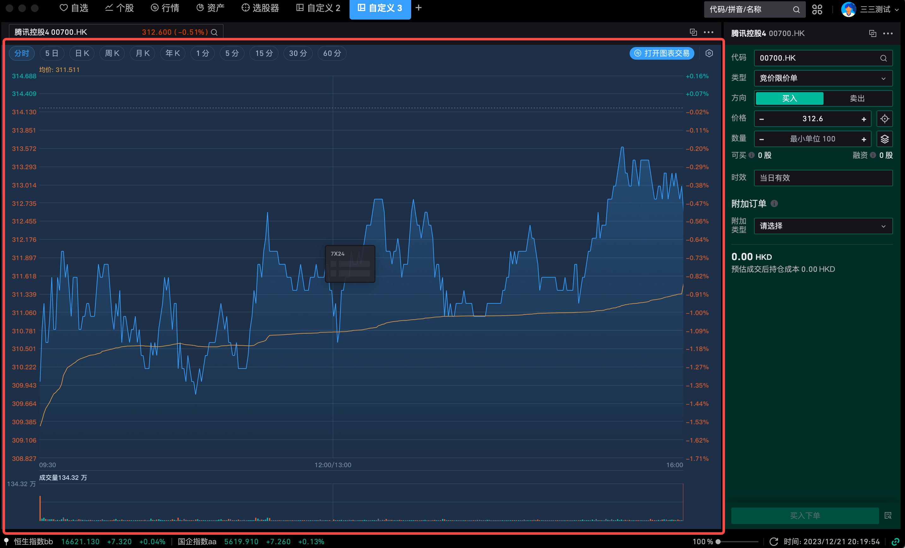

# 组件拼接

组件拼接仅在**自适应布局**模式下可用，允许将多个组件合并到同一区域，通过切换 Tab 页查看不同组件内容，解决屏幕空间不足时多组件平铺遮挡数据的问题。

## 主要特色

- **直观导航**：通过 Tab 轻松切换所需功能或组件
- **节省空间**：多个组件共享一块区域，按需切换显示
- **流畅体验**：在客户端切换内容面板，不触发整页刷新

## 阴影色块说明

拖动组件到目标组件上时，会出现蓝色阴影色块，颜色块位置决定拼接方式：

- **阴影出现在目标组件上、下、左、右侧**：表示将新组件放置在目标组件旁边，**不进行拼接**

  

  

  

  

- **阴影色块完全占满目标组件**：松开鼠标后即完成拼接。需将新组件移动至目标组件**中间区域**，以触发整块阴影。

  以下示例为将「7×24 快讯」拼接进「图表」组件：

  

## 拼接操作

### 两个独立组件拼接

按住组件拖动至目标组件中间区域，待整块蓝色阴影出现时松开鼠标。

### 将独立组件拼接进已有组合

**方式一**：将组件拖动至已有组合的中间区域，整块蓝色阴影出现时松开，新组件将追加为最后一个 Tab。

**方式二**：将组件拖动至已有组合的**顶部选项卡区域**，选项卡位置出现蓝色阴影时松开，新组件追加为最后一个 Tab。

### 整体移动拼接组件

按住拼接组件 Tab 栏的**空白区域**，可将整个拼接组件拖动到布局的其他位置，目标位置阴影规则与独立组件相同。

## 调整 Tab 顺序

选中需要移动的 Tab，按住拖动，目标 Tab 上出现蓝色阴影时松开，该组件将移动至此位置。拖动时鼠标下方会显示当前组件的缩略图。

## 移除拼接中的组件

### 拖出为独立组件

按住目标组件的 Tab 进行拖动，移动到布局空白区域，出现蓝色阴影时松开，组件将独立显示在面板中。

### 从拼接中移除组件

点击组件右上角「…」> **移除**，将该组件从拼接组合中删除。

### 将组件脱离为独立窗口

点击组件右上角「…」> **脱离**，组件将以独立浮动窗口形式运行。

## 组件数量限制

同一页面最多支持打开 **15 个组件**，组件拼接中的每个子组件均计入此上限。
