# 自定义布局

组件操作、联动设置、系统和自定义布局类型、布局保存及组件拼接。

## 组件概念

桌面端所有功能均以「组件」形式存在。可从右上角组件工具箱查看所有支持的功能，包括个股、市场、通用、交易、资产和资讯类组件。

## 组件基本操作

### 添加组件

点击右上角组件工具箱，单击或拖拽目标组件到当前面板中。

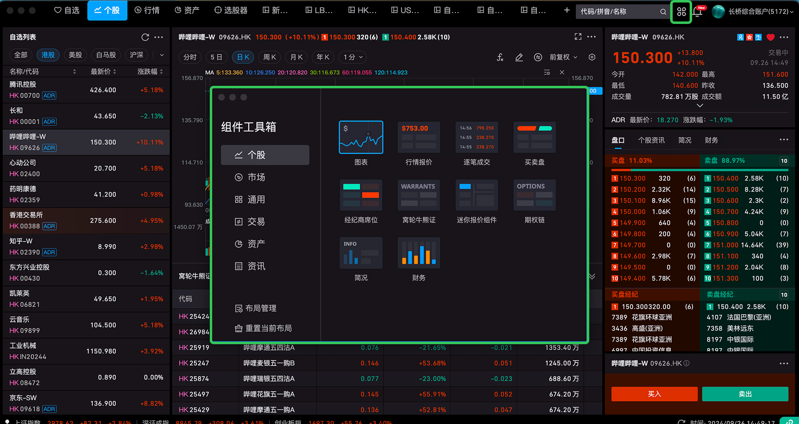

### 调整大小

每个组件的大小均可自由拖拉调整，在组件边缘范围内拖拉即可挤压或扩展。

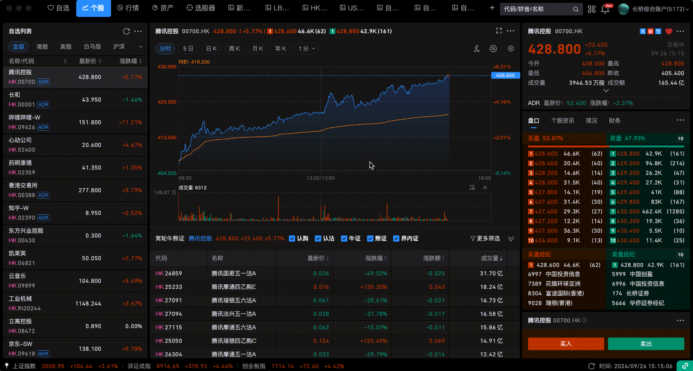

### 更多操作（复制、最大化、脱离、移除）

点击组件右上角的「…」，可进行以下操作：

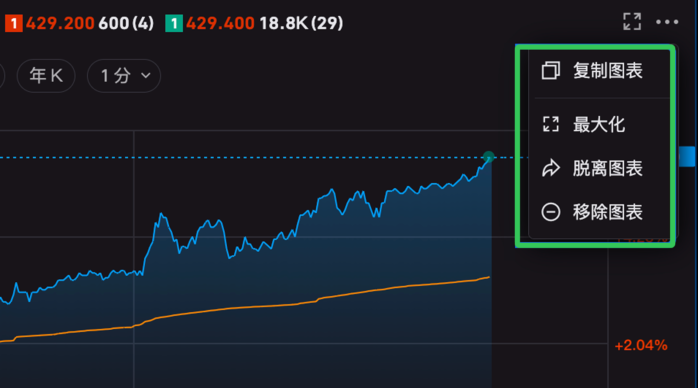

- **复制**：复制当前组件并生成新组件，以脱离窗口形式显示
- **最大化**：将当前组件最大化铺满，点击右上角恢复按钮可还原默认大小
- **脱离**：将组件脱离当前窗口成为独立浮动窗口，方便与其他软件并排使用；脱离后的组件默认与来源面板保持联动

- **移除**：从当前布局中删除该组件；若是系统布局（自选、个股、行情、交易、资产），可点击组件工具箱底部「重置布局」恢复；自定义布局不支持重置

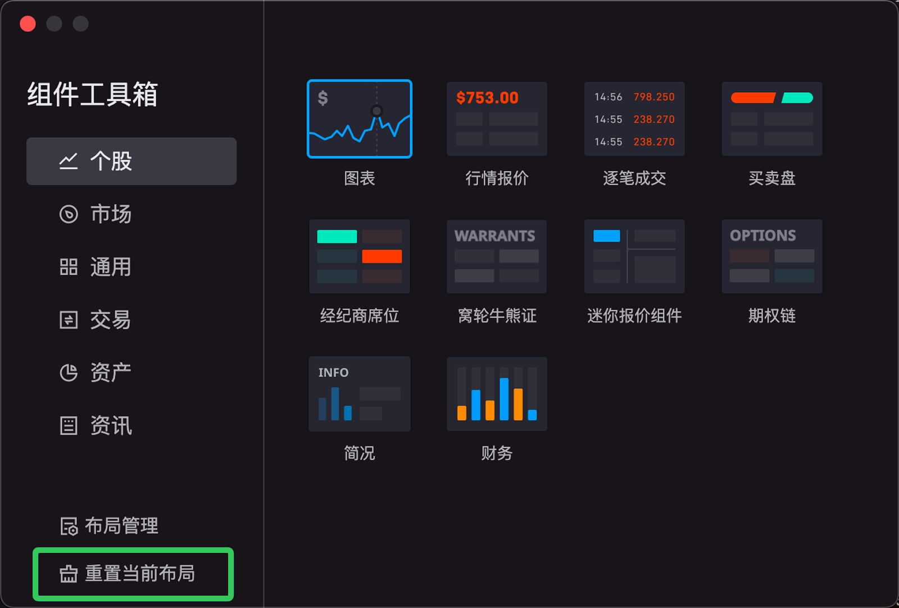

## 组件联动

### 自定义联动分组

系统布局中的组件默认全部联动，不支持设置联动分组。

自定义布局中，组件默认不联动，用户可自行设置以下分组方式：

- **默认联动**：所有组件共享同一联动，无需手动分组
- **不联动**：该组件独立，切换标的不影响其他组件
- **联动分组 1–9**：相同分组内的组件自动联动，组件右上角会标识所属分组编号

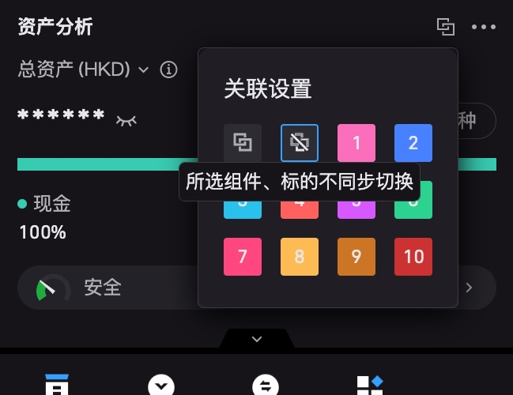

### 联动参数

- **股票联动**：图表与交易等组件联动后，切换到股票 A，联动组件同步切换
- **市场联动**：账户资产与持仓默认市场联动，切换到港股后持仓同步切换

### 单向联动与双向联动

- **双向联动**（当前默认）：点击组件 A，组件 B 联动；点击组件 B，组件 A 也联动
- **单向联动**：点击组件 A，组件 B 联动，反之则不联动；目前暂无业务场景，后续逐步增加

### 来源布局联动

组件从布局中脱离，或在布局中新增的组件，窗口会显示来源面板信息，默认与来源面板保持联动。

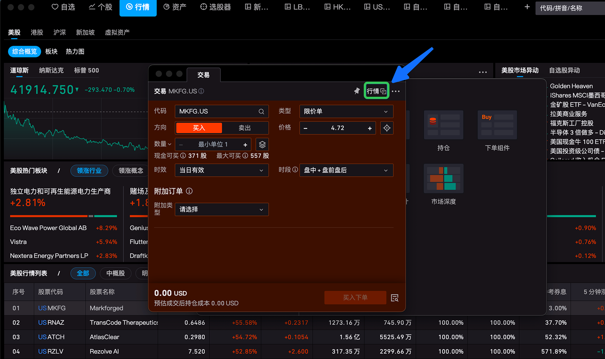

## 组件头部功能

### 股票搜索

带有股票标的属性的组件（如图表、盘口、行情报价、逐笔成交等），脱离后或在自定义布局中，头部自带股票搜索，方便快速切换标的。

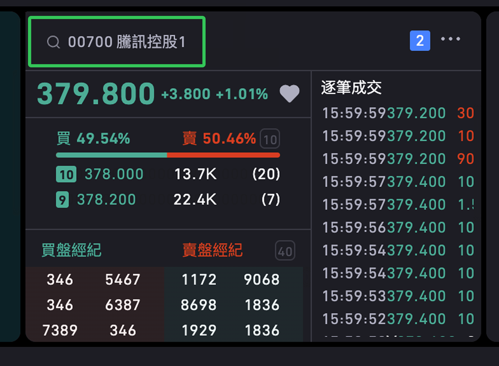

### 钉住置顶

组件脱离后，切换到其他软件或主窗口时组件可能被遮挡。点击组件右上角「钉住」，可固定悬浮在最顶层；再次点击取消置顶。

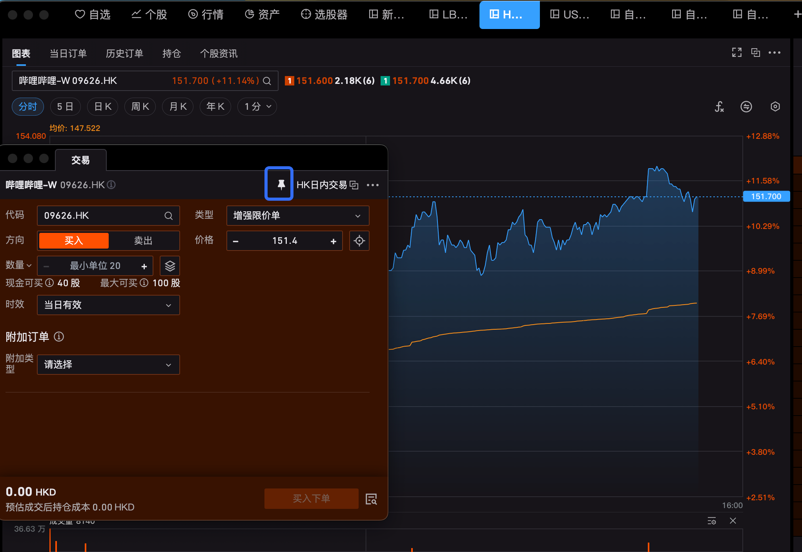

## 布局类型

桌面端布局分为两种：

- **系统布局**：系统默认提供，如自选、个股、行情、资产、选股器等页面，不可编辑和删除，但可自定义修改面板内组件排版
- **自定义布局**：新开标签页后创建，支持命名和删除，分为自适应布局和画布布局两种

### 系统布局

系统默认的布局，不可删除，可自由调整组件排版。

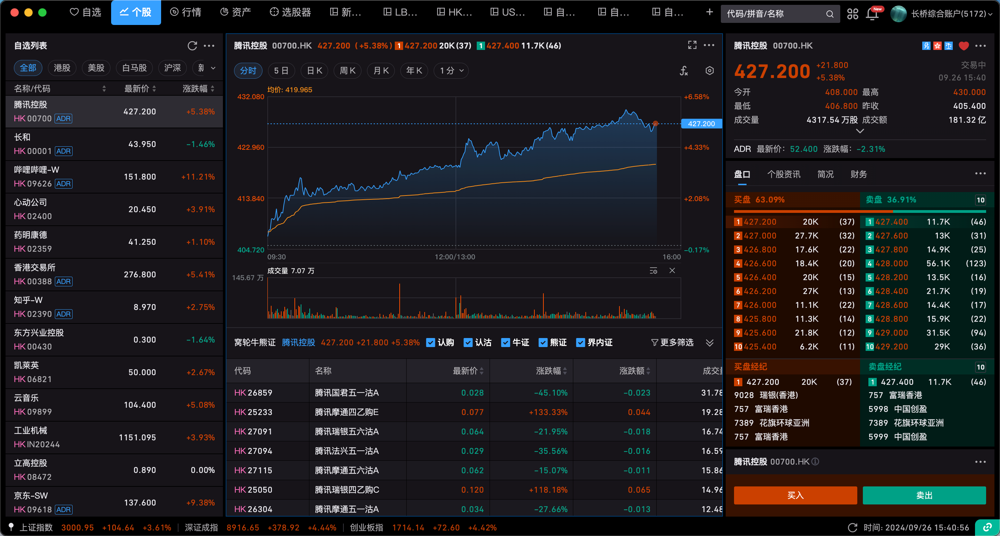

若自行修改了系统布局，想恢复默认，可点击右上角组件工具箱 > **重置布局**。

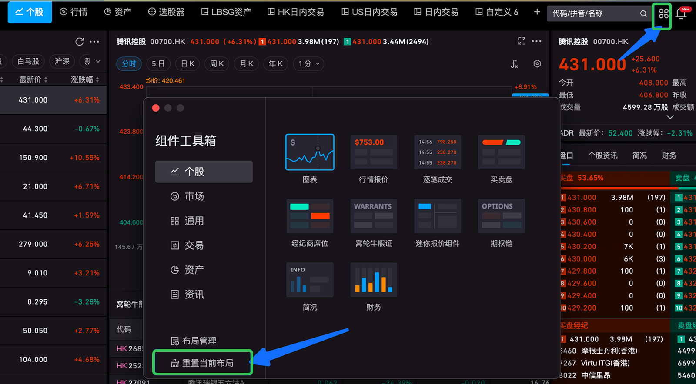

### 自定义布局

点击菜单栏右侧「+」可新开标签页。

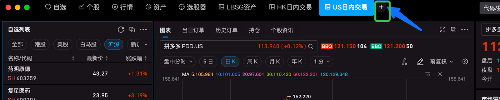

新开标签页后，可选择自适应布局或画布布局。

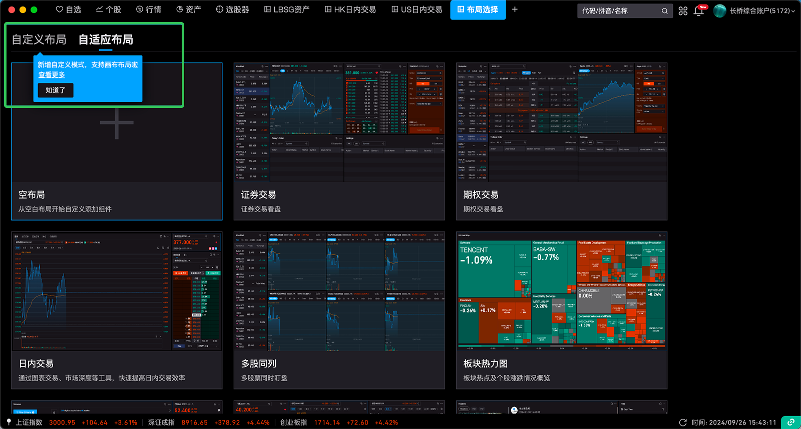

#### 自适应布局

**特色**：

- **动态调整**：根据屏幕大小和分辨率自动调整布局；单个组件时满屏展示，拖动某组件大小时自动挤压适配其他组件
- **流式设计**：以相对单位定义元素，适应各种分辨率
- **灵活性**：适合多设备、多屏切换场景

**操作说明**：

系统提供多种预设的交易员模板，如证券交易、日内交易、多股同列等，可直接选用；也可从空白布局开始搭建。

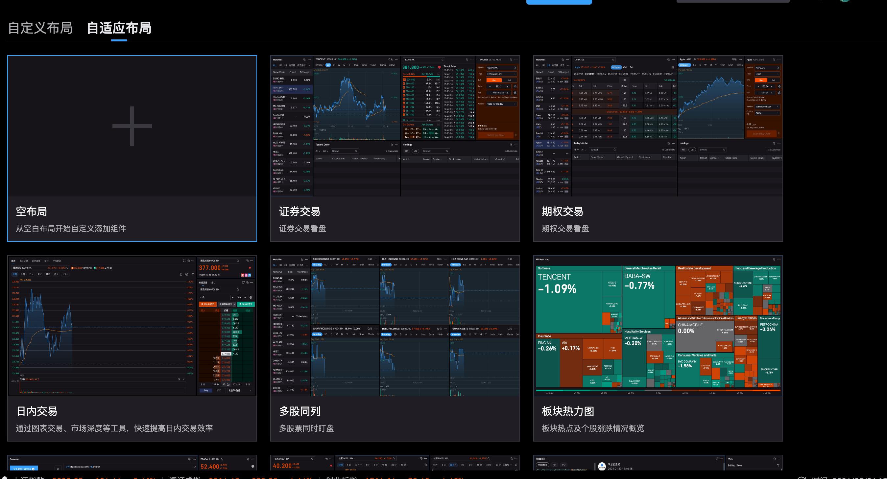

选择空白布局后，可从组件工具箱中拖拽组件到面板内自由排版。

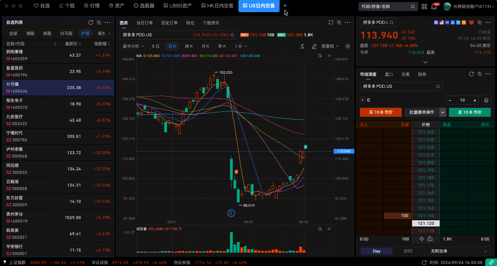

#### 画布布局

**特色**：

- **固定尺寸**：以固定像素值定义位置和大小
- **绝对定位**：元素基于画布固定尺寸进行精确定位
- **自由度高**：可完全控制每个组件的位置和大小，适合复杂精确的布局需求
- **不随设备变化**：不根据屏幕大小自动调整，组件超出屏幕时可滚动查看

**操作说明**：

从组件工具箱拖拽组件到画布中，或将独立组件窗口拖入画布布局面板。点击组件右上角「X」或通过「…」> 移除组件来关闭组件。

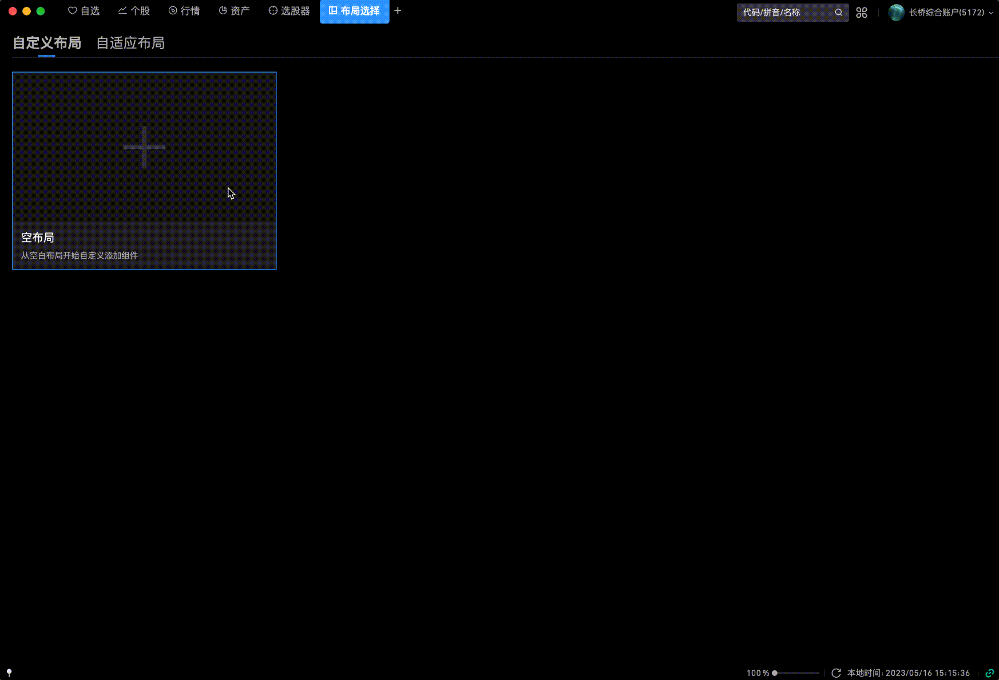

**锁定功能**：编辑完成后，点击右上角工具栏进行布局锁定；锁定后不可添加或移动组件，防止误操作。再次点击可解锁。

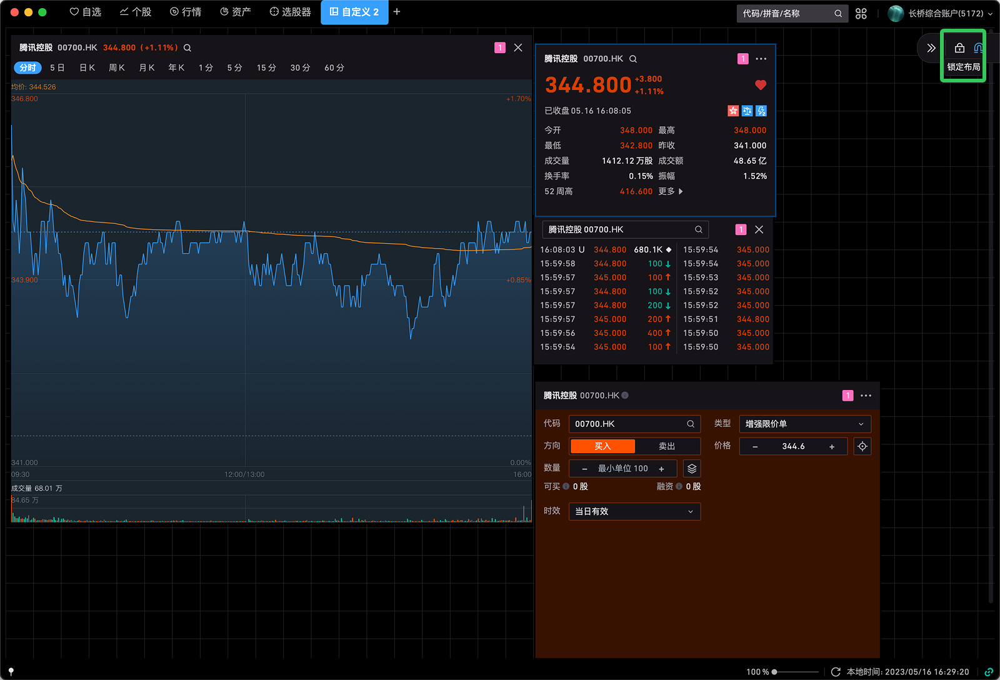

**磁吸功能**：拖动组件时自动吸附到最近的网格线或其他组件边缘，实现精确对齐。默认开启，如不需要可点击关闭。

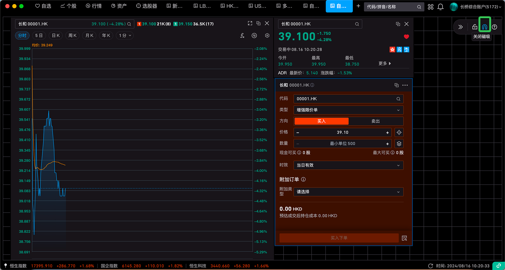

### 自适应布局与画布布局对比

| 对比项 | 自适应布局 | 画布布局 |
|--------|-----------|---------|
| 定位方式 | 流式，动态调整 | 固定像素，绝对定位 |
| 多屏适配 | 是，自动适配屏幕大小 | 否，超出屏幕可滚动查看 |
| 组件重叠 | 不可重叠，会挤压其他组件 | 可重叠展示 |
| 自由度 | 较低，受屏幕大小限制 | 高，可任意摆放 |
| 适用场景 | 常规使用、多屏切换 | 固定工作站、精细布局 |

## 布局保存

所有布局信息自动存储在云端，布局丢失时可通过右上角组件工具箱 > **布局管理**找回历史数据。

### 系统自动保存

布局修改后系统自动保存最新数据，默认第一条为系统自动保存的版本。

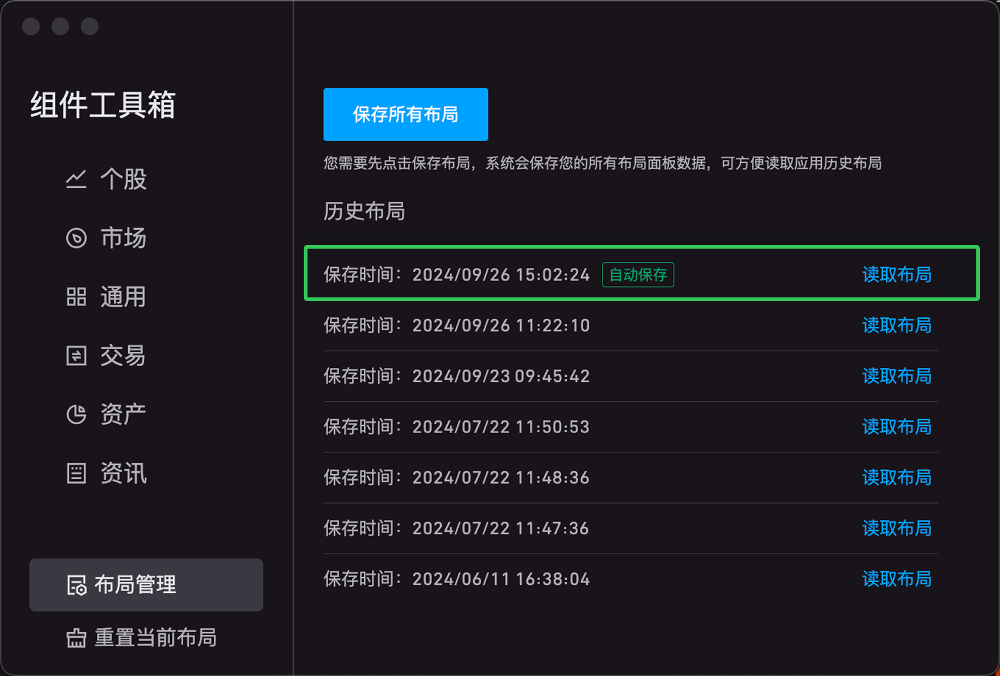

### 手动保存

如需保存更多历史版本，建议点击**保存所有布局**手动保存，最多支持 20 条历史记录，可按需读取。

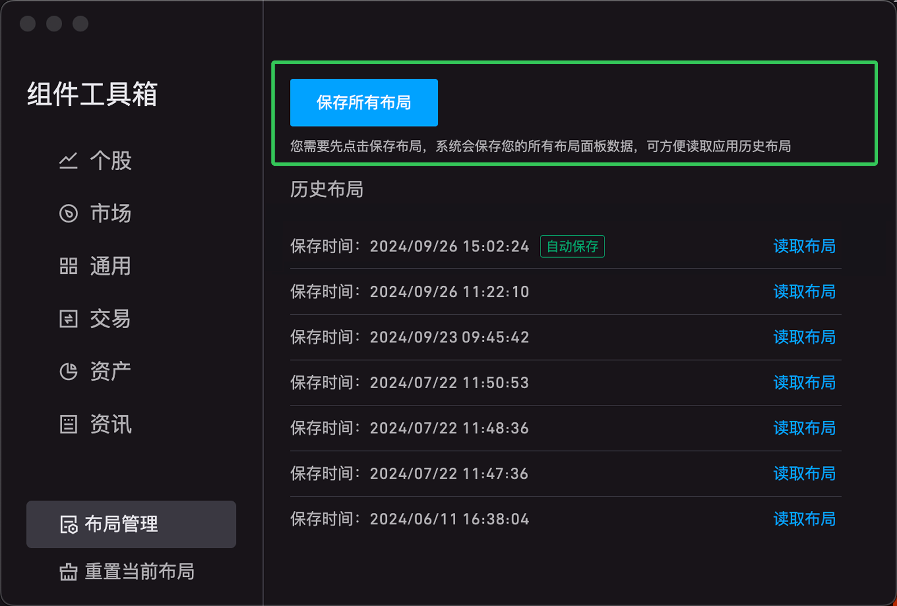

### 另存为我的布局

新开的标签页，可右键菜单选择**另存为我的布局**；保存后可在**布局选择** > **我的布局**中快速打开，方便后续复用。

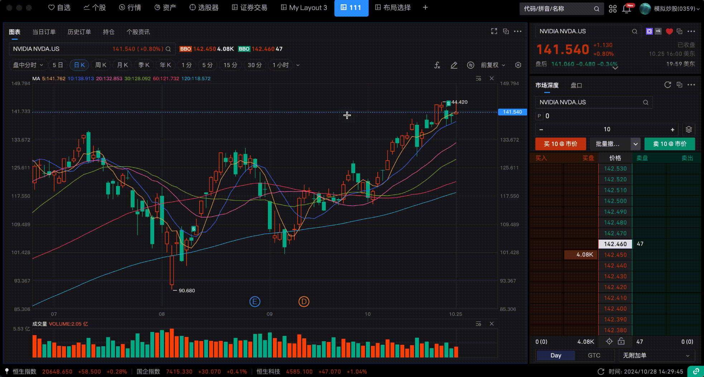

## 组件拼接

组件拼接仅在自适应布局下可用，允许将多个组件合并到同一区域，通过切换 Tab 页查看不同组件内容，节省屏幕空间。同一页面最多支持 15 个组件（含拼接内的子组件）。

详细操作说明（阴影色块、多种拼接方式、Tab 排序、移除）请参阅：[组件拼接详细说明](/stock-trading/desktop-tools/component-splicing)
