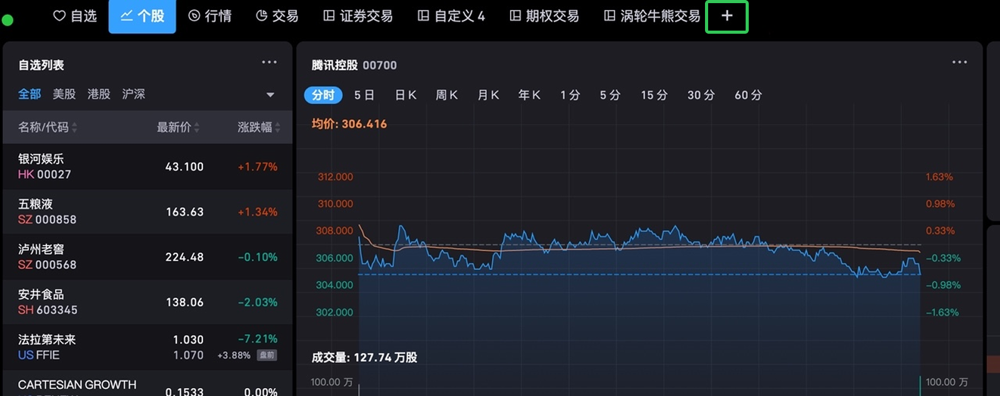
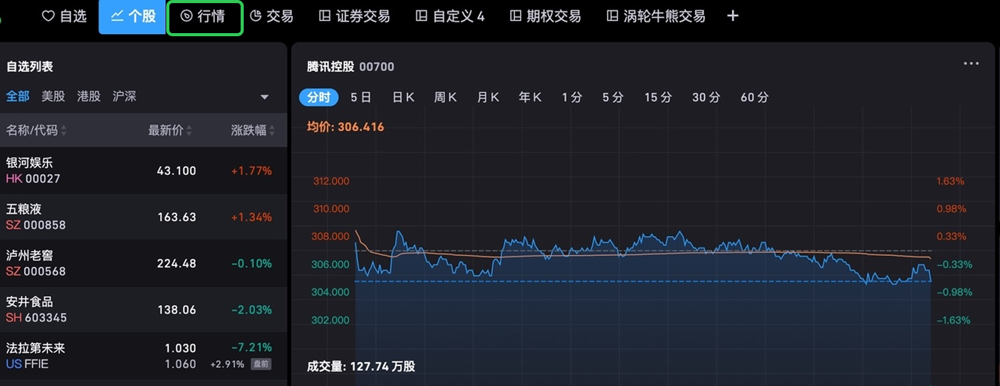
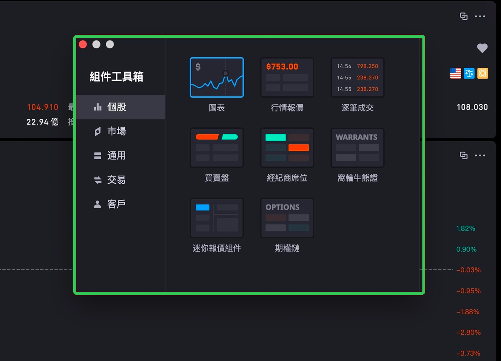
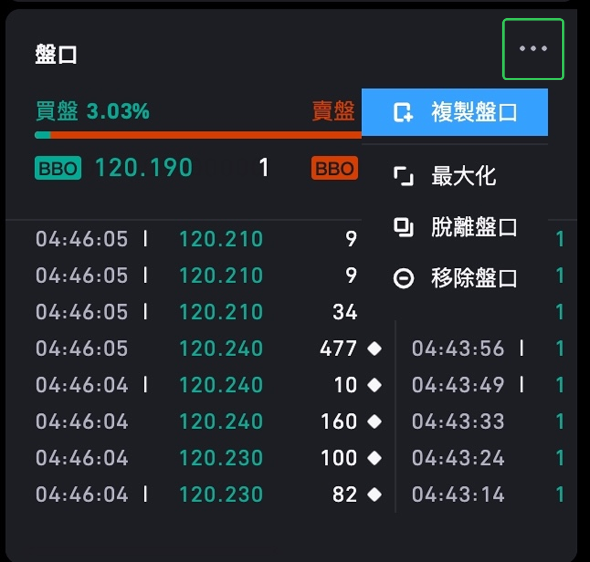
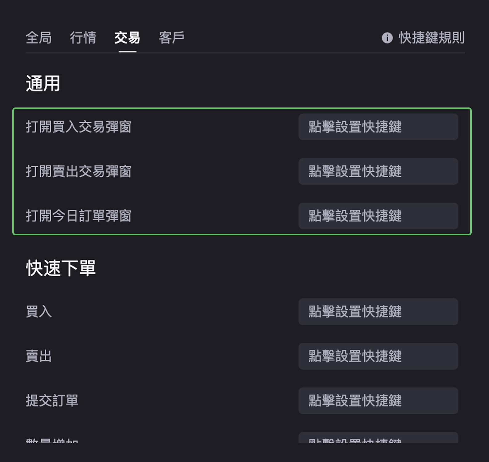
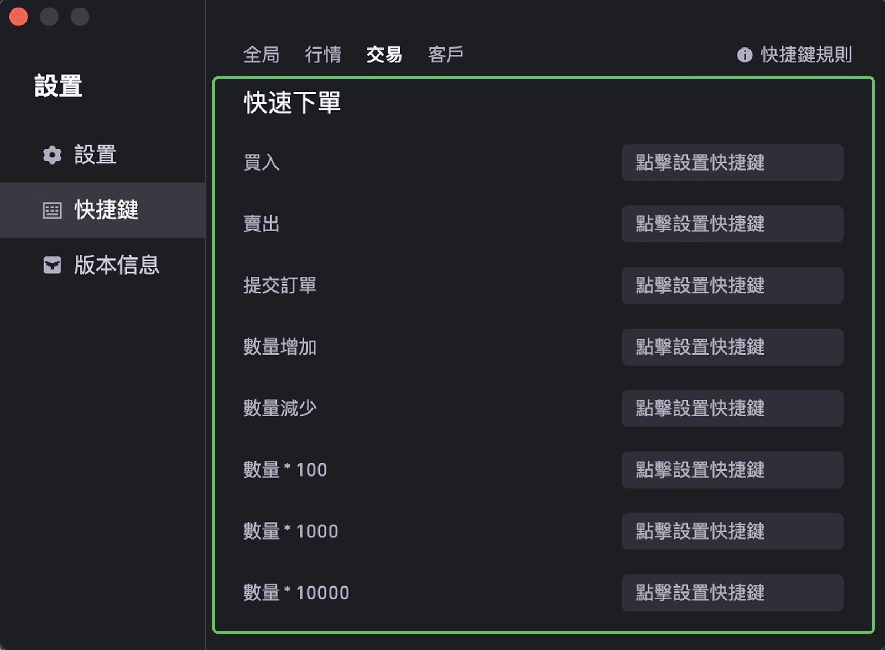
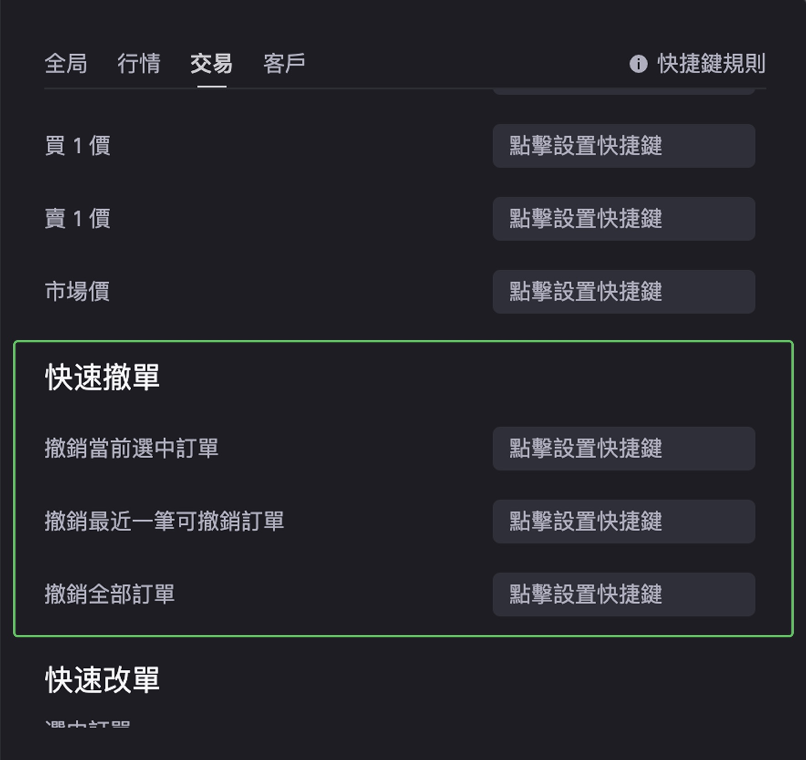
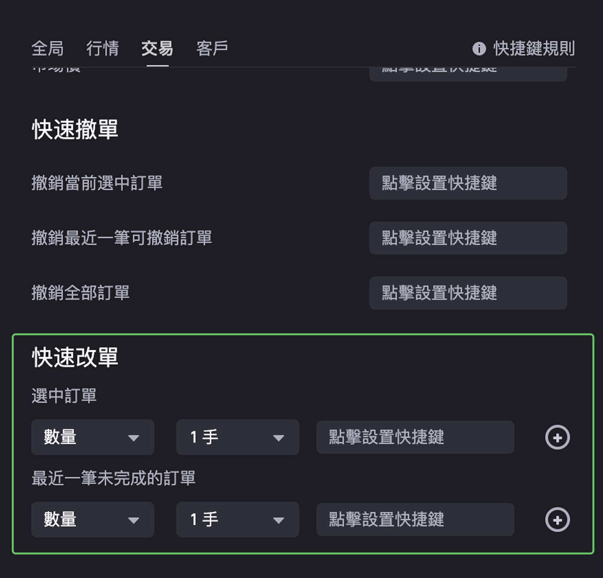

# 桌面端快捷键

桌面端全局和功能性快捷键、交易快捷键及自定义规则。

## 快捷键层级说明

- **全局快捷键**：桌面端打开时均可触发，无需聚焦特定组件
- **功能快捷键**：需要鼠标焦点位于对应组件内才可触发

## 常用功能快捷键

| 快捷键 | 功能 |
|--------|------|
| Tab | 切换到下一个焦点 |
| Shift+Tab | 返回到上一个焦点 |
| Enter | 确定并选中 |
| Esc | 取消 |
| ↑ | 向上焦点切换 |
| ↓ | 向下焦点切换 |
| ← | 向左焦点切换 |
| → | 向右焦点切换 |

## 全局快捷键

| 功能 | Mac | Windows |
|------|-----|---------|
| **标签页** | | |
| 新开标签页 | ⌘T（可自定义） | Ctrl+T（可自定义） |
| 跳转到前一个标签页 | ⌘← | Ctrl+← |
| 跳转到后一个标签页 | ⌘→ | Ctrl+→ |
| **组件** | | |
| 进入组件快速切换模式 | 长按 Option | 长按 Alt |
| 唤起组件工具箱 | 自定义设置 | 自定义设置 |
| 打开组件操作菜单 | ⌘E | Ctrl+E |
| 唤起交易买入弹窗 | 自定义设置 | 自定义设置 |
| 唤起交易卖出弹窗 | 自定义设置 | 自定义设置 |
| 唤起今日订单弹窗 | 自定义设置 | 自定义设置 |
| **列表** | | |
| 列表向上翻页 | Fn+↑ | PageUp |
| 列表向下翻页 | Fn+↓ | PageDown |
| **通用** | | |
| 唤起快捷键说明页 | ⌘/ | Ctrl+/ |
| 唤起设置弹窗 | ⌘, | Ctrl+, |
| 隐藏软件 | ⌘H | Ctrl+H |
| 退出 | ⌘Q | Ctrl+Q |

### 新开标签页

Mac：⌘T，Windows：Ctrl+T，可自动新开标签页。

### 跳转到前/后一个标签页

Mac：⌘← / ⌘→，Windows：Ctrl+← / Ctrl+→，快速左右切换当前选中的标签页。

### 进入组件快速切换模式

长按 Option（Mac）或 Alt（Windows），进入组件快速切换模式。此时可点击数字或字母快速定位组件，也可通过 ←↑↓→ 进行焦点快速切换。

### 唤起组件工具箱

默认为空，需手动设置快捷键，设置后可快速唤起组件工具箱。

### 打开组件操作菜单

Mac：⌘E，Windows：Ctrl+E。选中当前组件后，按下快捷键唤起组件操作菜单；按 ↑↓ 切换选项，按 Enter 执行。

## 交易快捷键

### 全局通用

可全局唤起交易组件买入弹窗、卖出弹窗、今日订单弹窗，具体快捷键支持自定义设置。

### 快速下单（焦点在交易组件时）

焦点选中交易组件后生效，支持价格填充、数量填充等快捷键操作。

## 快速撤单快捷键

需焦点选中当日订单或历史订单组件时生效。

## 快速改单快捷键

需焦点选中当日订单或历史订单组件时生效。

## 自定义快捷键规则

支持两类自定义快捷键：

- **单键**：F1–F12 或标点符号键；单个数字或单个字母不允许设置
- **组合键**：
  - Mac：Command / Shift / Option / Control + 数字、字母或标点符号
  - Windows：Ctrl / Shift / Alt + 数字、字母或标点符号
  - 组合键修饰键位数不限，最后一位必须是数字、字母或标点符号
