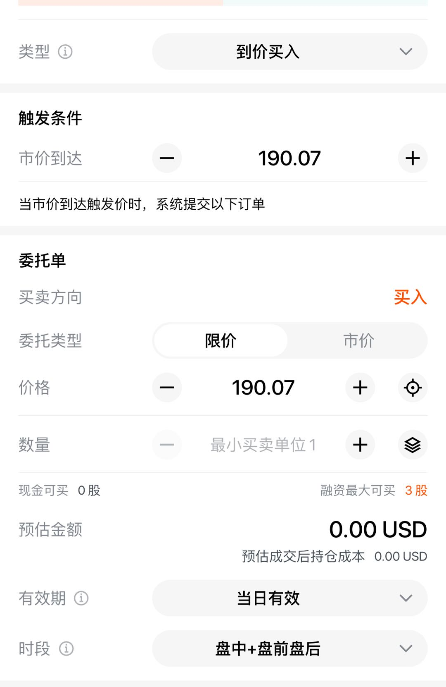
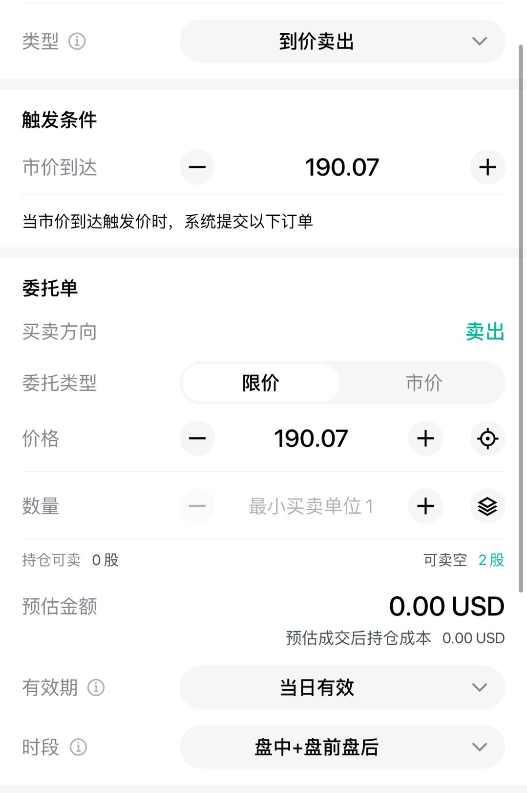
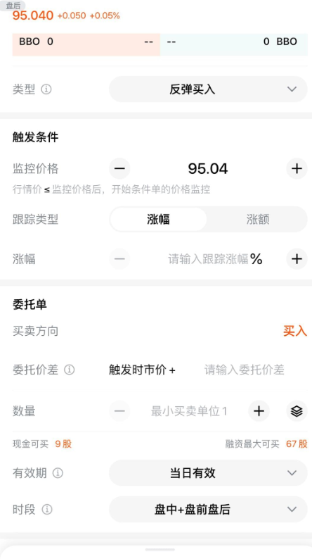
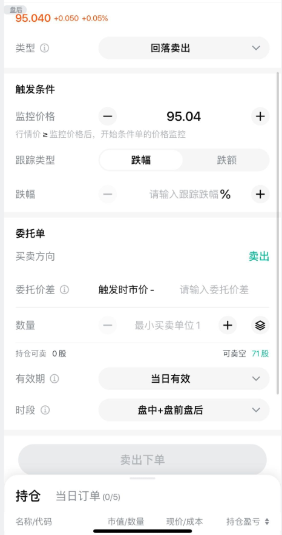

# 到价反弹订单

到价反弹订单是在市价触达设定价格后自动触发委托、或在价格回落/反弹达到设定幅度后触发委托的订单类型，适用于止盈、止损等场景。

---

## 到价买入（Buy if Touched）

设定触发价格，当市价达到该价格后，系统自动提交买入订单。

### 参数设置

- 触发条件：监控行情价格达到设定条件后触发委托单
- 市价到达：不能等于当前价格。设置价格 > 当前最新价时，最新价涨过设置价格就触发；设置价格 < 当前最新价时，最新价跌过设置价格就触发
- 委托类型：限价单或市价单
- 支持订单有效期：当日有效 / 撤销前有效 / 特定日期前有效

### 示例

- 当前最新价 191，设置市价达到 190.07 → 当最新价 ≤ 190.07 时触发买入
- 当前最新价 191，设置市价达到 191.07 → 当最新价 ≥ 191.07 时触发买入

适用场景：空头持仓的止盈或止损。

---

## 到价卖出（Sell if Touched）

设定触发价格，当市价达到该价格后，系统自动提交卖出订单。

### 参数设置

- 触发条件：同到价买入
- 委托类型：限价单或市价单
- 支持订单有效期：当日有效 / 撤销前有效 / 特定日期前有效

### 示例

- 当前最新价 160，设置市价达到 169.71 → 当最新价 ≥ 169.71 时触发卖出
- 当前最新价 160，设置市价达到 150.00 → 当最新价 ≤ 150.00 时触发卖出

适用场景：多头持仓的止盈或止损。

---

## 反弹买入（Trailing to Buy）

设定监控价格，当市场价格跌破监控价格后，系统开始跟踪价格反弹幅度。当反弹幅度达到设定条件时，自动提交买入委托单。

### 参数设置

- 跟踪类型：涨幅（百分比）或涨额（价格金额）
- 委托价格（触发时市价+）：输入 0 表示以当时市价委托，输入数字表示在市价基础上加价差以确保成交
- 支持订单有效期：当日有效 / 撤销前有效 / 特定日期前有效

### 示例

设置监控价格 100，跟踪类型涨额 = 10，触发时市价 + = 1，下单时市价 = 100：

1. 110 → 105：未满足监控价格条件
2. 105 → 99：满足监控条件（跌破 100），开始监控反弹幅度
3. 99 → 95：记录最低点 95
4. 95 → 104：距最低点 95 反弹涨额 = 9，不满足，不触发
5. 104 → 90：更新最低点为 90
6. 90 → 100：距最低点 90 反弹涨额 = 10，满足条件，触发：以市价 100 + 1 = 101 下达买入限价单

---

## 回落卖出（Trailing to Sell）

设定监控价格，当市场价格涨破监控价格后，系统开始跟踪价格回落幅度。当回落幅度达到设定条件时，自动提交卖出委托单。

### 参数设置

- 跟踪类型：跌幅（百分比）或跌额（价格金额）
- 委托价格（触发时市价-）：输入 0 表示以当时市价委托，输入数字表示在市价基础上减价差以确保成交
- 支持订单有效期：当日有效 / 撤销前有效 / 特定日期前有效

### 示例

设置监控价格 100，跟踪类型跌幅 = 10%，触发时市价 - = 0，下单时市价 = 100：

1. 90 → 95：未满足监控价格条件
2. 95 → 101：满足监控条件（涨破 100），开始监控回落幅度
3. 101 → 105：记录最高点 105
4. 105 → 100：距最高点 105 回落 4.76%，不满足，不触发
5. 100 → 110：更新最高点为 110
6. 110 → 99：距最高点 110 回落 10%，满足条件，触发：以市价 99 - 0 = 99 下达卖出限价单

---

## 免责声明

预埋订单是长桥证券为客户提供的一项附加功能。在订单发送条件未满足之前，预埋订单将暂时存放于长桥证券的系统中。由于系统升级、公司行动或其他不可控因素，长桥证券可能会取消系统内的预埋订单，由此可能导致的任何影响，长桥证券不承担相关责任。市场波动可能导致订单执行结果与客户预期不符。预埋订单的执行也可能受限于网络问题、第三方技术故障或其他不可预见的外部因素。

建议客户在使用条件订单功能前充分了解其特性与适用范围，并定期检查已设置的条件订单，以确保交易计划不受影响。长桥证券保留对条件订单功能进行调整或终止的权利，恕不另行通知。

## 行情数据源与系统限制

- 系统以特定行情数据作为价格监控标准。美股使用全美行情，Basic 行情表现与全美行情有差异
- 条件订单在触发前以预埋单方式暂存于系统，可能因系统升级、公司行动或其他不可控因素被取消
- 建议定期检查已设置的条件订单，确保交易计划不受影响
