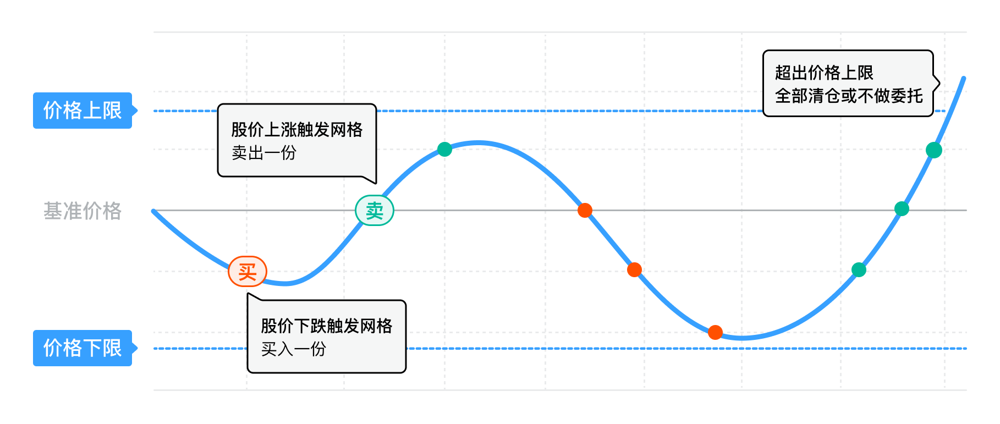
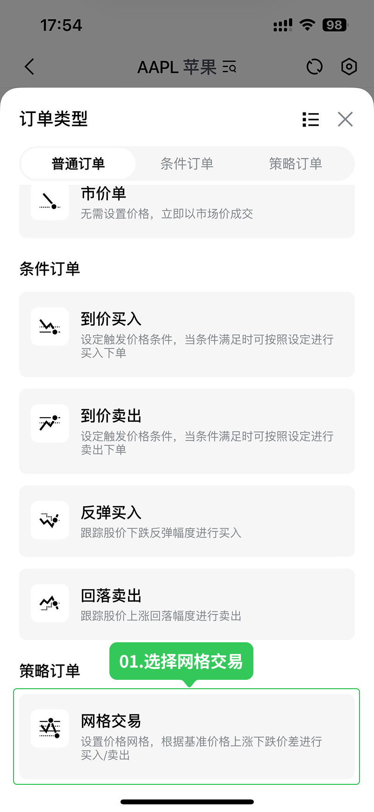
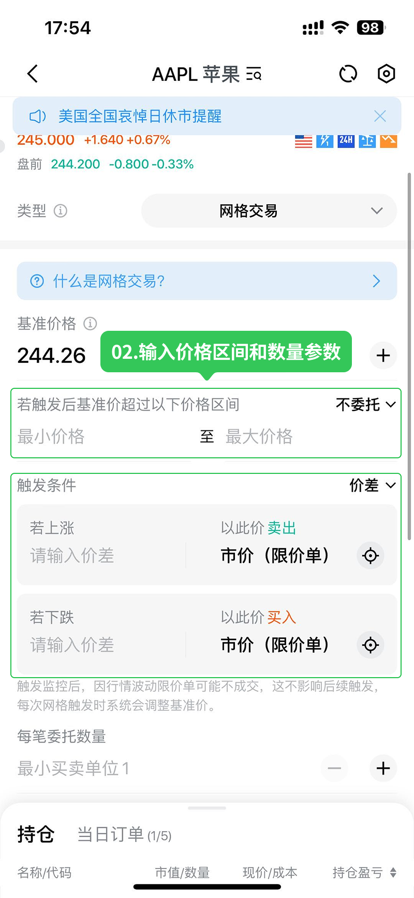
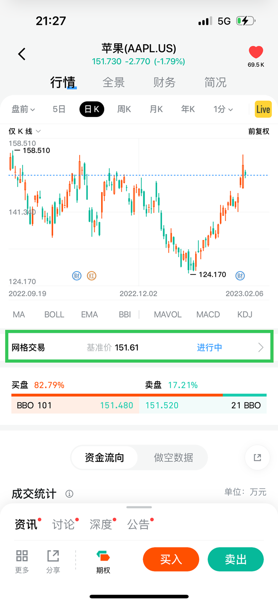
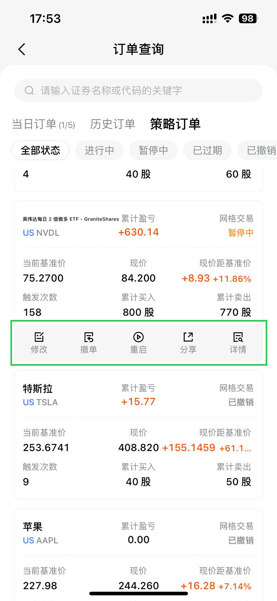
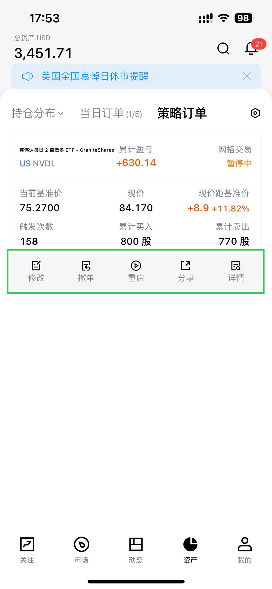
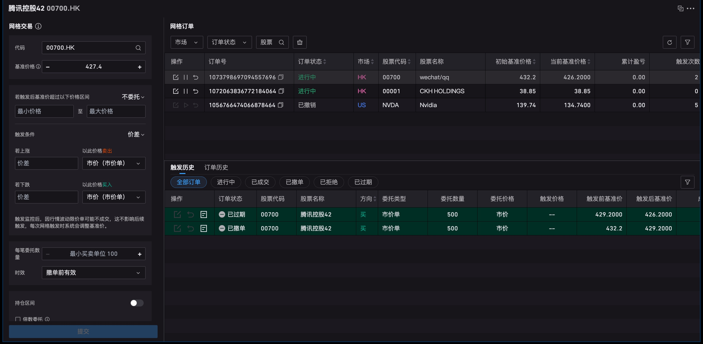

# 网格交易

网格交易是一种基于股价波动的自动化交易策略。投资者事先设定好策略参数（基准价格、触发条件、每笔数量等），系统根据参数自动执行低买高卖，通过反复买卖赚取波段差价。

注意：网格交易由系统自动下单，不支持需要在下单时手动绑定的卡券（如股票现金卡、平台费抵扣卡等）。通过每日结算同步生效的权益（如终生免佣）可正常适用于网格订单。

## 如何提交网格策略

### 移动端（长桥 App）

**步骤 1**：通过快捷交易抽屉或直接进入交易大厅，在订单类型中选择**网格交易**。

**步骤 2**：按界面提示输入价格和数量参数后提交策略。

**步骤 3**：提交完成后，在个股详情页可看到对应网格策略记录，点击可进入策略单详情。资产首页或订单记录页也可查看策略订单及交易盈亏情况。如需暂停监控或撤销，可点击策略单选择暂停或撤销；如需调整参数，可点击修改进行改单。

### 桌面端（Longbridge Pro）

**步骤 1**：在新开标签页 > 自适应布局，选择**网格交易**。

**步骤 2**：按界面提示输入价格和数量参数后提交策略。

**步骤 3**：提交成功后，可在右侧查看网格订单及订单的触发历史信息。如需暂停监控或撤销，可点击策略单选择暂停或撤销；如需调整参数，可点击修改进行改单。

## 核心参数

### 基准价格

网格策略的初始计算价格。系统以基准价格为起点，结合触发条件计算上下网格，并实时监控市价是否触及网格。当市价触发网格后，触发价自动成为新的基准价格，用于重新计算后续网格。

### 最大价格 / 最小价格

整个网格策略运行的有效价格区间，用于风险控制。股价超出该区间时，可选择不做任何委托或直接按最新价清仓。

### 触发条件

决定网格大小的参数，可按价差或百分比设置。分别设定上涨和下跌触发网格后的委托价格。

触发条件要求超过 5 个报价档位且超过基准价的 0.5%，防止收益不足以覆盖交易手续费。

网格以**实时逐笔成交价**为监控标准，不依赖行情图的显示价格（行情图为按时间加权结果）。美股使用全美行情（NBBO）监控，Basic 行情与全美行情之间可能存在价差，因此行情图显示未达触发条件时网格也可能已执行。

触发后委托类型：
- 市价（市价单）：以当时市场行情决定成交价
- 市价（限价单）：以触发时市价为限价，成交价优于或等于限价
- 触发价（限价单）：以设定触发价为限价

### 每笔委托数量

股价触发网格时的下单数量。

### 有效期

支持当日有效、撤销前有效、自定义有效期。

### 交易时段

- 港股：全时段（不含竞价时段）
- 美股仅盘中：网格仅在盘中时段执行
- 美股盘中 + 盘前盘后：可在盘前、盘中、盘后执行（盘前盘后仅支持限价单，不支持市价市价单）

注意：网格交易不支持夜盘及港股竞价时段交易。

## 进阶参数：跟踪与倍数委托

### 跟踪回落 / 跟踪反弹

开启跟踪回落后，价格上涨到设定值后需回落满足条件才触发卖出。跟踪反弹同理，下跌到最低点后需反弹满足条件才触发买入。

### 倍数委托

当股价跳空高开或低开超过一个网格时，按覆盖的网格数量委托对应倍数的每笔委托数量。

示例参数设置如下图：

示例：基准价 170，每笔数量 10 股，间隔 1 元，股价跳至 175：
- 开启倍数委托：(175 - 170) ÷ 1 × 10 = 50 股卖出
- 关闭倍数委托：固定卖出 10 股

### 持仓区间

设定最大和最小持仓数，触发网格后若下单会超出持仓区间则不委托。

### 支持卖空

开启后持仓为零时可自动做空；关闭后持仓为零不执行卖出。

## 基准价格示例

参数设置示意图：

基准价 172，价差触发条件 2 元，每笔委托 2 股：

1. 172 → 170：触发买入 2 股，新基准价 170
2. 170 → 168：触发买入 2 股，新基准价 168
3. 168 → 167：不触发（未达 2 元间隔）
4. 167 → 170：触发卖出 2 股，新基准价 170

## 休眠状态

网格遇到特定条件时自动进入休眠，条件解除后自动恢复。休眠期间：

- 暂停触发任何新的委托指令
- 继续监控股价变化和条件满足情况
- 维持最新基准价在最后一次触发失败前的状态

### 触发休眠的条件

- 资金或持仓不足：卖出时持仓超限或买入时资金不足
- 达到持仓极值：达到设定的最大或最小持仓数
- 价格越界：股价超出最高或最低价格区间

行情满足触发条件但网格未执行时，通常是账户处于休眠状态（资金不足、持仓超限或价格越界），请检查上述条件。

### 解除休眠

- 资金/持仓问题：资金或持仓满足下一次触发条件时自动恢复
- 持仓极值：持仓数回落至设定区间时恢复
- 价格越界：股价回落至价格区间时恢复
