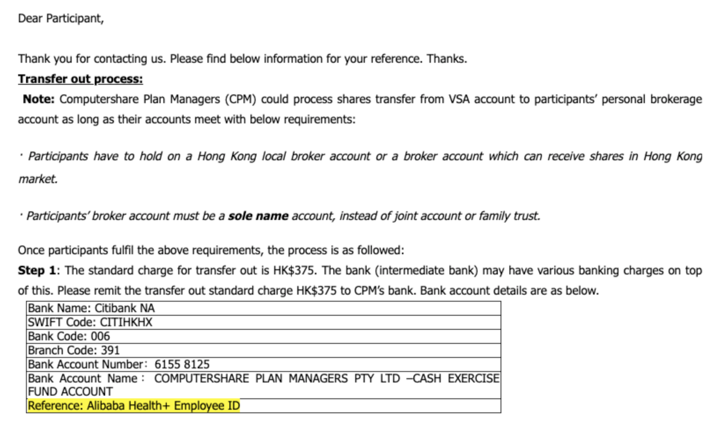
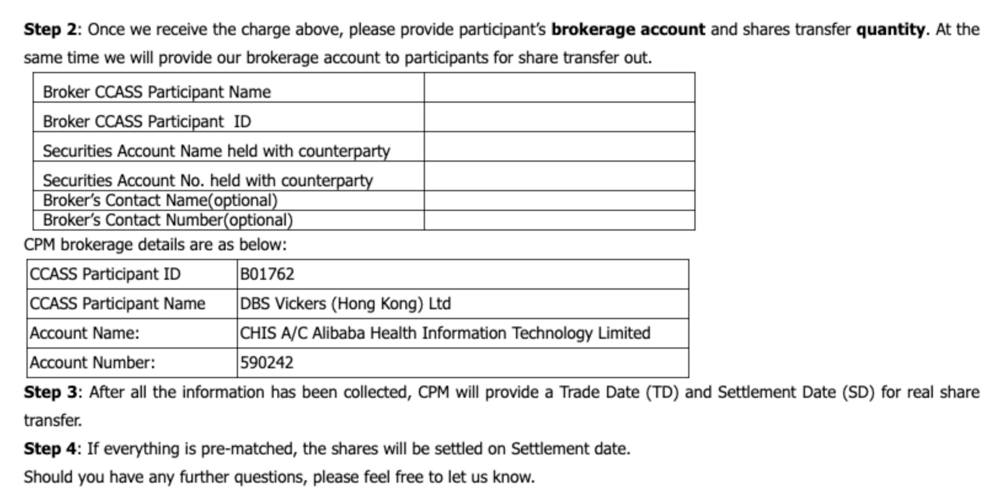
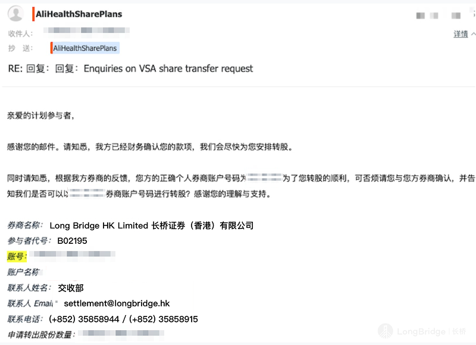
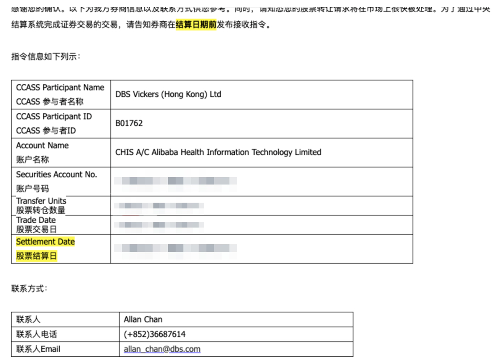

# Computershare 转仓

本指引专为持有阿里健康员工股份的员工设计。转仓通过邮件与 Computershare（CS）沟通完成，共 6 步，须使用**阿里健康工作邮箱**操作。

> 转入长桥不收费；Computershare 收取 **375 港币**转股手续费。

## 操作流程

**步骤 1**：用**阿里健康工作邮箱**发邮件至 `AliHealthSharePlans@computershare.com.au`，申请转出股票。

**步骤 2**：等待 CS 回复邮件，邮件中包含转仓步骤说明。

**步骤 3**：回复 CS 邮件，确认转出意向，并将 **375 港币**转股手续费转至 CS 邮件中提供的收款账户，回复邮件时附上支付凭证。

CS 收到手续费后，会再次发邮件提供存储券商信息，并要求您提供**转入券商信息**和转出股票数量，填写如下：

| 字段 | 内容 |
|------|------|
| 券商名称 | Long Bridge HK Limited 长桥证券（香港）有限公司 |
| 参与者代号 | B02195 |
| 账号 | 您的长桥证券账号（H 开头） |
| 账户名称 | 您的账户拼音名（如 LI XIAOHUA） |
| 联系人姓名 | 交收部 |
| 联系人 Email | settlement@longbridge.hk |
| 联系电话 | (+852) 3585 8944 / (+852) 3585 8915 |

**步骤 4**：CS 回复确认邮件，其中包含存储券商的联系人、联系方式及预计交割日期。

**步骤 5**：按照 CS 邮件中的信息，在**长桥 App** → **资产** → **存入股票** 提交股票转入申请。

**步骤 6**：提交后耐心等待，双方券商确认后 CS 发起转出，股票将在 **1–2 个工作日**存入您的长桥证券账户。
