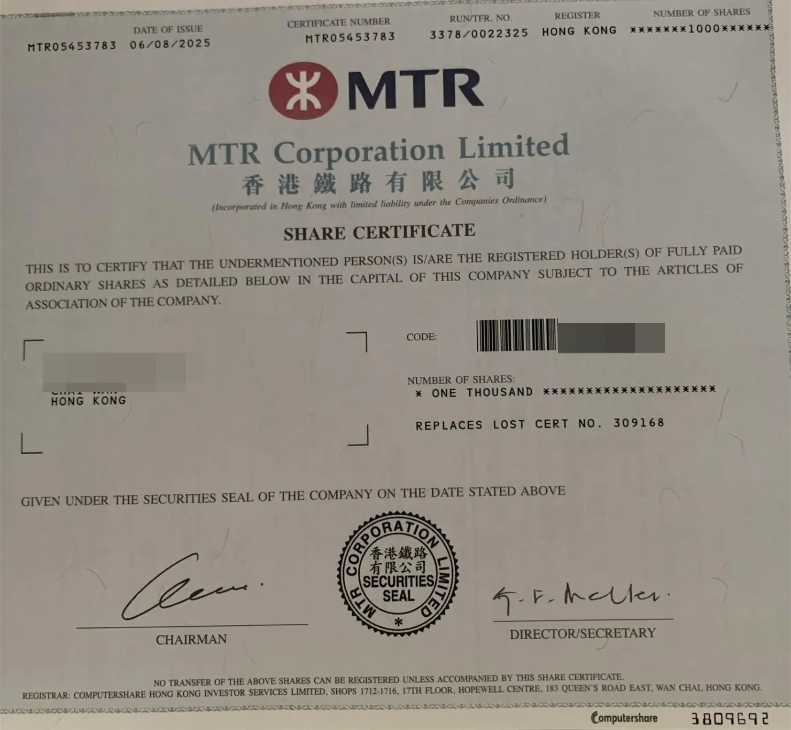
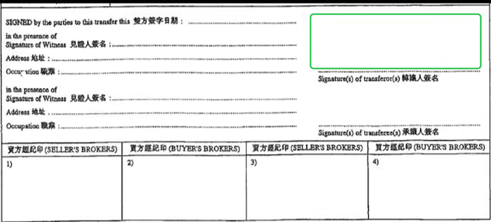

# 实物股票

实物股票是以实体印刷的股票证书形式存在的股票，每份证书代表一定数量的股份，印有公司名称、股份数量、证书编号及股东姓名等信息。

目前长桥仅支持港股实物股票的存入和提取，账户类型为长桥综合（香港）账户。

---

## 存入实物股票

### 要求

- 实物股票持有人（Shareholder）与长桥证券账户持有人姓名必须相同
- 存入大额实物股票前，须提供近半年的相关股票交易记录（如结单）和实物股票的提货纸

### 处理时间

自长桥收到实物股票起预计 12 个工作日内完成转入，实际时间以中央结算系统处理时间为准。

### 费用

同日存入 1-10 张：只代收政府印花税 5 港币 / 张
同日存入 11 张及以上：代收政府印花税 + 加收手续费 5 港币 / 张
如使用转让书，印花税只收取一次。如存入不成功，已收取的印花税不作退还。

### 存入流程

**第一步：线上提交实物股票资料**

1. 拍摄实物股票正面照片（每一只股票均需拍照）
2. 上传图片至长桥客服或客户经理，说明需存入实物股票
3. 长桥核实股票可存入后，2 个工作日内反馈结果

**第二步：前往香港办公室递交文件**

1. 文件签署：在股票正本背面「转让人签名」处签名。如使用转让书，在背面转让人签名处签名（签名须与股票过户处的签名留存一致，最多可同时签三个样式）
2. 公司账户需盖公司印章和签名，如无印章则需填写「FOR AND ON BEHALF OF [股东名称]」并签名

   

3. 本人亲自将签完名的实物股票、转让书（如有）交至长桥办公室（不接受邮寄）

办公地址：中环港景街 1 号国际金融中心一期 18 楼 1801-1804, 1815-1816 室

[实物股票存入表格](https://pub.lbkrs.com/files/202602/m8cRpKkmgvtKW7uh/_20260216.pdf)

注意：必须同时完成线上提交和线下递交两个步骤，长桥方可执行存入指示。

---

## 提取实物股票

### 提取流程

1. 联系客服获取实物股票提取表格，填写后提交
2. 在账户内预留资金，用于后续费用扣款
3. 长桥结算部门冻结相关股票和预计费用，在 CCASS 终端操作提货指令
4. 股票从中央结算取得后，长桥会通知客户在 10 个工作日内取回股票
5. 取回当天需携带身份证明文件核对身份，并在提货文件内签署确认

[实物股票提取表格](https://pub.lbkrs.com/files/202602/6kTEfaCUxAWB7v5R/20260216.pdf)
