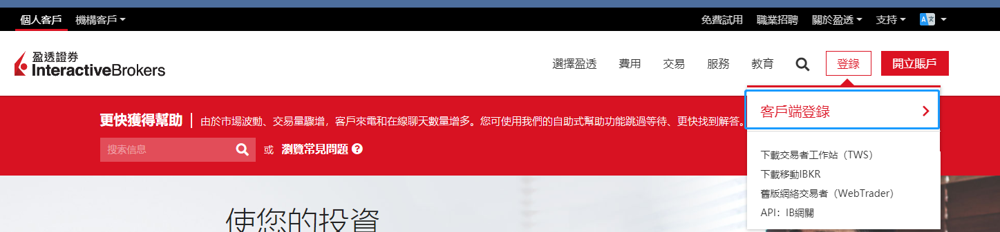
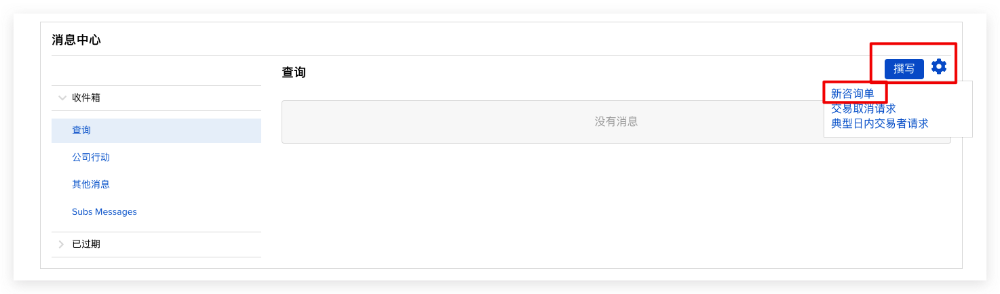
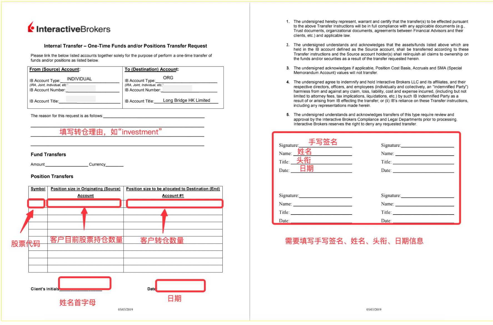

# 从荷马证券转仓

荷马证券底层基于 IB（盈透证券），转仓需同时在 IB 和荷马两侧操作，比其他券商多一步。

> **注意**：在长桥提交转入申请时，转出券商须选**盈透证券**（非荷马证券）。
>
> 转入长桥不收费；转出费用由荷马证券收取。

## 第一步：在长桥提交转入申请

1. 打开**长桥 App** → **资产** → **存入股票** → **提交转入申请**；或进入**资产 → 全部功能 → 转入股票**

   

   

2. 转出券商选择**盈透证券**，填写账户姓名和账户号码，填写股票信息后提交

   > 长桥支持填写每股成本价（选填）。未填写时按转仓成功当日收盘价计算；填写后无法修改。

## 第二步：在 IB 提交转出指示

**先联系荷马客户经理获取 IB 账户信息**，然后登录 [IB 官网](https://www.interactivebrokers.com.hk/cn/home.php)



### 港股（基础 FOP 转账）

路径：**转账与支付** → **转账头寸** → **转出** → **基础 FOP 转账**

| 字段 | 内容 |
|------|------|
| 金融机构 | Long Bridge HK Limited |
| 账户号码 | B02195 + 您的长桥账号（如 B02195+H1234567） |
| 账户名称 | 您的账户姓名（英文） |
| 联系人 | Settlement Team |
| 联系电话 | (+852) 3585 8944 / (+852) 3585 8915 |
| 联系邮箱 | settlement@longbridge.hk |


### 美股（IB 消息中心）

1. 在 IB 账户右上角选择**帮助** → **支持中心** → **消息中心**

   

2. **撰写** → **新咨询单** → **Funds & Banking** → **Position Transfers**

   

   

3. 按以下模板填写咨询单后点击 **Preview Ticket**：

   ```
   Subject: Transfer US position to another IB broker

   Body:
   Please transfer the following share(s) to U11928885. Detail listed as below:
   A/C Name: Long Bridge HK Limited
   A/C No. U11928885
   Stock Name: [股票名称]
   Symbol: [股票代码].US
   Quantity: [股数]
   Settlement Date: [提交当日 +1 天]
   No change in beneficial owner
   Account: [您的 IB 账户，U 开头]
   ```

   > 结算日期（Settlement Date）建议填写提交当日 +1 天。

4. 提交后 IB 生成 ticket number，**请将该 ticket number 告知长桥客服**

5. 部分用户会收到 IB 通知需提供授权书，联系 IB 获取并填写后提交

   

   IB 客服：上海 +86 (21) 6086 8586（周一至周五 09:00–18:00）；香港 +852-2156-7907（周一至周五 08:00–17:00）

## 第三步：联系荷马客户经理提交咨询单

完成以上 IB 操作后，**还须联系荷马证券客户经理**，请其在荷马侧也提交一张咨询单，双方均提交后转仓才会正式启动。

完成后耐心等待，股票转出后将在 **1–2 个工作日**存入长桥账户。
