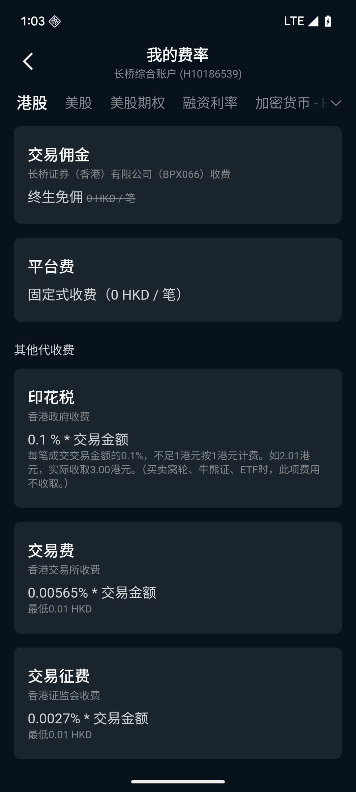
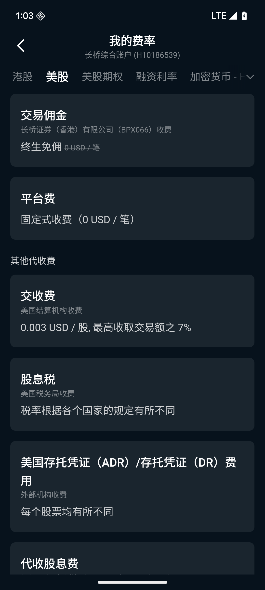
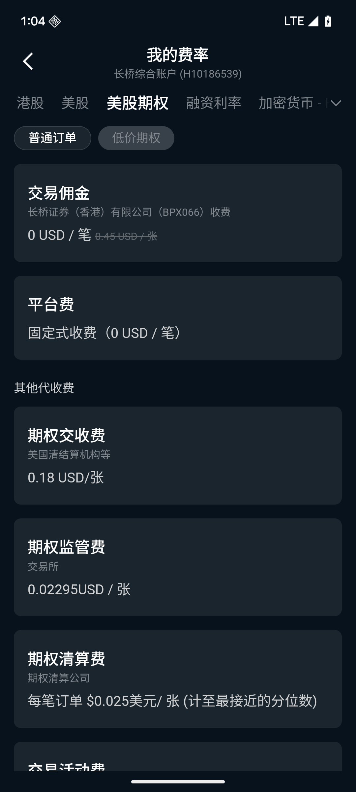
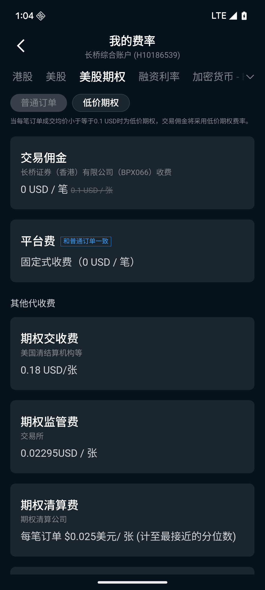
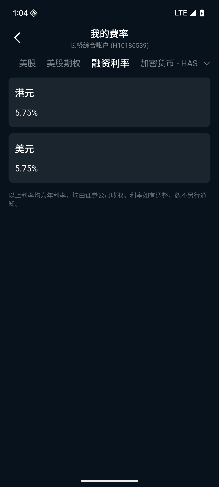
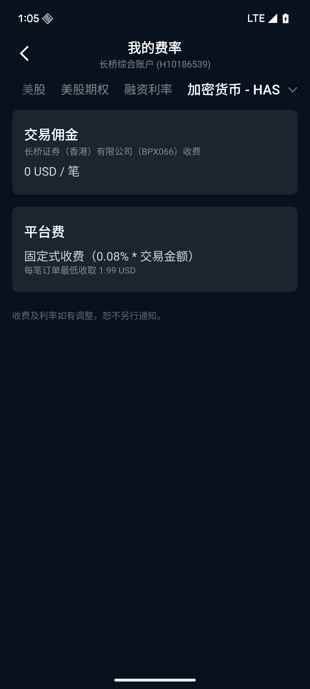

# 我的费率

「我的费率」页面显示当前账户实际适用的所有交易费率。入口在「我的」→「我的费率」，或「我的」快捷功能栏。

> **注意：** 页面展示的是你的账户实际适用费率，不同用户因账户类型、持有权益不同，显示的费率可能有所差异。本文档仅说明各费用项的含义，具体费率以 App 内页面显示为准。

## Tab 切换

页面顶部按市场分 Tab：**港股 / 美股 / 美股期权 / 融资利率 / 加密货币**

---

## 港股

### 长桥证券收费

| 费用项  | 说明                       |
|------|--------------------------|
| 交易佣金 | 以账户实际费率为准，持有免佣权益的用户显示为 0（但香港政府、交易所等第三方的代收费用仍按规定收取，无法减免） |
| 平台费  | 固定式或按比例收费，以账户实际适用方案为准    |

### 香港政府收费（代收）

| 费用项 | 费率          | 备注                                             |
|-----|-------------|------------------------------------------------|
| 印花税 | 0.1% × 交易金额 | 每笔不足 1 元按 1 元收，如 2.01 元实收 3 元；买卖窝轮、牛熊证、ETF 时免收 |

### 香港交易所收费（代收）

| 费用项  | 费率                          |
|------|-----------------------------|
| 交易费  | 0.00565% × 交易金额，最低 0.01 HKD |
| 交易征费 | 0.0027% × 交易金额，最低 0.01 HKD  |
| 交收费  | 香港结算所按规定收取                  |

### 其他代收费

| 费用项     | 费率              |
|---------|-----------------|
| 香港证监会收费 | 0.0015% × 交易金额  |
| 会财局交易征费 | 0.00015% × 交易金额 |
| 财务汇报局收费 | 按比例收取           |

---

## 美股

### 长桥证券收费

| 费用项  | 说明                       |
|------|--------------------------|
| 交易佣金 | 以账户实际费率为准，持有免佣权益的用户显示为 0 |
| 平台费  | 固定式或按比例收费，以账户实际适用方案为准    |

### 外部机构收费（代收）

SEC、FINRA 等监管机构的收费是法定代收项目，由长桥作为中介代为收取，不可减免，金额通常较小。

| 费用项               | 费率                             |
|-------------------|--------------------------------|
| 交易活动费用（TAF）       | 0.000195 USD / 股               |
| 美国证监会（SEC）费用      | 0.003 USD / 股，最高交易额的 7%（仅卖单收取） |
| 美国金融业监管局（FINRA）费用 | 最低 0.01 USD，最高 9.79 USD（仅卖单收取） |
| 代收股息费             | 免费                             |
| 股息税               | 按各国税率，具体以账户所在地为准               |
| ADR / DR 费用       | 每只股票各有不同                       |

---

## 美股期权

「美股期权」Tab 内按订单类型分为两种费率方案：**普通订单**和**低价期权**。

### 普通订单

| 费用项  | 说明                    |
|------|------------------------|
| 交易佣金 | 以账户实际适用方案为准           |
| 平台费  | 以账户实际适用方案为准           |

### 低价期权

低价期权（通常指期权权利金较低的合约）适用独立费率方案。

| 费用项  | 说明                    |
|------|------------------------|
| 交易佣金 | 以账户实际适用方案为准           |
| 平台费  | 以账户实际适用方案为准           |

> **说明：** 普通订单与低价期权适用不同费率档位，具体以 App 内「美股期权」Tab 显示为准。

### 外部机构收费（代收）

| 费用项               | 费率                             | 备注                         |
|-------------------|---------------------------------|------------------------------|
| 交易活动费用（TAF）       | 0.002 USD / 张合约                | 仅卖单收取                    |
| 美国证监会（SEC）费用      | 按交易金额比例收取                 | 仅卖单收取                    |
| 美国金融业监管局（FINRA）期权监管费 | 0.02975 USD / 张合约，最高不超过 6.27 USD | 仅卖单收取              |
| OCC 期权结算费         | 按结算规定收取                     | 买卖均收取                    |

---

## 融资利率

「融资利率」Tab 显示账户使用保证金融资时适用的利率。

### 长桥证券融资利率

| 项目     | 说明                         |
|--------|----------------------------|
| 港股融资利率 | 以账户实际适用方案为准，按日计息           |
| 美股融资利率 | 以账户实际适用方案为准，按日计息           |

> **计息说明：** 融资利率通常以年化利率展示，实际按持仓天数计算每日利息。不同账户类型、融资额度及持有权益不同，适用利率可能有所差异，以 App 内页面显示为准。

---

## 加密货币

「加密货币 - HAS」Tab 显示加密货币交易适用的费率。HAS 为长桥旗下加密货币交易平台。

### 长桥证券收费

| 费用项  | 说明                    |
|------|------------------------|
| 交易佣金 | 以账户实际适用方案为准           |
| 平台费  | 以账户实际适用方案为准           |

> **说明：** 加密货币交易费率以 App 内「加密货币 - HAS」Tab 显示为准，不同交易对或交易量可能适用不同费率档位。

---

## 费率显示与调整规则

- 页面显示的是**当前账户实际适用费率**，若持有特殊权益（如终生免佣），相应费率显示为 0
- 收费及利率如有调整，恕不另行通知，以页面最新显示为准
- 点击各费用项右侧「了解示例」可查看具体计算示例
