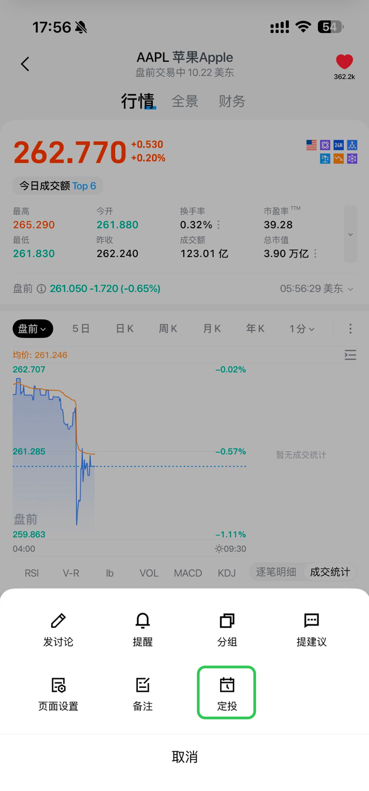
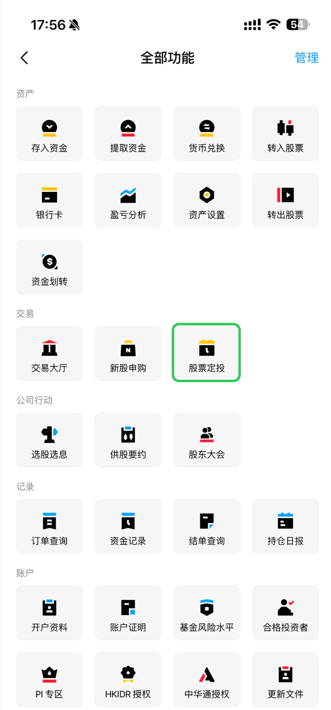
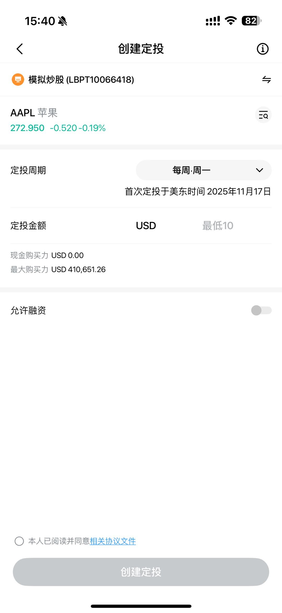
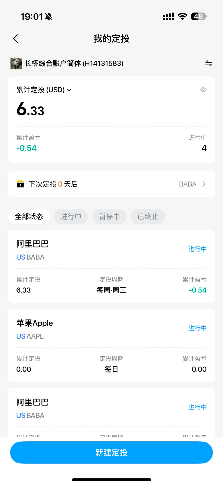
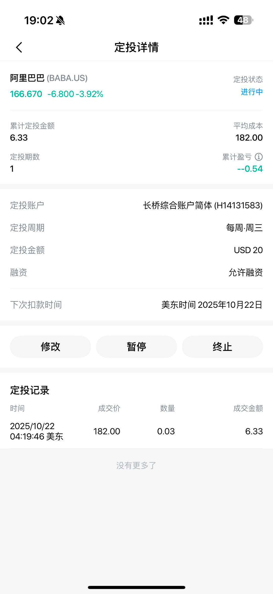
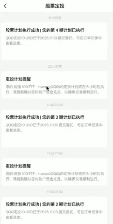
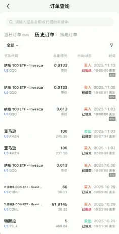

# 美股定投

股票定投是一种投资策略，指投资者在固定时间以固定金额投资于特定股票。适合无需深入研究个股、希望长期参与股市的投资者。

当前仅美股市场支持定投，大部分支持美股碎股交易的股票都支持定投。

## 功能入口

- 方式一：长桥 App - 个股详情 - 更多 - 定投，创建该股票的定投计划

- 方式二：长桥 App - 资产 - 全部功能 - 股票定投，进入定投界面

## 创建定投计划

### 定投周期

频率支持每日、每周、每两周、每月。并非所有美股标的都支持定投，具体以 App 内个股页面是否显示定投入口为准。界面展示时区为港股市场 HKT 时间，美股市场美东时间。新建定投计划后，首次定投执行时间以美东时间为准。

### 定投金额

只能输入整数，US 市场标的默认 USD，最低金额为 10 美元。定投采用市价单执行，并预留部分资金用于支付交易费用，因此实际投入金额会略低于设定值。

### 融资选项

允许融资开关默认关闭，开启需二次确认。若账户余额不足，定投计划将自动启用融资，可能产生利息。

余额不足（且未开启融资）时，当次定投创建失败，可在定投记录中查看失败原因并收到消息推送。连续失败三次定投计划将自动暂停。

## 定投计划维护

长桥 App - 资产 - 全部功能 - 股票定投，可进行以下操作：

- 查看累计定投金额
- 管理定投状态：修改、暂停、恢复、终止
- 查看定投详情：每笔定投的时间、成交价、数量、成交金额（定投失败会记录失败原因）

累计盈亏基于所有定投股票的买入成本与当前价值计算，不反映手动卖出操作对盈亏的影响。

## 查看定投提醒与订单记录

- 定投通知：长桥 App - 右上角通知 - 股票定投

- 订单记录：长桥 App - 资产 - 全部功能 - 订单记录（定投订单会有定投标识，可在「策略订单」标签页查看）

## 免责声明

本文仅供参考，不构成任何投资建议。

## 相关文档

- [美股交易规则与结算](/stock-trading/交易时间与规则/美股交易规则与结算) — 美股交易时段
- [美股卖空](/stock-trading/交易时间与规则/美股卖空) — 相关交易规则
