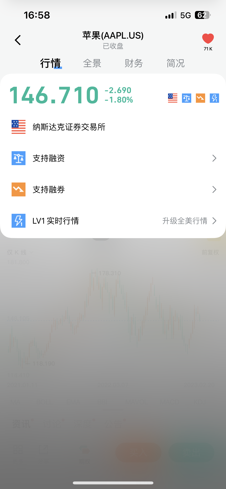
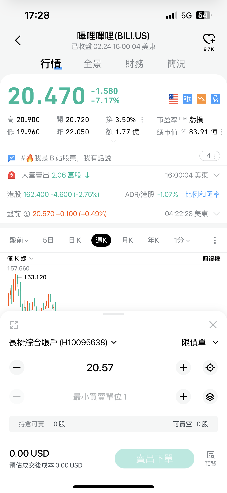
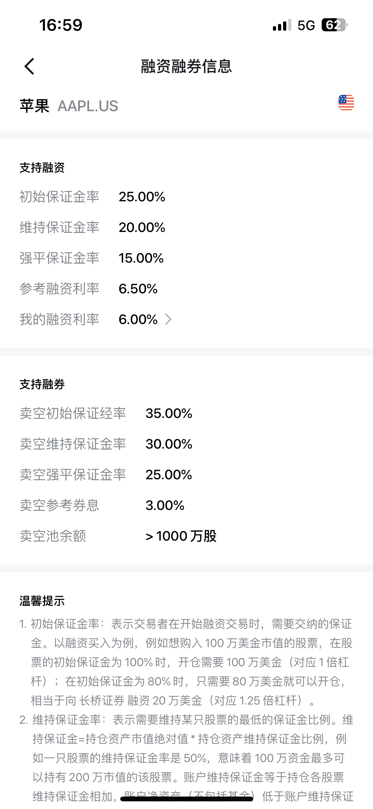

# 美股卖空

美股融券卖空条件、操作流程、融券利息计算、强平规则及派息处理。

## 什么是美股卖空

融券是美股最基本的卖空方式，与做多操作相反。当投资者认为某股票未来价格会下跌且尚未持有该股票时，可将证券账户内的资金（保证金）作为抵押物向长桥借入该股票并卖出。

待股价下跌时低价买进同等数量股票归还，从中赚取高卖低买的差价。

## 卖空条件

- 已开通长桥证券综合账户（保证金账户），现金账户不支持
- 账户内有足够购买力（账户资产 > 融券个股所需初始保证金）
- 该股票支持长桥卖空

每个支持卖空的股票融券保证金率不同，具体可在个股详情页查看。入金或存入可抵押股票均可提升购买力。

## 如何查看是否支持卖空

进入个股详情页，查看右上角补充信息，如包含「支持卖空融券」则可融券卖出。点击可查看卖空所需保证金、券息、融券池额度等信息。

支持卖空股票名单会根据公司政策及市场风险不时调整。并非所有美股都能卖空，价格非常低或流动性非常差的股票不允许卖空。

## 卖空操作

下单界面选择卖出方向，输入数量下方会显示「可卖空」额度，根据额度输入数量后提交订单。

### 空头转多头

需先平仓（买入空仓股数）后再下新买入单。例如卖空 200 股，需先买入 200 股平仓，再下新买入单。直接买入 400 股会下单失败。

### 同一股票限制

同一证券账户无法同时做多和卖空一支股票。持有多头时卖出相同数量视为平仓，超过持仓数量则下单失败。

## 收费

### 交易费用

与做多方向交易费率相同（佣金、平台费、第三方收费）。

### 融券利息

借入股票卖出且未在日内买回平仓，需支付融券利息。

融券利息 = 每日已交收卖空股票数量 ×【（收盘价 × 102%）向上取整】× 卖空参考利率 ÷ 360

- 融券利息每日计提，月底合计扣费
- 卖空参考利率和收盘价可能浮动，最终以每日清算后的利率计算
- 每支股票不同时间点卖空参考利率可能不同，具体在个股详情页查询

### 计息时间

美股 T+1 交收，计息在股票完成交收后开始。融券期间每日不会实时扣除利息，但计息会每日影响购买力，请确保账户内有足够保证金。

## 融券担保品规则

卖空成交后，系统自动计算担保金 = 与借入股份实时市值等值的现金。担保金以保证金方式收取，不计入现金购买力。若现金扣减空头平仓担保额后产生欠款，将按融资欠款计算利息。

## 融券与融资额度

若客户没有足够现金进行卖空，实际上是券商借款给客户卖空，会占用融资额度。

示例：现金为 0，卖空 AAPL 1 股 130 美元，初始保证金需 50 美元 → 券商借出 50 美元，占用融资额度。
示例：现金 100 美元，卖空 AAPL 1 股 130 美元，初始保证金需 50 美元 → 现金足够，不占用融资额度。

## 追缴保证金与强平

卖空股票市值上升导致账户资产净值低于维持保证金时，会触发追缴保证金（Margin Call）。资产净值低于强平保证金或追缴限期到时，账户可能随时被强平。

## 卖空期间派息

融券期间如发生股票派息，且在除权日前一个交易日仍持有空头头寸，长桥将在股息支付日从账户扣取分红金额。由于除权后股价下跌，空头仓位会增加相同金额浮盈，一减一增刚好抵消。如不想支付分红，可于除权日前一个交易日之前平仓。

## 风险提示

- **风险与收益不对等**：做多最大亏损为 100%，卖空潜在亏损没有上限（股价可无限上涨）
- **时间成本**：卖空每天产生利息，随时间累积成本增加
- **利率风险**：卖空利率随市场变化，个股卖空拥挤度增加可能导致利率大幅上涨
- **公司行动**：并购、收购、分红等可能增加卖空成本
- **退市和停牌**：股票无法交易期间仍需按最近交易日价格持续支付融券费用
- **股票归还**：长桥可酌情要求客户随时归还借入的股票

## 相关文档

- [美股交易规则与结算](/stock-trading/交易时间与规则/美股交易规则与结算) — 美股市场规则
- [融资额度与保证金规则](/margin/融资额度与保证金规则) — 卖空保证金要求
