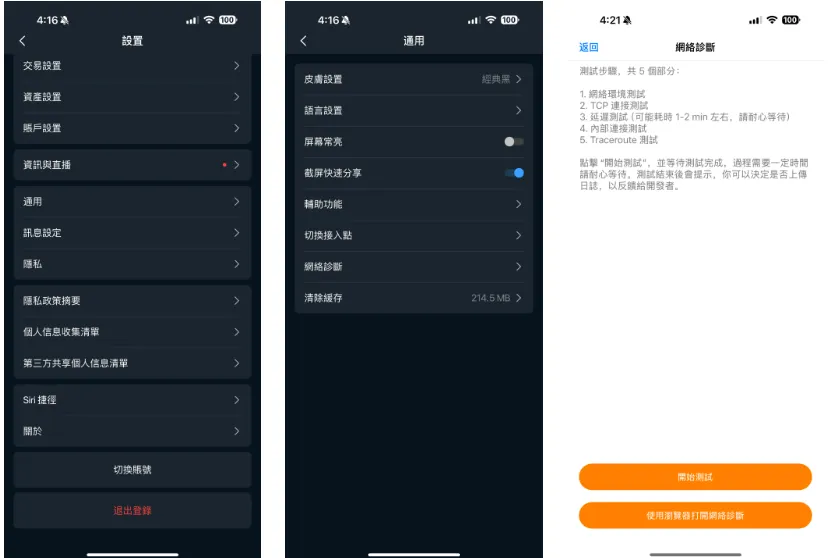

# App 网络连接排查

主要用于 APP 卡顿、连接不上、页面加载慢等网络问题的排查。

## 网络诊断工具

长桥提供在线网络诊断工具，可检测网络连接状况。

访问方式：
- [网页访问](http://detect.longbridge-inc.com/)
- App 入口：设置 - 通用 - 使用浏览器打开网络诊断

### 检测功能

1. **浏览器和系统信息**：检测浏览器、操作系统及 Cookie/localStorage 状态
2. **网络速度测试**：测量 LongBridge API、WebSocket 连接和静态资源的延迟，以及第三方服务（Google、Bing、Baidu）的连接性能
3. **隐私保障**：工具不收集或存储私人信息，仅收集诊断所需的技术数据

## 工具结果说明

运行诊断后，页面会显示以下信息：

- **Local IP**：您的本地 IP 地址（如 `34.96.47.35`），用于判断您当前所在地区
- **Local DNS**：您正在使用的 DNS 服务器地址（如 `74.125.186.155`），辅助判断网络路由情况

## 典型网络故障场景

### VPN 或代理导致网络问题

**现象一：中国 IP + global 快 + 大陆慢**

Local IP 显示为中国地址，但 global 地址连接快（约 50ms），mainland 地址连接慢（约 500ms），第三方服务（Google）连接快。

原因：可能使用了 VPN 或代理，导致访问中国服务的连接变慢。

解决方案：关闭 VPN 或代理，重启 App 并重新测试。

**现象二：海外 IP + 大陆快 + global 慢**

Local IP 显示为海外地址，但 mainland 地址连接快（约 100ms），global 地址连接慢（约 800ms）。

原因：可能使用了代理手段，导致访问海外服务器变慢。

解决方案：关闭 VPN 或代理，重启 App 并重新测试。

**现象三：部分快部分慢（无规律）**

部分检测项响应快，部分异常慢，无明显规律。

原因：可能使用了代理但未配置合理的代理策略。

解决方案：关闭 VPN 或代理，重启 App 并重新测试。

### 用户网络质量问题

**现象：所有检测项都很慢**

global 和 mainland 地址连接均慢（600-1200ms），第三方服务也慢（500-1500ms）。

原因：网络带宽不足或网络质量不稳定。

解决方案：检查本地网络连接，重启路由器或切换到其他网络（如手机热点）。

### 长桥服务问题

**现象：所有 API/WS 检测均失败**

global 和 mainland 地址均无法连接，但部分第三方服务可以连接（50-150ms）。

原因：长桥服务可能出现故障，或用户本地对部分地址做了安全防护。

解决方案：请联系客服确认服务状态。如确认是服务故障，请等待恢复通知。

## IP 地址查询工具

如需查询本地 IP 地址：
- [https://www.ip138.com/](https://www.ip138.com/)
- [https://ip.tool.chinaz.com/](https://ip.tool.chinaz.com/)
