# 卡券系统

各类卡券类型、激活方式、状态说明、使用规则及常见问题解答。

## 卡券类型

| 卡券名称   | 用途               | 激活方式           | 有效期     |
|--------|------------------|----------------|---------|
| 行情卡    | 免费使用行情数据服务       | 自动激活           | 发放后固定天数 |
| 股票卡    | 获得指定金额/股数用于购买股票  | **手动激活**       | 激活后固定天数 |
| 免佣卡    | 交易佣金优惠或免除        | 自动激活           | 发放后固定天数 |
| 免佣次卡   | 按次免佣，有次数上限       | 自动激活           | 发放后固定天数 |
| 终生免佣   | 永久免除指定市场交易佣金     | 自动激活           | 永久有效    |
| 基金加息卡  | 基金持仓期间享受额外收益     | 持仓后自动激活        | 持仓期间有效  |
| 咖啡券    | 兑换实体咖啡饮品         | **手动领取**后出示    | 固定截止日期  |
| 现金卡    | 激活后发放至账户余额       | **手动激活**       | 激活后永久有效 |
| 碎股卡    | 用于购买不足一手的股票      | 自动激活           | 发放后固定天数 |
| 打新手续费卡 | IPO 申购时自动抵扣手续费   | 事件驱动自动抵扣       | 发放后固定天数 |
| 平台费抵扣卡 | 交易产生的平台费先收后返     | 事件驱动自动减免       | 发放后固定天数 |
| 融资利息卡  | 融资期间享受利率优惠       | 自动激活，持仓期间生效    | 发放后固定天数 |
| 股票现金卡  | 买入股票成交后按卡面金额返现   | 下单时自动匹配，T+1 返现 | 发放后固定天数 |
| 期权现金卡  | 买入美股期权成交后按卡面金额返现 | 下单时自动匹配，T+1 返现 | 发放后固定天数 |

> **手动激活**的卡券（加粗显示）不会自动生效，请在「我的卡券」中手动操作，逾期未激活将失效。具体有效天数以卡券详情页为准。

具体天数请以卡券详情页显示为准，不同活动发放的同类卡券有效期可能不同。

---

## 如何激活和使用卡券

### 查看卡券

1. 打开 APP，进入「我的」页面
2. 点击「卡券」或「权益中心」
3. 可查看所有卡券及其状态

### 手动激活步骤

1. 在卡券列表中找到待激活的卡券
2. 点击卡券进入详情页
3. 点击「激活」按钮
4. 激活成功后状态变为「使用中」

### 自动激活的卡券

行情卡、免佣卡、碎股卡、基本面卡等无需手动激活，发放后系统会在短时间内自动处理。打新手续费卡、平台费抵扣卡等在对应事件发生时由系统自动触发。

联系客服参考时间：

- 自动激活类（行情卡、免佣卡等）：发放后超过 30 分钟仍未生效，联系客服
- 手动激活类（股票卡、现金卡等）点击「激活」后：超过 10 分钟仍显示「激活中」，联系客服

---

## 卡券状态说明

| 状态   | 含义              | 需要做什么                     |
|------|-----------------|---------------------------|
| 未激活  | 卡券已发放到账，等待激活    | 自动激活类：等待即可；手动激活类：点击「激活」按钮 |
| 激活中  | 系统正在处理激活请求      | 等待 1-2 分钟，无需操作            |
| 使用中  | 卡券已激活，权益生效中     | 正常享受对应权益，注意使用期限           |
| 已使用  | 卡券权益已全部消费完毕     | 无法继续使用，可参与活动获取新卡券         |
| 已过期  | 卡券已超过有效期        | 无法使用，请注意今后在有效期内及时激活和使用    |
| 等待开户 | 账户未开通对应市场（仅股票卡） | 完成对应市场账户开户后即可激活           |

---

## 各类卡券详细说明

### 行情卡

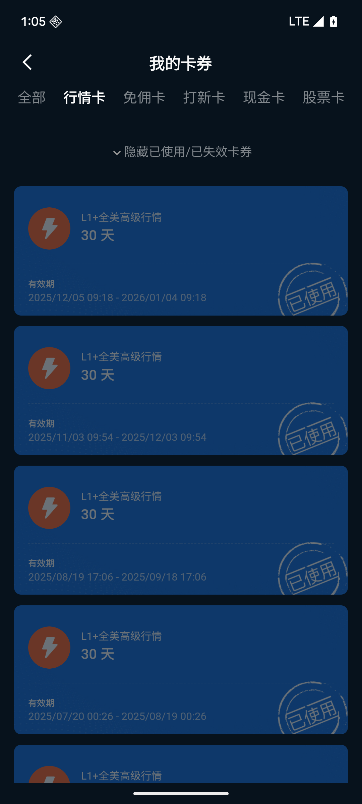

行情卡提供免费的实时行情数据服务，覆盖港股、美股等市场。

- 激活方式：绝大多数行情卡自动激活，发放后无需任何操作。少数特殊配置的行情卡需手动激活，以卡券详情页提示为准
- 有效期：从发放日起计算，具体天数见卡券详情
- 市场限制：行情卡可能有市场范围限制（如港股行情卡仅支持港股实时行情）
- 叠加规则：同类型行情卡（同市场、同卡类）有效期自动叠加而非重置。例：原有 30 天港股行情卡剩余 20 天，新收到 30 天后剩余 50 天
- 到期后如未订阅行情，将恢复为延迟行情

---

### 股票卡

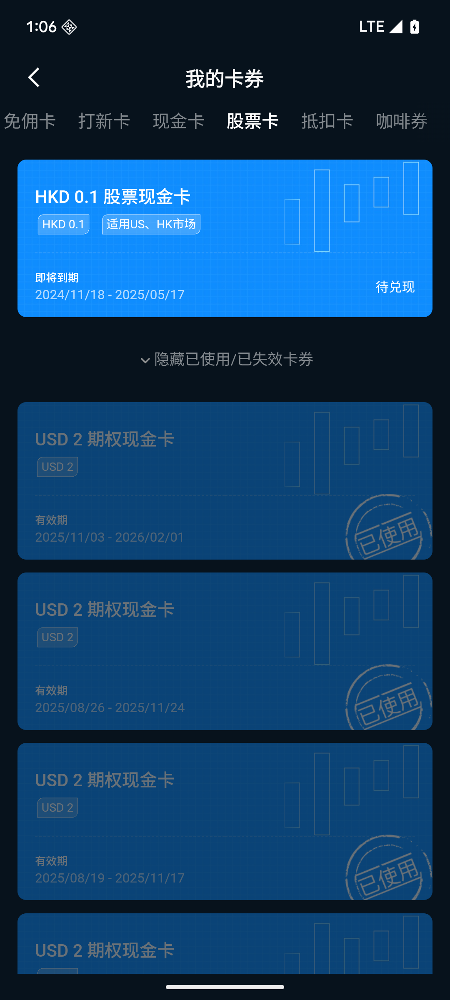

股票卡提供一定金额或固定股数用于购买指定市场的股票。

- 激活方式：需手动点击「激活」按钮
- 使用条件：需已开通对应市场账户（如港股账户），且须为长桥证券账户（LB 账户）
- 兑换方式分两种：
    - 按面值兑换：卡券面值为 X 港元/美元，按前一交易日（昨日）收盘价换算为对应股数
    - 固定股数：约定 X 股，无论股价涨跌，固定获得 X 股
    - 激活前请在卡券详情中确认是哪种方式
- 若未开通对应市场账户，卡券显示「等待开户」，完成开户后可激活

**发放与到账时间：**

- 香港账户：留存活动达标后系统将在「我的」页面展示领取入口，需于 60 个自然日内领取；领取后前往奖励记录使用，股票当日发放至账户
- 新加坡账户：达标后 5 个工作日内以股票卡形式发放至「我的卡券」；请在有效期内完成兑换，逾期失效不予补发；发起兑换后股票将在 10 个工作日内发放至账户

---

### 免佣卡

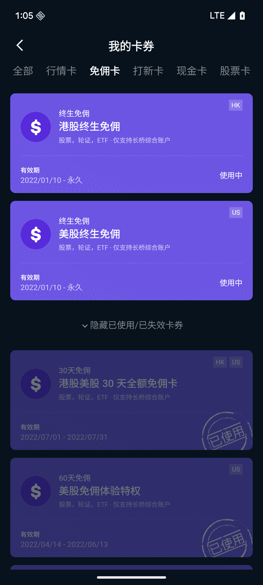

免佣卡让您在指定交易次数或金额内享受手续费优惠或全免。

- 激活方式：自动激活，发放后直接生效
- 结算方式分两种：
    - 即时抵扣模式：交易完成后手续费立即减免，账单直接显示优惠后金额
    - 先收后返模式：交易时先按正常费率收取，结算后（通常 T+1）返还至账户
- 多维度限制：次数上限、单笔金额上限、市场限制、标的限制，请以卡券详情页说明为准
- 若卡剩余额度不足以覆盖全部手续费，则部分抵扣，其余按正常费率收取

---

### 免佣次卡（金额次卡 / 折扣次卡）

免佣次卡有两种形式，均有使用次数上限：

- **免佣金额次卡**：每次交易最多免除固定金额的佣金（如每次最多免 50 港元），超出部分按正常费率收取
- **免佣折扣次卡**：每次交易按指定折扣率计算佣金（如打 8 折）

使用规则：

- 每次交易消耗一次次数，撤单或废单**不消耗**次数
- 次数用完后卡券自动失效，剩余金额不退还
- 适用市场和标的类型以卡券详情页说明为准

---

### 终生免佣

终生免佣是平台给予用户的长期权益，激活后永久有效，不会过期。权益通过每日同步方式生效于结算系统，不依赖下单时绑定，因此*
*支持网格交易订单**。

**发放与生效**：达标后的 1-3 个工作日内发放至「我的卡券」，**次日生效**。

**适用范围**：仅适用于股票、ETF；**不适用于新股暗盘、美股期权**等交易。

#### 港股终生免佣

免佣范围包括港股证券账户发生证券交易买卖时产生的佣金费用。

以下费用**不在**免佣范围内：

- 暗盘交易佣金
- 平台使用费
- 交易征费
- 交易费
- 交收费
- 印花税

如需查看完整费率详情，可前往长桥 App → 我的 → 我的费率。

#### 美股终生免佣

免佣范围包括美股证券账户发生证券交易买卖时产生的佣金费用。

以下费用**不在**免佣范围内：

- 暗盘交易佣金
- 平台使用费
- 交易征费
- 交易费
- 交收费
- 印花税

如需查看完整费率详情，可前往长桥 App → 我的 → 我的费率。

**注意：** 港美股终生免佣不适用于新股暗盘、美股期权等交易。

---

### 基金加息卡

基金加息卡在持有基金期间额外提升持仓收益率。

#### 长桥香港

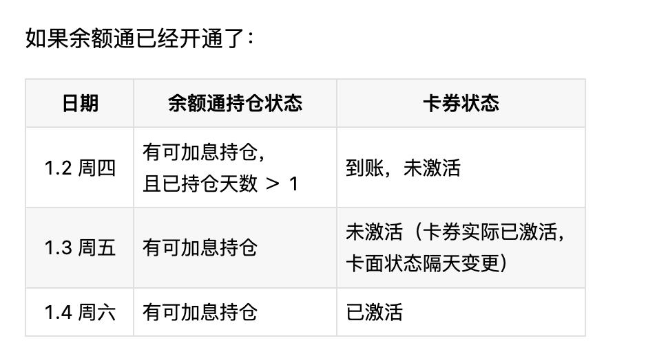

**适用范围：** 适用于长桥综合账户，对余额通及公募基金的买入订单生效。

加息周期 60 日，最大可加息本金 10,000 港币或等值美金

**生效条件：** 加息券有效期为 30 日。需在有效期内满足以下条件之一方可生效：

- 持有余额通或公募基金持仓
- 在有效期结束前至少 2 个交易日完成余额通或公募基金确认份额

份额确认后 1-2 个交易日持仓增加，持仓增加后次日加息券自动生效，开始计算加息周期。加息券生效的标志：卡面状态变更为「使用中」。

**加息计算规则：**

- 加息券对每笔投入的本金计算加息
- 加息周期内有多只基金持仓，或增加、减少持仓本金，均会根据实际持仓本金每日计算一次加息金额
- 若实际持仓超过加息券最大可加息本金，则按加息券最大可加息本金计算

**收益结算：** 每 7 日为一个结算周期，加息奖励以现金回赠形式在 3 个工作日左右返还至账户余额。可在长桥 App →
我的卡券中点击卡面查看每日加息详情。

#### 长桥新加坡

**适用范围：** 加息券仅对长桥余额通的有效持仓生效。

**发放时间：** 加息券将在达标后的 5 个工作日内发放至「长桥 App → 我的 → 我的卡券」。

**生效条件：** 请在加息券有效期内完成长桥余额通服务开通及份额认购，以享受加息收益。

- 账户中有符合加息范围的持仓时，才可激活使用加息券
- 请在加息券有效期结束前至少 2 个交易日，完成相应持仓份额确认
- 符合加息范围的持仓份额确认后，加息券将在次日自动激活

未在有效期内激活的卡券将过期失效，且不予补发。

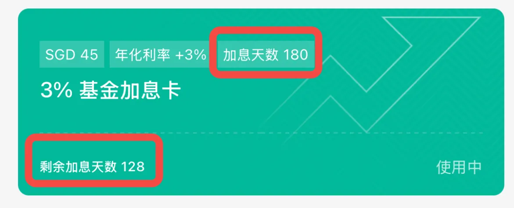

可在「我的卡券 - 加息券」卡面或详情查看加息周期及剩余天数；可在活动规则或卡券详情中查看加息生效对象（包含可加息持仓范围及本金上限）。

**激活状态时间线（未开通余额通）：**

| 日期 | 余额通持仓状态 | 卡券状态 |
|------|------------|---------|
| 1.2 周四 | 还未开通 | 加息券到账，未激活 |
| 1.3 周五 | 提交认购，无可加息持仓 | 未激活 |
| 1.4 周六 | 无可加息持仓 | 未激活 |
| 1.5 周日 | 无可加息持仓 | 未激活 |
| 1.6 周一 | 份额确认，有可加息持仓 | 未激活 |
| 1.7 周二 | 有可加息持仓 | 未激活（卡券实际已激活，卡面状态将隔天变更）|
| 1.8 周三 | 有可加息持仓 | 已激活（卡面状态在上午 10:00 后更新）|

**激活状态时间线（余额通已开通）：**

| 日期 | 余额通持仓状态 | 卡券状态 |
|------|------------|---------|
| 1.2 周四 | 有可加息持仓，且已持仓天数 ＞ 1 | 到账，未激活 |
| 1.3 周五 | 有可加息持仓 | 未激活（卡券实际已激活，卡面状态隔天变更）|
| 1.4 周六 | 有可加息持仓 | 已激活 |

每张加息券激活后，加息周期为 90 天，加息额度 SGD 2,000；加息收益根据实际持仓计算，每日可加息的本金设有上限，可于卡券详情查看。

**多张加息券同时持有：** 多张加息券可以同时生效，每张加息券将分别根据自身规则独立计算加息。

举例：若持有 SGD 300 的可加息持仓，同时有两张加息券：

- 加息周期 30 天、利率 3%、最大加息本金 SGD 100
- 加息周期 60 天、利率 5%、最大加息本金 SGD 200

则 60 天最大加息收益计算为：

- 第 1 天 ~ 第 30 天：SGD 100 × (3% / 365) × 30 + SGD 200 × (5% / 365) × 30
- 第 31 天 ~ 第 60 天：SGD 200 × (5% / 365) × 30

**收益结算：** 加息收益每 30 天结算一次，结算后将在 3 个工作日内以现金形式自动发放至您的长桥账户。可在「长桥 App → 我的 →
我的卡券 → 加息券 → 卡券详情」查看每日收益详情。

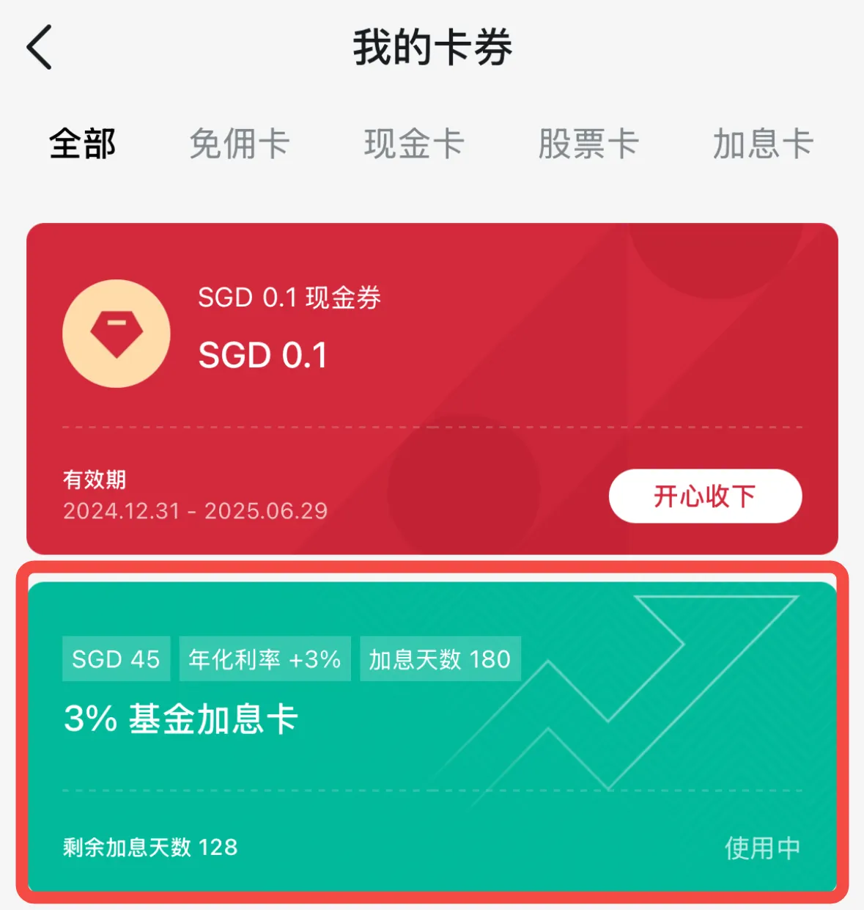

---

### 咖啡券

咖啡券可兑换指定品牌的实体咖啡饮品。

- 激活方式：需手动在 APP 内领取
- 使用步骤：在卡券详情页点击「领取」→ 获取兑换码或电子券 → 前往指定门店出示兑换
- 使用次数限制分两种：
    - 总次数模式：整个有效期内可使用 N 次，用完即止
    - 每日次数模式：每天最多使用 N 次，次日香港时间 00:00 重置
- 咖啡券二维码一旦出示，系统即开始扣减使用次数，请确认准备好使用时再打开

---

### 现金卡

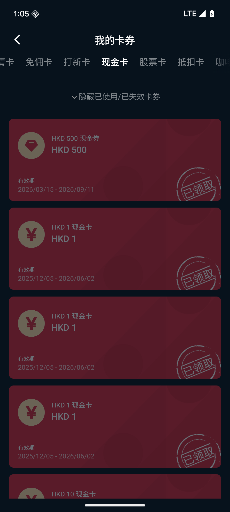

现金卡激活后将对应金额的现金直接发放至账户余额，与「现金奖励」外观相似但操作方式不同。

- **激活方式**：需手动点击「激活」按钮，不会自动到账
- **账户限制**：以卡券配置为准
- **多账户选择**：若账户下持有多个子账户，激活时需手动选择将现金划转至哪个账户；若配置了指定账户，则系统自动入账，无需选择
- **资金到账**：激活后通常几分钟内到账至对应货币的账户余额，可用于交易或提现
- **币种**：以卡券详情页显示的币种为准（港元 / 美元 / 新加坡元等）
- **有效期**：卡券有激活截止时间，过期未激活则失效，不予补发；激活后资金永久有效

**与现金奖励的区别：**

|      | 现金奖励        | 现金卡       |
|------|-------------|-----------|
| 到账方式 | 自动到账，无需操作   | 需手动点击「激活」 |
| 账户限制 | 无账户类型限制     | 以卡券配置为准   |
| 查看位置 | 账户余额 / 奖励记录 | 「我的卡券」列表  |

> 活动通知显示「获得现金奖励」时，请先在「我的卡券」确认具体类型。若是现金卡，需手动激活才能到账。

---

### 碎股卡

碎股卡用于购买不足一手（碎股）的股票，激活后在指定有效期内可用于碎股买入交易。

- **激活方式**：自动激活，发放后直接在「我的卡券」中生效，无需手动操作
- **账户限制**：仅限长桥证券账户（LB 账户）使用
- **使用范围**：仅适用于碎股买入订单；普通整手订单不适用
- **使用次数**：卡券详情页显示可用次数，每次碎股交易消耗 1 次；次数用完即失效
- **有效期**：卡券显示截止日期，到期未用完的次数自动失效，不补偿
- **锁定机制**：碎股订单提交后卡券进入「锁定中」状态，防止同一张卡被重复绑定；订单成交或撤单后系统自动解锁
- **锁定超时处理**：若订单已结束但卡券超过 30 分钟仍显示「锁定中」，请联系客服协助解锁

**查看路径**：APP「我的 → 我的卡券」，筛选卡券类型可找到碎股卡。

---

### 打新手续费卡

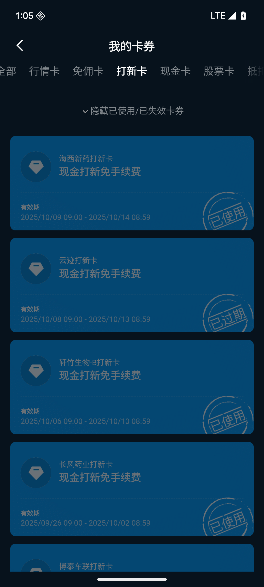

IPO 申购时系统自动抵扣手续费。

- 通用卡（未指定标的）：适用于所有 IPO 申购
- 绑定特定标的的卡：仅限该标的申购时生效
- 系统自动触发，无需手动操作

---

### 平台费抵扣卡

#### 长桥香港

**使用范围：**

- 支持抵扣港美股市场所有可交易标的（包括股票、ETF、窝轮牛熊证、期权等）产生的平台费
- 网格交易不支持使用
- 仅限抵扣长桥 App 内证券交易买入产生的平台费，不含第三方服务商收取的平台费

**使用规则：**

- 仅支持在长桥综合账户下使用
- 每笔订单仅可使用一次抵扣，次数使用完或过期均视为失效，过期未使用的次数与金额不退还
- 每笔订单有最高抵扣上限，以卡面显示金额及币种为准，超出部分按正常计费规则计费
- 仅可用于抵扣平台费，不记名、不挂失、不找零、不可兑换现金
- 使用模式为**先收后返**，交易时不会直接抵扣，结算完成后将抵扣额度返还至综合账户
- 账户中同时持有多张平台费抵扣卡时，系统优先使用单次价值更高的卡券；单次价值相同时，优先使用有效期更短的卡券
- 可与其他类型卡券叠加使用

**返还时间：** 使用平台费抵扣卡后，返还金额将在交易成功后的 5-10 个工作日内发放至长桥综合账户。

**查看卡券详情：** 前往「长桥 App → 我的 → 我的卡券」，点击对应平台费抵扣卡，可查看有效期、适用订单范围及抵扣上限。

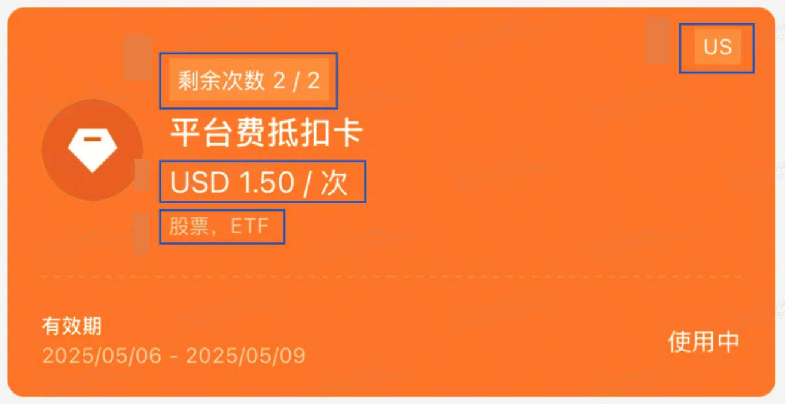

#### 长桥新加坡

**使用范围：** 平台费抵扣卡对指定市场、指定交易产品类型的订单生效，具体范围以卡面说明为准。

**使用规则：**

- 每张平台费抵扣卡设有最大抵扣金额及最大抵扣订单数量
- 卡券到账后自动生效，对符合要求的订单**直接进行费用减免**（直接抵扣，无需先收后返）
- 未用于实际交易的卡券余额将作废，不予退还

举例：若订单平台费为 SGD 0.99，而卡券每单最大抵扣金额为 SGD 1.50，则剩余的 SGD 0.51 将作废。

**查看卡券详情：** 前往「长桥 App → 我的 → 我的卡券」，点击对应平台费抵扣卡，可查看有效期、适用订单范围及抵扣上限。

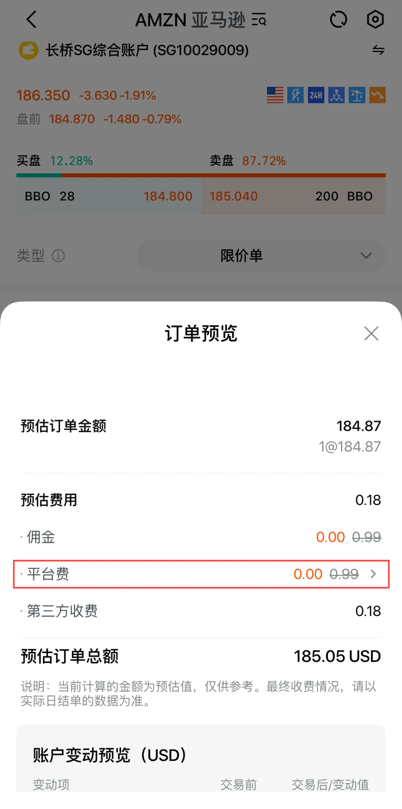

**抵扣示例：**

美国股票：

| 场景 | 原订单平台费 | 卡抵扣上限 | 实际需付平台费 |
|------|-----------|----------|-------------|
| A | USD 0.99 | 最高 USD 1.50 | USD 0 |
| B | USD 2.50 | 最高 USD 1.00 | USD 1.50 |

香港股票：

| 场景 | 原订单平台费 | 卡抵扣上限 | 实际需付平台费 |
|------|-----------|----------|-------------|
| A | HKD 15 | 最高 HKD 15 | HKD 0 |
| B | HKD 15 | 最高 HKD 10 | HKD 5 |

新加坡股票：

| 场景 | 原订单平台费 | 卡抵扣上限 | 实际需付平台费 |
|------|-----------|----------|-------------|
| A | SGD 0.99 | 最高 SGD 1.50 | SGD 0 |
| B | SGD 2.50 | 最高 SGD 1.00 | SGD 1.50 |

---

### 融资利息卡

融资利息卡在有效期内降低融资持仓的利息费率，到期后自动恢复正常利率，不影响持仓本身。

- 有效期内自动生效，无需手动操作
- 同一货币（如港元、美元）同时只能使用一张融资利息卡，不可叠加
- 到期后系统自动切换回正常融资利率

---

### 股票现金卡

股票现金卡提供固定面额的交易返现，买入股票成交后按卡面金额返现至账户。

**使用范围：**

- 适用于卡面提示支持市场的正股、ETF 买入交易
- 仅支持**买入**方向，卖出交易不适用
- 不支持：港股窝轮、牛熊证、美股期权、网格交易
- 仅支持长桥综合账户（LB 账户）

**两种使用方式：**

- 方式一（买入返现）：买入对应市场正股或 ETF 衍生品，成交后按卡面金额返还至账户

  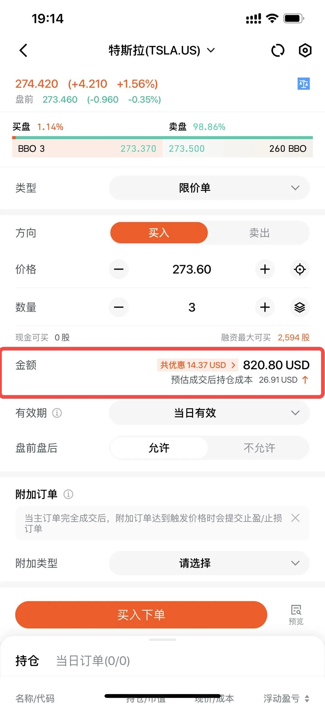

- 方式二（合并兑换）：在持有相同市场下的指定股票卡时，可与股票现金卡合并兑换，单次兑换支持勾选多张同市场股票现金卡

**使用流程：**

1. 在交易下单页面，系统自动推荐可用的股票现金卡
2. 可在「金额详情 → 股票现金卡」中手动更换或取消选中的卡券
3. 确认下单后，卡券绑定至该订单并锁定
4. 订单成交后，系统在结算完成后 T+1 将返现金额发放至账户
5. 若订单撤销（无成交），卡券自动解锁，可重新用于其他订单

**使用规则：**

- 每张卡只能绑定**一笔订单**，一经结算返现不可退回
- 一笔订单只能选择一张股票现金卡
- 不记名、不挂失、不找零、不可兑换现金
- 每张卡均有使用有效期，过期自动失效，不予补发

**返现规则：**

- 返现金额为**固定卡面金额**，最高不超过卡面价值
- 采用**先收后返**模式：交易时正常收取费用，成交结算后 T+1 返现至账户
- 多币种交易按结算日汇率折算

**卡券优先级：** 持有多张股票现金卡时，系统根据订单金额自动选择收益最大的卡券（例：订单金额 > HKD 100 时选 HKD 100 卡；订单金额 < HKD 10 时选 HKD 10 卡避免浪费）；条件相近时优先即将过期的卡券。也可在下单页面手动更换。

---

### 期权现金卡

期权现金卡仅支持在长桥综合账户下，买入美股期权时使用。

**使用流程：**

1. 下单买入美股期权时，在「金额详情」中查看并选择期权现金卡

   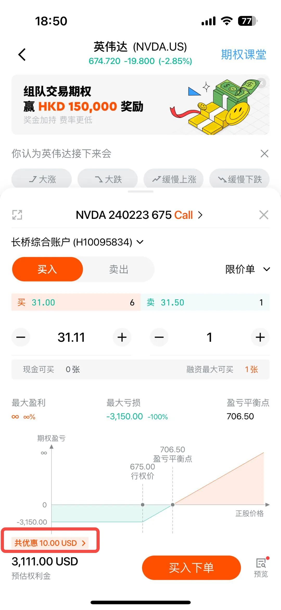

   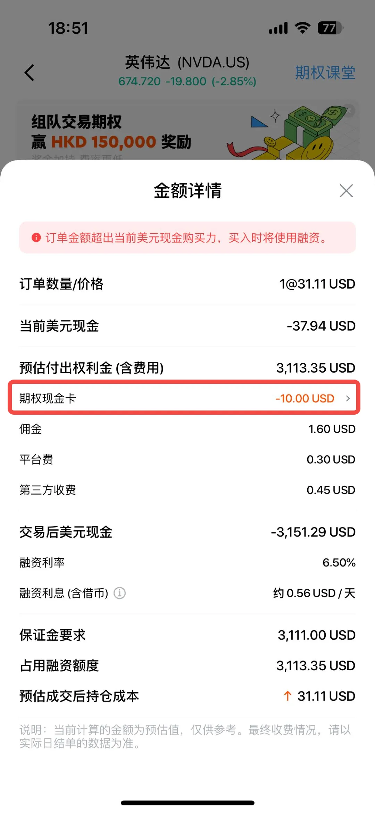

   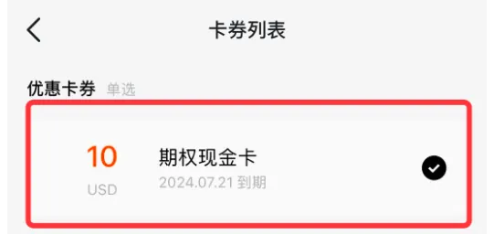

2. 订单提交后，卡券状态显示为「待兑现」

   

3. 订单成交后 T+1，返现金额发放至账户

**使用规则：**

- 一笔期权买入订单只能勾选一张期权现金卡，仅限交易金额返还，不含佣金、手续费等费用
- 一张期权现金卡仅限使用一次，不记名、不挂失、不找零、不可兑换现金及重复使用
- 每张期权现金卡均有使用有效期，过期未使用则自动失效，失效后不予补发
- 每张期权现金卡均有最高返还上限，以卡面显示为准

---

## 激活、过期与使用答疑

**Q：卡券发放后多久可以使用？**

A：自动激活的卡券（行情卡、免佣卡、碎股卡）通常在发放后数分钟内生效。需手动激活的卡券（股票卡、现金卡），点击激活后 1-2 分钟内生效。

---

**Q：为什么我的股票卡显示「等待开户」？**

A：股票卡需要已开通对应市场的交易账户（如港股账户）才能激活。请先完成账户开户流程，开户成功后即可激活股票卡。

---

**Q：卡券忘记激活过期了怎么办？**

A：已过期的卡券无法恢复使用。建议收到卡券后尽快激活，并留意有效期提醒。如需补发，请联系客服说明情况，是否补发由平台评估决定。

---

**Q：行情卡和免佣卡需要手动激活吗？**

A：不需要。这两种卡券发放后会自动激活。若超过 30 分钟未生效，请联系客服。

---

**Q：一张免佣卡可以用多少次？**

A：每张免佣卡的使用次数或金额上限以卡券详情页显示为准，不同活动发放的免佣卡可能有不同规格。您可在卡券详情页查看总次数、已使用次数、剩余次数。

---

**Q：基金加息卡卖出基金后权益还在吗？**

A：不在。基金加息卡的加息权益与持仓挂钩，卖出基金后权益自动停止。

---

**Q：同类型卡券可以叠加使用吗？**

A：取决于卡券类型：行情卡同类型有效期自动叠加（如原剩余 20 天 + 新 30 天 = 50 天）；次数型免佣卡等为顺序使用，前一张用完后再使用下一张。具体以卡券详情页说明为准。

---

**Q：我的卡券一直显示「激活中」怎么办？**

A：正常激活通常在 1-2 分钟内完成。若超过 10 分钟仍显示「激活中」，请退出重新进入卡券页面刷新状态。若仍未解决，请联系客服并提供卡券编号和用户
ID。

---

**Q：我的免佣卡使用后手续费还是正常收取，是卡券没生效吗？**

A：不一定。若持有的是「先收后返」模式的免佣卡，交易时会先按正常费率收取手续费，T+1 结算后再返还至账户。请次日确认账户是否有返还记录，如次日仍未返还，请联系客服。

---

**Q：为什么使用股票现金卡时，下单页面显示的预计返还金额与最终实际返还不同？**

A：下单时展示的预计返现是基于当时订单信息的估算值。实际返还金额需等交易结算完成后才能确定——结算时系统会以最终成交金额及费用为准重新计算，因此与预计值可能存在差异。T+1 结算完成后可在账户明细中查看实际到账金额。

---

**Q：股票卡的面值是多少股？**

A：取决于卡券的兑换方式。按面值兑换的卡券按前一交易日（昨日）收盘价换算为对应股数；固定股数的卡券无论股价涨跌，固定获得约定的股数。请在激活前查看卡券详情页确认。

---

**Q：行情卡已经有了，再收到新的会叠加还是替换？**

A：叠加。同类型行情卡收到后，系统自动将有效期延长，而不是重置。

---

**Q：基金加息卡买了基金后为什么还没激活？**

A：这是正常现象。基金买入后需要等待 T+1 持仓确认，买入当天（T+0）加息卡显示「认购处理中」，次日持仓确认后才变为「使用中」。

---

**Q：打新 IPO 时手续费卡会自动用吗？**

A：是的。持有打新手续费卡时，发起 IPO 申购时系统会自动识别并抵扣对应手续费，无需手动操作。通用卡适用所有
IPO，绑定特定标的的卡券仅限该标的申购时生效。

---

**Q：咖啡券今天已经用过了，明天可以再用吗？**

A：取决于咖啡券类型。总次数模式整个有效期内次数固定，今天用了明天不会重置；每日次数模式每天有固定次数，次日香港时间 00:00
自动重置。请在卡券详情页确认您的咖啡券属于哪种模式。

---

**Q：我准备注销账户，卡券里还有余额，能退给我吗？**

A：账户注销后，所有未使用完的卡券将自动关闭，剩余额度不作补偿。建议在申请注销前尽量使用完卡券额度。

---

**Q：为什么我用了股票现金卡卖出股票，但没有返现？**

A：股票现金卡仅适用于**买入**订单，卖出交易不会触发返现。此外，港股窝轮/牛熊证及美股期权也不适用。如买入交易也未返现，请确认卡券是否在有效期内，并查看卡券详情页的适用范围。

---

**Q：撤单后股票现金卡/期权现金卡会退回吗？**

A：会。订单完全撤销（无任何成交量）后，卡券自动解锁恢复可用。若订单有部分成交后撤单，已成交部分使用的卡券不退回。

---

**Q：持有多张股票现金卡时如何匹配？**

A：系统默认选择最优卡券。例如持有 HKD 50 和 HKD 100 两张卡，订单金额 HKD 60 会匹配 HKD 50 的卡，订单金额 HKD 120 会匹配 HKD
100 的卡。

---

## 卡券使用限制与账户要求

- 所有有效期均以香港时间（HKT，UTC+8）为准
- 卡券绑定发放账户，不可转让或赠予他人账户
- 以下卡券仅限长桥证券账户（LB 账户）激活使用：现金卡、股票卡、碎股卡、股票现金卡。非长桥账户用户激活时会收到「账户类型不符合要求」的提示
- 账户处于冻结或受限状态时，卡券可能无法正常激活或使用
- 有效期天数以卡券详情页显示的日期为准
- 加息券不记名、不挂失、不找零、不可直接兑换现金及重复使用

## 相关文档

- [我的卡券](/rewards/rewards-mall/my-coupons) — 卡券管理
- [奖励系统](/rewards/rewards-overview) — 奖励机制
